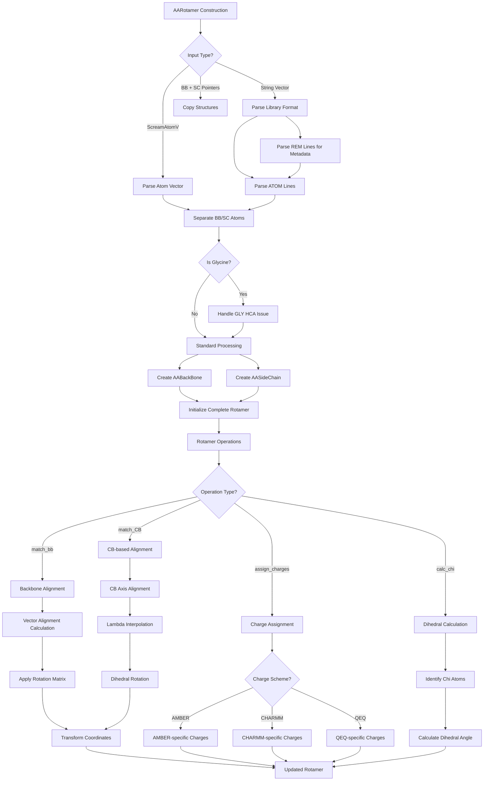

# `AARotamer.cpp` File Analysis

## File Purpose and Primary Role

The `AARotamer.cpp` file implements the `AARotamer` class, which is a specialized derived class of `Rotamer` that specifically handles amino acid rotamers in the SCREAM protein modeling system. Its primary responsibilities include:

- Managing amino acid rotamer structures with both backbone and sidechain components
- Handling rotamer library data parsing and initialization
- Implementing geometric transformations for rotamer placement and alignment
- Providing energy calculation support and charge assignment
- Supporting various rotamer matching algorithms (backbone matching, CB matching)
- Managing the special case of Glycine residues which lack traditional sidechains

## Key Classes, Structs, and Functions (if any)

### Primary Class:

- **`AARotamer`**: The main class inheriting from `Rotamer`, representing an amino acid rotamer with backbone (`AABackBone`) and sidechain (`AASideChain`) components.

### Key Public Methods:

- **Constructors**: Multiple constructors for creating rotamers from atom lists, string vectors (library format), or from existing backbone/sidechain components
- **`deepcopy()`**: Deep copy method that recursively copies all SCREAM_ATOM objects and their connectivity information
- **`match_bb()`**: Aligns this rotamer's backbone to match another rotamer's backbone geometry
- **`match_CB()`**: Advanced alignment method using CB atom positioning with lambda parameter for interpolation
- **`create_CB()`**: Generates CB atom coordinates using geometric parameters
- **`calc_PHI()`/`calc_PSI()`**: Calculates backbone dihedral angles
- **`chi1()`-`chi5()`**: Calculates sidechain chi dihedral angles
- **`assign_atom_fftype()`**: Assigns force field atom types
- **`assign_charges()`**: Assigns partial charges based on different charge schemes (AMBER, CHARMM, QEQ)
- **`assign_lone_pair()`**: Assigns lone pair electron information

### Key Private Methods:

- **`initRotamerAtomList()`**: Parses rotamer library string data to initialize atom structures
- **`private_chi()`**: Internal method for chi angle calculations
- **`_determine_and_fix_GLY_sidechain_HCA_issue()`**: Special handling for glycine's unique sidechain structure

## Inputs

### Data Structures/Objects:

- **`ScreamAtomV`**: Vector of SCREAM_ATOM pointers representing atomic coordinates and properties
- **`vector<string>`**: Rotamer library format strings containing atom coordinates, energies, and metadata
- **`AABackBone*`**: Backbone structure pointer
- **`AASideChain*`**: Sidechain structure pointer
- **`SCREAM_ATOM*`**: Individual atom pointers for CB positioning
- **`vector<double>`**: Parameters for CB creation (angles, bond lengths, lambda values)

### File-Based Inputs:

- **Rotamer Library Files**: Parsed externally but consumed as string vectors containing:
  - ATOM records in PDB-like format
  - Energy information (REM energy lines)
  - Rotamer metadata (residue names, rotamer numbers)
  - Dihedral angles (PHI/PSI records)
  - Library names (REM lib lines)

### Environment Variables:

- **`SCREAM_NEW_CHG`**: Determines charge assignment scheme ("amber", "amber_n", "charmm", "charmm_n", "qeq", "qeq_n")

### Parameters/Configuration:

- **CreateCBParameters**: Array containing [offBisectorAngle, offPlaneAngle, bondLength, rotamerMatchLambda]
- **aa_state**: Integer parameter (0 or 1) affecting hydrogen charge assignments
- **lambda**: Interpolation parameter for backbone matching (0.0-1.0 range between C and N directions)

## Outputs

### Data Structures/Objects:

- **Modified `AARotamer` objects**: Fully initialized rotamer structures with:
  - Populated atom lists with coordinates and connectivity
  - Assigned force field types and charges
  - Calculated dihedral angles
  - Energy terms and metadata
- **`ScreamVector`**: Calculated atomic positions (e.g., CB coordinates)
- **`double`**: Calculated dihedral angles (PHI, PSI, chi angles)

### File-Based Outputs:

- **Standard output streams**: Via `append_to_filehandle()` and `pdb_append_to_filehandle()` methods
- **PDB format output**: Through specialized output methods

### Console Output (stdout/stderr):

- **Debug information**: Via `Debug` class for constructor operations
- **Error messages**: For missing atoms or failed operations
- **Rotamer placement notifications**: "Original rotamer placement" messages
- **Connectivity warnings**: "connectivity info not printed for rotamer"

### Side Effects:

- **Memory allocation**: Creates new SCREAM_ATOM objects with `allocatedScreamAtoms` flag management
- **Coordinate transformation**: Modifies atomic positions through translation and rotation operations
- **Connectivity updates**: Updates inter-atomic bond connectivity maps

## External Code Dependencies (Libraries/Headers)

### Standard C++ Library:

- **`<algorithm>`**: For STL algorithms like `find()`
- **`<cassert>`**: For assertion macros
- **`<string>`**: String manipulation
- **`<iostream>`**: Input/output operations
- **`<fstream>`**: File stream operations
- **`<sstream>`**: String stream processing
- **`<typeinfo>`**: Type information for debugging
- **`<exception>`**: Exception handling
- **`<cmath>`**: Mathematical functions

### Internal SCREAM Project Headers:

- **`defs.hpp`**: Project-wide definitions
- **`scream_atom.hpp`**: SCREAM_ATOM structure definitions
- **`scream_vector.hpp`**: Custom 3D vector mathematics
- **`scream_matrix.hpp`**: Custom matrix operations for rotations
- **`scream_tools.hpp`**: Utility functions for geometric calculations
- **`Rotamer.hpp`**: Base rotamer class
- **`AARotamer.hpp`**: Header for this implementation
- **`sc_BackBone.hpp`**: Backbone structure interface
- **`sc_AABackBone.hpp`**: Amino acid backbone implementation
- **`sc_SideChain.hpp`**: Sidechain structure interface
- **`sc_AASideChain.hpp`**: Amino acid sidechain implementation

### External Compiled Libraries:

- None identified in this file

## Core Logic/Algorithm Flowchart (Mermaid JS Format)

## Potential Areas for Modernization/Refactoring in SCREAM++

### 1. Memory Management and Resource Safety

- **Replace raw pointers with smart pointers**: The extensive use of `new`/`delete` and manual memory management with `allocatedScreamAtoms` flags could be replaced with `std::unique_ptr` or `std::shared_ptr` for automatic memory management and exception safety.
- **RAII principle**: Implement proper resource acquisition and management in constructors/destructors to prevent memory leaks.

### 2. Modern C++ Container and Algorithm Usage

- **Replace custom atom vectors with modern containers**: Consider using `std::vector<std::unique_ptr<SCREAM_ATOM>>` or custom container classes with proper move semantics.
- **Leverage STL algorithms**: Replace manual loops with STL algorithms like `std::transform`, `std::find_if`, and range-based for loops for cleaner, more maintainable code.
- **Use structured bindings and auto**: Modern C++17/20 features could significantly improve code readability, especially in the connectivity map iterations.

### 3. Object-Oriented Design and API Improvements

- **Strategy pattern for charge assignment**: The large switch-case logic in `assign_charges()` could be refactored using a strategy pattern with different charge calculation classes.
- **Builder pattern for rotamer construction**: The multiple constructors with complex initialization logic could benefit from a builder pattern for clearer, more flexible object construction.
- **Error handling with exceptions**: Replace error codes and assertion-based error handling with proper exception handling using custom exception classes for different error types.
