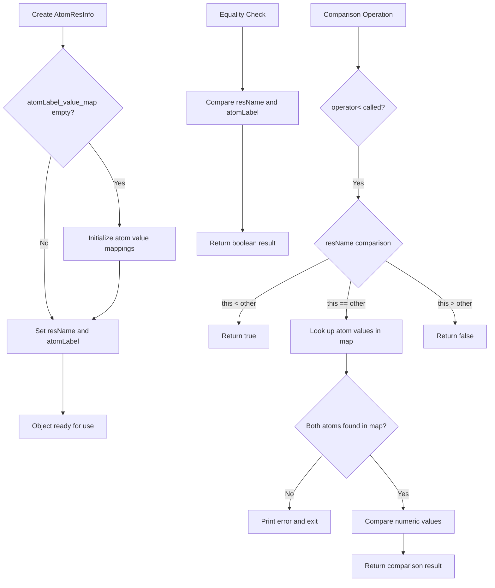

# `AtomResInfo.cpp` File Analysis

## File Purpose and Primary Role

The `AtomResInfo.cpp` file implements a utility class that serves as an identifier and ordering mechanism for atoms within protein residues. Its primary role is to provide a standardized way to represent atom-residue combinations and establish a consistent ordering scheme for atoms based on their chemical significance and position within amino acid structures. This is crucial for molecular modeling operations where atoms need to be processed in a predictable, chemically meaningful order.

## Key Classes, Structs, and Functions (if any)

### `AtomResInfo` Class

- **Purpose**: Represents a combination of residue name and atom label, providing comparison operators for sorting and identification
- **Key Members**:
  - `resName`: String representing the residue name (e.g., "ALA", "CYS")
  - `atomLabel`: String representing the atom label (e.g., "CA", "N", "CB")
  - `atomLabel_value_map`: Static map that assigns numeric values to atom labels for ordering

### Key Functions:

- **Constructors**: Default constructor and parameterized constructor for creating AtomResInfo objects
- **Operator overloads**: `=`, `==`, `<` for assignment, equality, and ordering operations
- **Stream operator**: `<<` for output formatting

## Inputs

### Data Structures/Objects:

- **Constructor inputs**: `std::string resName` and `std::string atomLabel` parameters
- **Operator inputs**: `const AtomResInfo&` references for comparison and assignment operations

### File-Based Inputs:

- **None directly**: This file does not read from any external data files

### Environment Variables:

- **None**: No direct or indirect dependency on environment variables

### Parameters/Configuration:

- **Hardcoded atom ordering values**: The static map contains predefined numeric values for different atom types, establishing the chemical ordering hierarchy
- **Atom label naming conventions**: Relies on standard PDB atom naming conventions

## Outputs

### Data Structures/Objects:

- **AtomResInfo objects**: Created and returned by constructors and assignment operations
- **Boolean values**: Returned by comparison operators (`==`, `<`)
- **AtomResInfo references**: Returned by assignment operator for chaining

### File-Based Outputs:

- **None directly**: No direct file output operations

### Console Output (stdout/stderr):

- **Error messages**: Outputs error messages to `std::cerr` when undefined atom labels are encountered in comparison operations
- **Formatted output**: Can output residue name and atom label pairs via the stream operator

### Side Effects:

- **Static map initialization**: Populates the global `atomLabel_value_map` on first instantiation
- **Program termination**: Calls `exit(2)` when encountering undefined atom labels in comparison operations

## External Code Dependencies (Libraries/Headers)

### Standard C++ Library:

- `<cstdlib>`: For `exit()` function
- `<map>`: For `std::map` container (implied from usage)
- `<string>`: For `std::string` class (implied from usage)
- `<iostream>`: For `std::ostream`, `std::cerr` (implied from usage)

### Internal SCREAM Project Headers:

- `"AtomResInfo.hpp"`: Header file containing the class declaration

### External Compiled Libraries:

- **None**: No third-party library dependencies

## Core Logic/Algorithm Flowchart (Mermaid JS Format)

## Potential Areas for Modernization/Refactoring in SCREAM++

### 1. **Replace Static Map with Modern Initialization**

- **Current Issue**: The static map is initialized with repetitive code in both constructors, violating DRY principle
- **Modernization**: Use `std::unordered_map` with brace initialization or a separate initialization function, potentially making it `constexpr` where possible

### 2. **Improve Error Handling and Safety**

- **Current Issue**: Uses `exit(2)` for error handling, which terminates the entire program
- **Modernization**: Replace with exception throwing (e.g., `std::invalid_argument` or custom exceptions) to allow for proper error recovery and testing

### 3. **Enhance Type Safety and API Design**

- **Current Issue**: Uses raw strings for atom labels and residue names, no validation
- **Modernization**: Consider using strongly-typed enums or wrapper classes for atom labels and residue names, add input validation, and potentially use `std::string_view` for performance in comparison operations
