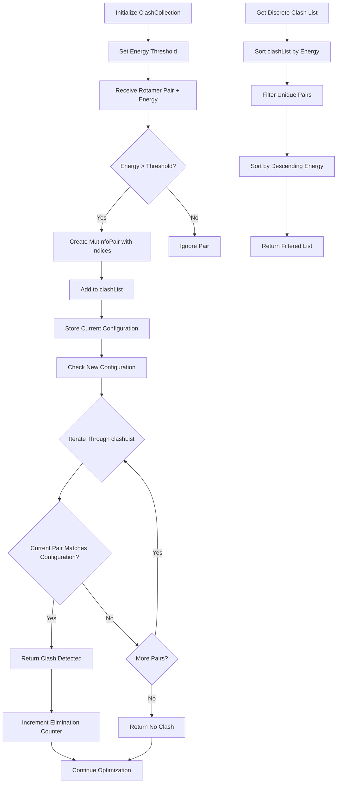

# `ClashCollection.cpp` File Analysis

## File Purpose and Primary Role

The `ClashCollection` class serves as a clash detection and management system for rotamer configurations in the SCREAM molecular modeling software. Its primary responsibility is to:

- Store and manage pairs of rotamers that clash (have energy above a threshold)
- Check whether new rotamer configurations contain any known clashing pairs
- Eliminate rotamer combinations that would result in high-energy clashes
- Track statistics about eliminated rotamers during the optimization process

This is a core component of the side-chain placement algorithm, helping to prune the search space by avoiding energetically unfavorable rotamer combinations.

## Key Classes, Structs, and Functions (if any)

### Classes:

- **`ClashCollection`**: Main class for managing rotamer clashes

  - Stores clash pairs and energy thresholds
  - Provides clash detection functionality
  - Tracks elimination statistics

- **`cmp_mutInfo_E_descend`**: Comparator class for sorting `MutInfoPair` objects by descending clash energy

### Key Methods:

- **`addClashPair()`**: Adds a clashing rotamer pair if energy exceeds threshold (2 overloads)
- **`checkClash()`**: Checks if a given configuration contains any known clashing pairs
- **`getDiscreteClashPairList()`**: Returns a filtered list of unique clashing pairs sorted by energy
- **`storeCurrentRotamerConfiguration()`**: Stores the current rotamer state for indexing

## Inputs

### Data Structures/Objects:

- **`MutInfoPair`**: Pairs of rotamer mutation information with clash energies
- **`MutInfo`**: Individual rotamer mutation information objects
- **`ExcitationEnumeration`**: Map-like structure representing current rotamer configuration (string → int mapping)
- **`double energy`**: Energy values for clash pairs

### File-Based Inputs:

- None directly - this class operates on data structures populated elsewhere

### Environment Variables:

- None identified in this file

### Parameters/Configuration:

- **`threshold_E`**: Energy threshold for considering rotamer pairs as clashing (default: 300 in absolute terms)
- Rotamer indices and string identifiers from the current configuration

## Outputs

### Data Structures/Objects:

- **`vector<MutInfoPair>`**: Lists of clashing rotamer pairs
- **`int`**: Clash detection results (0 = no clash, 1 = clash detected)
- **Modified `MutInfoPair` objects**: With updated indices and clash energies

### File-Based Outputs:

- None directly

### Console Output (stdout/stderr):

- Debug output through `Debug` class in `getDiscreteClashPairList()`
- Commented-out debug statements showing clash list sizes

### Side Effects:

- Modifies internal `clashList` vector by adding new clash pairs
- Updates `currentRotamerConfiguration` map
- Increments `total_clashing_rotamers_eliminated` counter
- Sorts internal clash lists

## External Code Dependencies (Libraries/Headers)

### Standard C++ Library:

- `<assert.h>`: For assertion checks
- `<map>`: For storing rotamer configurations and appearance tracking
- `<vector>`: For storing lists of clash pairs
- `<string>` (implied): For string operations with rotamer identifiers

### Internal SCREAM Project Headers:

- `"ClashCollection.hpp"`: Header file for this class
- `"MutInfo.hpp"`: Mutation information class definitions
- Implied dependencies: `Debug` class, `ExcitationEnumeration` type

### External Compiled Libraries:

- None identified

## Core Logic/Algorithm Flowchart (Mermaid JS Format)

## Potential Areas for Modernization/Refactoring in SCREAM++

### 1. **Replace Raw Containers with Modern STL and Smart Pointers**

- Use `std::unordered_map` instead of `std::map` for `currentRotamerConfiguration` for O(1) lookups
- Consider using `std::unordered_set` for faster clash detection
- Replace raw pointers with `std::shared_ptr` or `std::unique_ptr` if any are used in related classes

### 2. **Improve Type Safety and API Design**

- Replace C-style assertions with proper exception handling
- Use `enum class` for return codes instead of magic numbers (0/1 for clash detection)
- Make the API more const-correct and add `noexcept` specifications where appropriate
- Consider using `std::optional<double>` for energy values that might not exist

### 3. **Enhance Performance and Memory Management**

- Use move semantics for large objects like `MutInfoPair` and `ExcitationEnumeration`
- Implement custom hash functions for better performance with custom types
- Consider using `std::vector::reserve()` to pre-allocate memory for known sizes
- Replace string-based lookups with integer-based indexing where possible for better cache performance
