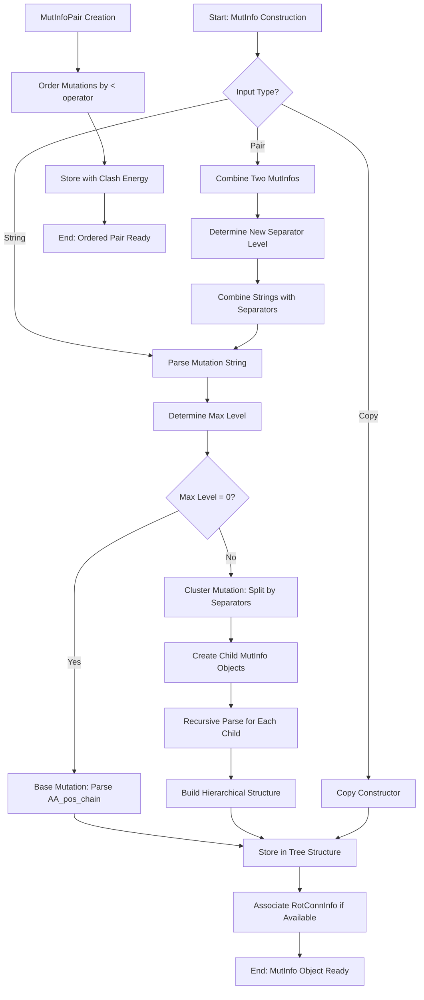

# `MutInfo.cpp` File Analysis

## File Purpose and Primary Role

The `MutInfo.cpp` file implements classes for representing and managing mutation information in the SCREAM protein side-chain placement software. The primary purpose is to handle hierarchical mutation data structures that can represent both individual mutations (base mutations) and clusters of mutations. The file provides functionality for parsing mutation strings, creating tree-like structures of mutations, and managing associated rotamer connection information. This appears to be a core component for tracking and organizing mutation combinations during the side-chain placement process.

## Key Classes, Structs, and Functions (if any)

### **MutInfo Class**

- **Purpose:** Represents mutation information, can be either a single mutation or a cluster of mutations
- **Key Features:** Hierarchical structure with child mutations, string parsing/generation, comparison operators
- **Key Members:**
  - `string chn` - Chain identifier
  - `int pstn` - Position number
  - `string AA` - Amino acid type
  - `vector<MutInfo*> childMutInfo` - Child mutations for cluster mutations
  - `RotConnInfo* rCI` - Associated rotamer connection information

### **MutInfoPair Class**

- **Purpose:** Represents a pair of mutations with associated clash energy
- **Key Features:** Ordered pair management, energy storage, comparison operators
- **Key Members:**
  - `MutInfo mutInfo1, mutInfo2` - The two mutations
  - `double clashE` - Clash energy between the mutations

### **Key Functions**

- `init(string s)` - Parses mutation string and builds hierarchical structure
- `getString()` - Converts mutation object back to string representation
- `getAllMutInfos()` - Retrieves all base mutations from a cluster
- `searchAndAddRotConnInfo()` - Associates rotamer information with mutations
- `_determineMaxLevel()` - Determines hierarchical level from string separators

## Inputs

### **Data Structures/Objects:**

- `string mutInfo` - Mutation strings with hierarchical separators (e.g., "A1_A|B2_B||C3_C")
- `RotConnInfo*` - Rotamer connection information objects
- `MutInfo` objects for copy construction and assignment
- `MutInfoPair` objects for pair operations

### **File-Based Inputs:**

- No direct file reading is performed in this file

### **Environment Variables:**

- No environment variables are directly used

### **Parameters/Configuration:**

- Mutation string format with pipe separators (`|`, `||`, `|||`, etc.) indicating hierarchical levels
- Mutation naming convention: `[AA][position]_[chain]` (e.g., "A123_B")
- Energy values for mutation pairs (clash energies)

## Outputs

### **Data Structures/Objects:**

- `MutInfo` objects representing parsed mutation hierarchies
- `MutInfoPair` objects with ordered mutation pairs and energies
- `vector<MutInfo*>` containing all base mutations from clusters
- `map<string, RotConnInfo*>` mapping mutation strings to rotamer information

### **File-Based Outputs:**

- No direct file writing is performed

### **Console Output (stdout/stderr):**

- Debug/error messages via `cout` and `cerr`
- Error message for identical mutations in pairs: "the two MutInfos are identical! exiting."
- Mutation information printing via overloaded `<<` operator

### **Side Effects:**

- Dynamic memory allocation for child `MutInfo` objects
- Modification of `RotConnInfo*` associations
- Global state changes through rotamer information updates

## External Code Dependencies (Libraries/Headers)

### **Standard C++ Library:**

- `<cstdlib>` - For `atoi()` function and `exit()`
- `<iostream>` - For `cout`, `cerr` output operations
- `<string>` - For string manipulation
- `<vector>` - For dynamic arrays of mutation objects
- `<map>` - For associating strings with rotamer information

### **Internal SCREAM Project Headers:**

- `"defs.hpp"` - Project-wide definitions and declarations
- `"MutInfo.hpp"` - Header file containing class declarations

### **External Compiled Libraries:**

- None identified

## Core Logic/Algorithm Flowchart (Mermaid JS Format)

## Potential Areas for Modernization/Refactoring in SCREAM++

### **1. Memory Management with Smart Pointers**

- Replace raw pointers (`MutInfo*`, `RotConnInfo*`) with `std::unique_ptr` or `std::shared_ptr`
- Eliminate manual `new`/`delete` operations and potential memory leaks
- Use RAII principles for automatic resource management

### **2. String Parsing and Modern C++ Practices**

- Replace C-style string parsing (`atoi()`, `substr()` loops) with modern alternatives
- Use `std::regex` for robust mutation string pattern matching
- Implement `std::string_view` for efficient string operations without copying
- Consider using `std::from_chars()` for number parsing instead of `atoi()`

### **3. Container and Algorithm Improvements**

- Use range-based for loops instead of iterator-based loops
- Leverage STL algorithms (`std::find_if`, `std::transform`) for cleaner code
- Consider `std::variant` or inheritance hierarchy instead of flag-based type checking (`isClusterMutInfo()`)
- Use `std::optional` for nullable `RotConnInfo` associations instead of raw pointers
