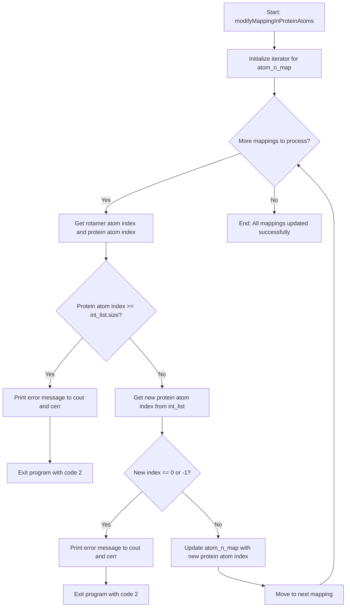

# `RotConnInfo.cpp` File Analysis

## File Purpose and Primary Role

This file implements functionality for the `RotConnInfo` class, which manages atom mapping relationships between rotamers (side-chain conformations) and protein atoms. Its primary responsibility is to update these mappings when protein atoms undergo modifications (such as mutations) that change their internal numbering or remove certain atoms. The class serves as a critical component for maintaining consistency between rotamer libraries and the actual protein structure during molecular modeling operations.

## Key Classes, Structs, and Functions (if any)

- **`RotConnInfo` class** (implementation only - definition likely in RotConnInfo.hpp):
  - Contains an `atom_n_map` member (appears to be `std::map<int, int>`) that maps rotamer atom indices to protein atom indices
  - **`modifyMappingInProteinAtoms(vector<int>& int_list)`**: Updates the internal atom mapping when protein atoms are modified, renumbered, or removed

## Inputs

**Data Structures/Objects:**

- `vector<int>& int_list`: A reference to an integer vector where the index represents the original protein atom number and the value represents the new atom number after modification (0 or -1 indicates atom removal)
- `this->atom_n_map`: Internal mapping from rotamer atom indices to protein atom indices (std::map<int, int>)

**File-Based Inputs:**

- The code references `.cnn` files in error messages, suggesting this class works with connectivity files, though no direct file I/O occurs in this specific implementation

**Environment Variables:**

- No direct environment variable usage detected in this file

**Parameters/Configuration:**

- The atom mapping modifications are driven by external protein mutation/modification operations that generate the `int_list` parameter

## Outputs

**Data Structures/Objects:**

- Modified `this->atom_n_map`: The internal atom mapping is updated with new protein atom indices
- The function operates by side effect, modifying the object's internal state

**File-Based Outputs:**

- No direct file output in this implementation

**Console Output (stdout/stderr):**

- Error messages to both `cout` and `cerr` when inconsistencies are detected between protein modifications and `.cnn` file specifications
- Specific error: "Serious error: mutation in protein has wiped out certain atoms .cnn files specification. Please fix your .cnn files."

**Side Effects:**

- Modifies the `atom_n_map` member variable of the `RotConnInfo` object
- May terminate the program with `exit(2)` if critical errors are detected

## External Code Dependencies (Libraries/Headers)

**Standard C++ Library:**

- `<iostream>`: For console output (`cout`, `cerr`)
- `<cstdlib>`: For the `exit()` function
- `<vector>`: For `std::vector` (likely via the header)
- `<map>`: For `std::map` (inferred from usage of `atom_n_map`)

**Internal SCREAM Project Headers:**

- `"RotConnInfo.hpp"`: Contains the class definition and member variable declarations

**External Compiled Libraries:**

- None detected in this file

## Core Logic/Algorithm Flowchart (Mermaid JS Format)

## Potential Areas for Modernization/Refactoring in SCREAM++

1. **Error Handling and Exceptions**: Replace the use of `exit(2)` with proper C++ exception handling. The current approach of terminating the entire program is not suitable for modern software design. Consider throwing custom exceptions that can be caught and handled appropriately by calling code.

2. **Iterator Modernization**: Replace the old-style iterator loop with modern C++11 range-based for loops or STL algorithms. The current pattern `for (map<int, int>::iterator itr = ...)` can be modernized to `for (auto& [rot_rep, ptn_rep] : this->atom_n_map)` using structured bindings (C++17) or at minimum `for (const auto& pair : this->atom_n_map)`.

3. **Input Validation and Const-Correctness**: The function should validate input parameters at the beginning and use const-correctness where possible. The `int_list` parameter could potentially be `const` if the function only reads from it, and additional bounds checking should be implemented before accessing vector elements to prevent undefined behavior.
