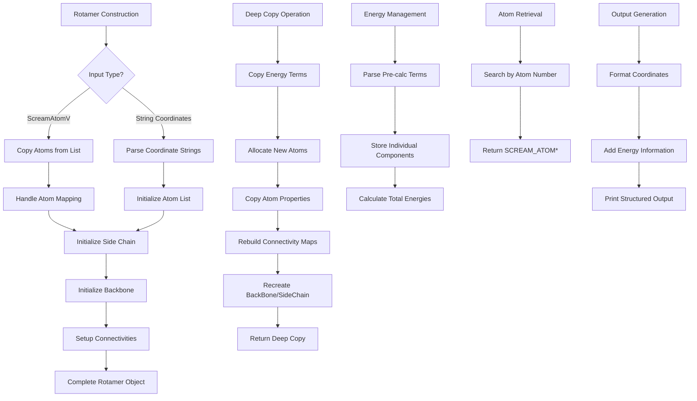

# `Rotamer.cpp` File Analysis

## File Purpose and Primary Role

The `Rotamer.cpp` file implements the `Rotamer` class, which represents a single rotameric conformation of a protein residue in the SCREAM molecular modeling system. A rotamer is a specific spatial arrangement of atoms in a residue's side chain, and this class manages both the atomic coordinates and energetic properties of such conformations. The class serves as a fundamental building block for protein side-chain placement algorithms, storing atom lists, backbone/side-chain divisions, and various energy terms used in the flat-bottom strategy for side-chain optimization.

## Key Classes, Structs, and Functions (if any)

- **`Rotamer` class**: The primary class representing a single rotameric conformation

  - Multiple constructors for different initialization scenarios (from atom lists, coordinate strings, etc.)
  - Deep copy functionality for rotamer duplication
  - Energy storage and management for various force field terms
  - Backbone and side-chain atom organization and management
  - Atom retrieval and manipulation methods

- **Key Methods**:
  - `deepcopy()`: Creates a complete deep copy of a rotamer including all atoms and connectivities
  - `getAtom()` / `getTheseAtoms()`: Atom retrieval by index
  - `print_Me()` / `print_ordered_by_n()`: Output formatting for rotamer data
  - `populate_preCalc_Terms()`: Parses pre-calculated energy terms from string input
  - `_initAtomList()`: Parses rotamer coordinate data from string format
  - `_initSideChain()` / `_initBackBone()`: Organizes atoms into backbone and side-chain components

## Inputs

**Data Structures/Objects:**

- `ScreamAtomV` (vector of `SCREAM_ATOM*`): Input atom lists for rotamer construction
- `RotConnInfo*`: Connectivity information containing side-chain atom indices, anchor points, and atom number mappings
- `stringV`: Vector of strings containing rotamer coordinate data in specific format
- `vector<int>`: Lists of atom indices for backbone/side-chain classification

**File-Based Inputs:**

- Rotamer coordinate files (parsed via `stringV` input containing ATOM records and REM headers)
- Energy files containing pre-calculated force field terms (bonds, angles, torsions, etc.)

**Environment Variables:**

- None directly used in this file

**Parameters/Configuration:**

- `atomListFromProtein`: Boolean flag controlling atom number mapping behavior
- `rotamer_n`: Rotamer identification number
- `library_name`: Rotamer library identifier
- Various energy thresholds and default values (set to 99999 as placeholders)

## Outputs

**Data Structures/Objects:**

- Complete `Rotamer` objects with organized atom lists
- `BackBone*` and `SideChain*` objects containing classified atoms
- Modified `SCREAM_ATOM` objects with updated connectivities and properties

**File-Based Outputs:**

- None directly written by this file

**Console Output (stdout/stderr):**

- Rotamer information in structured format (via `print_Me()` methods)
- Energy breakdown displays
- Debug/warning messages for missing atoms or errors
- Formatted coordinate output with REM headers

**Side Effects:**

- Memory allocation/deallocation for `SCREAM_ATOM` objects
- Modification of atom connectivity maps
- Creation and management of backbone and side-chain sub-objects

## External Code Dependencies (Libraries/Headers)

**Standard C++ Library:**

- `<cassert>`: Assertion checking
- `<string>`: String manipulation
- `<iostream>`: Input/output operations
- `<fstream>`: File stream operations
- `<sstream>`: String stream operations
- `<algorithm>`: STL algorithms (find, etc.)
- `<map>`: Associative containers
- `<vector>`: Dynamic arrays

**Internal SCREAM Project Headers:**

- `"defs.hpp"`: Project-wide definitions
- `"scream_atom.hpp"`: SCREAM_ATOM class definition
- `"scream_vector.hpp"`: Custom vector implementation
- `"scream_matrix.hpp"`: Custom matrix implementation
- `"Rotamer.hpp"`: Rotamer class declaration
- `"sc_BackBone.hpp"`: BackBone class for backbone atoms
- `"sc_SideChain.hpp"`: SideChain class for side-chain atoms
- `"sc_AASideChain.hpp"`: Amino acid specific side-chain handling
- `"scream_tools.hpp"`: Utility functions

**External Compiled Libraries:**

- None identified

## Core Logic/Algorithm Flowchart (Mermaid JS Format)

## Potential Areas for Modernization/Refactoring in SCREAM++

1. **Memory Management with Smart Pointers**: The current implementation uses extensive manual memory management with `new`/`delete` operations and raw pointers. This should be modernized to use `std::unique_ptr` and `std::shared_ptr` for automatic memory management, eliminating potential memory leaks and making the code safer and more maintainable.

2. **Replace Custom Containers with Modern STL**: The code uses custom vector types (`ScreamAtomV`) and manual connectivity maps. These could be replaced with modern STL containers like `std::vector<std::unique_ptr<ScreamAtom>>` and potentially `std::unordered_map` for better performance. The connectivity system could benefit from a more structured graph representation.

3. **Improve Error Handling and Input Validation**: The current code uses basic assertions and minimal error checking. Modern C++ exception handling, `std::optional` for potentially missing values, and comprehensive input validation would make the code more robust. The magic number "99999" used as default/invalid energy values should be replaced with proper optional types or enumerated states.
