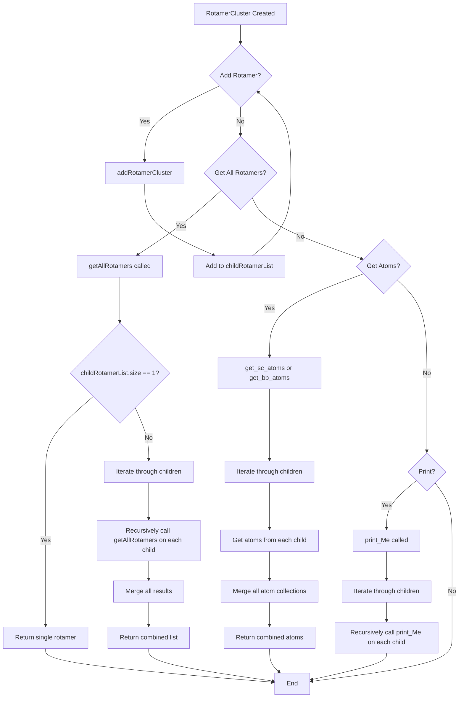

# `RotamerCluster.cpp` File Analysis

## File Purpose and Primary Role

The `RotamerCluster.cpp` file implements a hierarchical clustering mechanism for rotamers in the SCREAM molecular modeling software. A rotamer cluster represents a collection of rotamers (different conformations of amino acid side chains) that can be organized in a tree-like structure. This class serves as a composite pattern implementation, allowing individual rotamers and clusters of rotamers to be treated uniformly. The primary purpose is to enable efficient organization, traversal, and manipulation of rotamer collections during protein side-chain placement algorithms.

## Key Classes, Structs, and Functions (if any)

### Primary Class: `RotamerCluster`

**Key Methods:**

- **`RotamerCluster()`** - Default constructor that initializes an empty cluster
- **`RotamerCluster(Rotamer* rot1, Rotamer* rot2)`** - Constructor that creates a cluster from two rotamers
- **`~RotamerCluster()`** - Destructor (currently empty)
- **`addRotamerCluster(Rotamer* newRot)`** - Adds a new rotamer to the cluster
- **`getAllRotamers()`** - Recursively collects all rotamers from the cluster hierarchy
- **`print_Me()`** - Recursively prints all rotamers in the cluster
- **`get_sc_atoms()`** - Collects all side-chain atoms from all rotamers in the cluster
- **`get_bb_atoms()`** - Collects all backbone atoms from all rotamers in the cluster

## Inputs

### Data Structures/Objects:

- **`Rotamer*`** - Pointers to individual rotamer objects that are organized within the cluster
- **`vector<Rotamer*> childRotamerList`** - Internal storage for child rotamers/clusters
- **`rCI`** - A pointer to some connection information object (type not visible in this file, but initialized to NULL)

### File-Based Inputs:

- No direct file I/O operations are performed in this file

### Environment Variables:

- No direct environment variable usage detected in this file

### Parameters/Configuration:

- No explicit configuration parameters are used directly in this file; behavior is controlled through method calls and rotamer object states

## Outputs

### Data Structures/Objects:

- **`vector<Rotamer*>`** - Collections of rotamer pointers returned by `getAllRotamers()`
- **`ScreamAtomV`** - Collections of SCREAM atom objects returned by `get_sc_atoms()` and `get_bb_atoms()`

### File-Based Outputs:

- No direct file output operations

### Console Output (stdout/stderr):

- Indirect console output through `print_Me()` method, which recursively calls `print_Me()` on all contained rotamers

### Side Effects:

- Modifies internal `childRotamerList` when adding new rotamers via `addRotamerCluster()`
- No modification of external objects (methods that return data create new collections)

## External Code Dependencies (Libraries/Headers)

### Standard C++ Library:

- **`<vector>`** - For `std::vector` container usage (implied from `vector<Rotamer*>`)

### Internal SCREAM Project Headers:

- **`RotamerCluster.hpp`** - Header file for the RotamerCluster class definition
- **`Rotamer.hpp`** - Header for the Rotamer class (implied from usage)
- **`ScreamAtom.hpp`** - Header defining `ScreamAtomV` type (implied from usage)

### External Compiled Libraries:

- None detected

## Core Logic/Algorithm Flowchart (Mermaid JS Format)

## Potential Areas for Modernization/Refactoring in SCREAM++

### 1. **Smart Pointer Usage and Memory Safety**

The current implementation uses raw pointers (`Rotamer*`) which can lead to memory management issues. Modern C++ should use `std::shared_ptr<Rotamer>` or `std::unique_ptr<Rotamer>` to ensure automatic memory management and prevent memory leaks. The `rCI` pointer should also be replaced with a smart pointer.

### 2. **STL Algorithm Integration and Iterator Modernization**

The manual loops using traditional iterators can be replaced with modern range-based for loops and STL algorithms. For example, the `getAllRotamers()` method could use `std::accumulate` or range-based loops for cleaner, more expressive code. The container operations could benefit from move semantics to avoid unnecessary copies.

### 3. **Interface Design and Type Safety**

The current interface mixes different responsibilities (printing, atom collection, rotamer management) in a single class. A more modern approach would separate concerns using composition or strategy patterns. Additionally, the `ScreamAtomV` type should be replaced with a more type-safe container, potentially using templates to ensure compile-time type checking and better performance.
