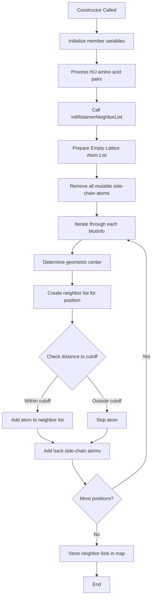

# `RotamerNeighborList.cpp` File Analysis

## File Purpose and Primary Role

The `RotamerNeighborList` class is responsible for building and managing spatial neighbor lists for rotamer conformations in protein side-chain placement calculations. Its primary role is to precompute which atoms are within a specified cutoff distance of each mutable residue position, creating an "empty lattice" representation where the variable side-chain atoms are temporarily removed. This optimization reduces the computational cost of energy calculations by limiting the scope of atom-atom interactions that need to be evaluated during rotamer sampling.

## Key Classes, Structs, and Functions (if any)

### Primary Class

- **`RotamerNeighborList`**: Main class that manages neighbor lists for rotamer calculations
  - Stores protein reference, mutation information, and cutoff distances
  - Maintains maps between mutation positions and their corresponding neighbor atom lists

### Key Member Functions

- **Constructor `RotamerNeighborList(Protein*, map<MutInfo, RotConnInfo*>, double)`**: Initializes the neighbor list system with protein data, mutation information, and distance cutoff
- **`initRotamerNeighborList()`**: Master function that orchestrates the creation of all neighbor lists
- **`_prepareEmptyLatticeAtomList()`**: Creates a "background" atom list by removing all mutable side-chain atoms from the protein
- **`_initOneRotamerNeighborList()`**: Builds the neighbor list for a single mutation position
- **`_determineCenter()`**: Calculates the geometric center point for neighbor list construction (currently returns origin as placeholder)
- **`returnEmptyLatticeNeighborList()`**: Accessor method to retrieve the neighbor list for a specific mutation

## Inputs

### Data Structures/Objects

- **`Protein*`**: Pointer to protein object containing atomic coordinates and structural information
- **`map<MutInfo, RotConnInfo*>`**: Map linking mutation information to rotamer connection data
- **`MutInfo`**: Objects describing mutation positions (chain, residue number, amino acid type)
- **`RotConnInfo*`**: Pointers to rotamer connectivity information (can be NULL for natural amino acids)
- **`double cutoff`**: Distance cutoff for neighbor list inclusion (typically in Angstroms)

### File-Based Inputs

- No direct file I/O operations are performed in this file; data is passed through object references

### Environment Variables

- No direct environment variable dependencies identified

### Parameters/Configuration

- **Distance cutoff**: Controls the spatial extent of neighbor lists
- **Mutation positions**: Defines which residues are considered variable
- **Histidine/Histidine-SE handling**: Special logic for "H" and "J" amino acid codes (likely different protonation states)

## Outputs

### Data Structures/Objects

- **`map<MutInfo, ScreamAtomV> emptyLatticeNeighborLists`**: The primary output - maps each mutation position to its corresponding neighbor atom list
- **`ScreamAtomV`**: Vectors of atom pointers representing spatial neighbors within the cutoff distance

### File-Based Outputs

- No direct file output operations

### Console Output (stdout/stderr)

- Debug messages: "Preparing EmptyLatticeAtomList!" during neighbor list construction
- Various commented-out debug statements for development/troubleshooting

### Side Effects

- Modifies the internal state of the `RotamerNeighborList` object
- Creates temporary `SCREAM_ATOM*` objects for distance calculations
- Potential memory allocation for neighbor list storage

## External Code Dependencies

### Standard C++ Library

- **`<algorithm>`**: Used for `find()` operations on vectors
- Implicit dependencies likely include `<vector>`, `<map>`, `<string>` through included headers

### Internal SCREAM Project Headers

- **`"defs.hpp"`**: Project-wide definitions and constants
- **`"RotamerNeighborList.hpp"`**: Class declaration header
- **`"scream_vector.hpp"`**: Custom 3D vector implementation

### External Compiled Libraries

- No external compiled libraries identified

## Core Logic/Algorithm Flowchart

## Potential Areas for Modernization/Refactoring in SCREAM++

### 1. **Memory Management and Smart Pointers**

The code uses raw pointers (`RotConnInfo*`, `SCREAM_ATOM*`) and manual memory management. Modern C++ should utilize smart pointers (`std::unique_ptr`, `std::shared_ptr`) to prevent memory leaks and improve safety. The temporary `CENTER_ATOM` allocation could be eliminated entirely.

### 2. **Algorithm and Container Optimization**

The current approach of removing atoms from vectors using `find()` and `erase()` is inefficient (O(n) operations). A more modern approach would use spatial data structures (like octrees or KD-trees) for neighbor searching, or at minimum, use `std::unordered_set` for faster lookups during atom removal.

### 3. **Error Handling and Const Correctness**

The code lacks proper error handling and has inconsistent const correctness. Functions like `_determineCenter()` currently return placeholder values (0,0,0) and need proper implementation. Modern C++ should include exception handling, validation of input parameters, and proper const member functions where appropriate.
