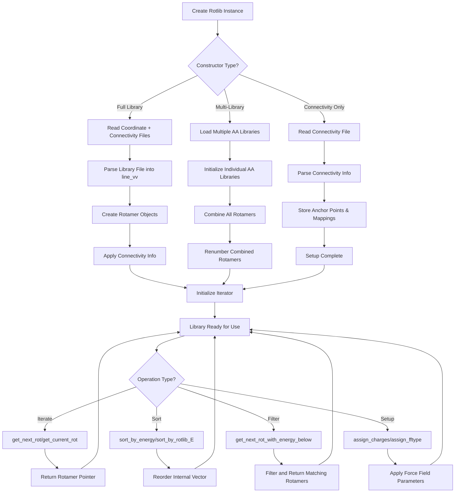

# `Rotlib.cpp` File Analysis

## File Purpose and Primary Role

This file implements the rotamer library system for the SCREAM molecular modeling software. It manages collections of protein side-chain rotamers (conformations) and provides functionality for loading, storing, and manipulating rotamer libraries. The file implements a hierarchical class system where `Rotlib` is the base class for general rotamer libraries, `AARotlib` handles amino acid-specific libraries, and specialized classes like `NtrlAARotlib`, `Multiple_NtrlAARotlib`, and `HIS_NtrlAARotlib` provide specific functionality for natural amino acids and histidine variants.

## Key Classes, Structs, and Functions (if any)

### Core Classes:

- **`Rotlib`**: Base class for rotamer libraries. Manages a vector of `Rotamer*` objects and provides basic iteration and sorting functionality.
- **`AARotlib`**: Inherits from `Rotlib`, specialized for amino acid rotamers with `AARotamer*` objects.
- **`NtrlAARotlib`**: Natural amino acid rotamer library that reads standard rotamer library files and connectivity information.
- **`Multiple_NtrlAARotlib`**: Combines multiple amino acid libraries into a single library for mutant design applications.
- **`HIS_NtrlAARotlib`**: Specialized library for histidine rotamers handling both HSD and HSE protonation states.

### Key Member Functions:

- **`readConnectivityFile()`**: Reads connectivity information from `.cnn` files
- **`populate_line_vv()`**: Parses rotamer library files into internal data structures
- **`store_connectivity_info()`**: Processes connectivity file data into internal maps
- **`sort_by_empty_lattice_E()`**: Sorts rotamers by energy values
- **`get_next_rot()`**: Iterator-style access to rotamers
- **`setup_library()`**: Initializes library with force field parameters and charges

## Inputs

### Data Structures/Objects:

- **`vector<vector<string>> line_vv`**: Raw file content parsed into lines
- **`RotConnInfo rotConnInfo`**: Connectivity and mapping information structure
- **`Rotamer*` objects**: Individual rotamer conformations
- **String parameters**: File paths, amino acid codes, force field scheme names

### File-Based Inputs:

- **`.lib files`**: Rotamer library files containing atomic coordinates and metadata (e.g., "A_30.lib" for alanine at 30° resolution)
- **`.cnn files`**: Connectivity files defining atomic bonds and mappings (e.g., "A.cnn" for alanine)
- **Coordinate files**: Referenced within connectivity files for atomic position data

### Environment Variables:

- **`SCREAM_NEW_CNN`**: Path to connectivity files directory (must be set or program exits)

### Parameters/Configuration:

- **`resolution`**: Angular resolution for rotamer libraries (e.g., 30, 60 degrees)
- **`CUTOFF_E`**: Energy cutoff values for filtering rotamers
- **`scheme`**: Force field scheme (e.g., "CHARM22") for charge assignment
- **Amino acid selection**: Vector of single-letter amino acid codes for multi-library construction

## Outputs

### Data Structures/Objects:

- **`vector<Rotamer*> rot_v`**: Populated vector of rotamer objects
- **`RotConnInfo` structures**: Processed connectivity and mapping information
- **Sorted rotamer collections**: Libraries sorted by various energy criteria
- **Iterator positions**: Current position tracking for library traversal

### File-Based Outputs:

- **Library files**: Via `append_to_filehandle()` method for writing processed libraries
- **No direct file output**: Most output is through member function calls on contained objects

### Console Output (stdout/stderr):

- **Progress messages**: "loading rotamer library...", "Done with reading ConnectivityFile"
- **Debug information**: Rotamer counts, energy values, processing status
- **Error messages**: File opening failures, missing environment variables, validation errors
- **Status updates**: Library setup completion, connectivity processing

### Side Effects:

- **Memory allocation**: Creates and manages `Rotamer*` objects with explicit new/delete
- **Global state modification**: Modifies rotamer objects' internal connectivity and energy states
- **Iterator state changes**: Advances internal iterators affecting subsequent calls

## External Code Dependencies

### Standard C++ Library:

- **`<iostream>`**: Console I/O operations
- **`<iomanip>`**: Output formatting
- **`<fstream>`**: File I/O operations
- **`<vector>`**: Dynamic arrays for rotamer storage
- **`<algorithm>`**: Sorting and searching algorithms
- **`<string>`**: String manipulation
- **`<cassert>`**: Assertion macros for debugging
- **`<map>`**: Associative containers for connectivity mapping

### Internal SCREAM Project Headers:

- **`defs.hpp`**: Project-wide definitions and constants
- **`scream_atom.hpp`**: Atomic structure definitions
- **`Rotamer.hpp`**: Base rotamer class definition
- **`AARotamer.hpp`**: Amino acid specific rotamer implementation
- **`RotamerCluster.hpp`**: Rotamer clustering functionality
- **`sc_BackBone.hpp`**: Backbone structure handling
- **`sc_AABackBone.hpp`**: Amino acid backbone specifics
- **`sc_SideChain.hpp`**: Side chain structure management
- **`sc_AASideChain.hpp`**: Amino acid side chain implementation
- **`scream_tools.hpp`**: Utility functions for parsing and manipulation
- **`Rotlib.hpp`**: Header file for this implementation
- **`scream_vector.hpp`**: Custom vector mathematics implementation

## Core Logic/Algorithm Flowchart

## Potential Areas for Modernization/Refactoring in SCREAM++

### 1. Memory Management and Smart Pointers

The code uses extensive manual memory management with raw pointers (`new`/`delete`) and manual tracking of ownership via `declaredInRotlibScope()` flags. This is error-prone and leads to complex destructor logic. Modern C++ should use:

- `std::unique_ptr<Rotamer>` or `std::shared_ptr<Rotamer>` for automatic memory management
- Container of smart pointers (`std::vector<std::unique_ptr<Rotamer>>`) instead of raw pointers
- RAII principles to eliminate manual memory tracking

### 2. File I/O and Error Handling

The file parsing code uses C-style file handling with manual buffer management and inconsistent error handling (mix of `exit()` calls and return values). Improvements should include:

- Modern C++ file streams with proper exception handling
- Replace `exit()` calls with proper exception throwing for recoverable errors
- Use of `std::filesystem` for path manipulation and file existence checking
- Structured error types instead of generic error codes

### 3. String Processing and Data Parsing

The code relies heavily on custom string splitting and parsing logic with C-style character arrays. Modern alternatives include:

- Use of `std::string_view` for efficient string processing without copies
- Regular expressions (`std::regex`) for complex parsing patterns
- Structured parsing with proper validation and error reporting
- Replace custom `scream_tools::split()` with standard library alternatives or modern parsing libraries
