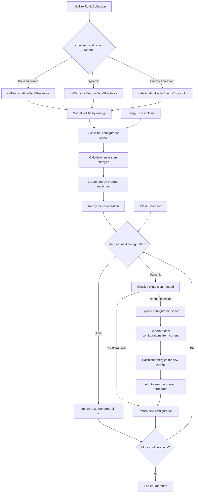

# `RotlibCollection.cpp` File Analysis

## File Purpose and Primary Role

The `RotlibCollection.cpp` file implements a central management system for rotamer libraries in the SCREAM protein side-chain placement software. Its primary role is to:

- **Manage multiple rotamer libraries**: Store and organize collections of rotamer libraries for different amino acid types and positions
- **Energy-based enumeration**: Provide systematic enumeration of rotamer configurations ordered by empty lattice energy (single residue energies)
- **Dynamic memory management**: Implement efficient memory allocation strategies for exploring large combinatorial spaces of rotamer configurations
- **Clash detection integration**: Interface with clash detection systems to filter out sterically infeasible rotamer combinations
- **Energy threshold filtering**: Support energy-based filtering to limit the search space to energetically reasonable configurations

This class serves as the core engine for the combinatorial optimization aspect of protein side-chain placement, managing the exploration of rotamer configuration space in an energy-guided manner.

## Key Classes, Structs, and Functions (if any)

### Primary Class

- **`RotlibCollection`**: Main class managing collections of rotamer libraries and their systematic enumeration

### Key Public Methods

- **`addRotlib(string mutInfo, Rotlib* rotlib)`**: Adds a rotamer library for a specific mutation/position
- **`initEmptyLatticeDataStructures()`**: Initializes data structures for pre-enumerated empty lattice calculations
- **`initDynamicMemoryDataStructures()`**: Initializes dynamic memory allocation scheme for large systems
- **`initAllocationUnderEnergyThreshold(double thresholdE)`**: Initializes energy-threshold-based allocation
- **`getNextRotamersByELEnergy()`**: Returns next rotamer configuration ordered by empty lattice energy
- **`getNextEmptyLatticeExcitationRotamers()`**: Gets next configuration from pre-enumerated list
- **`getNextDynamicMemoryRotamers_And_Expand()`**: Dynamic expansion-based configuration retrieval
- **`setExcitationEnergy()`/`getExcitationEnergy()`**: Manages total energy storage for configurations

### Key Private Helper Methods

- **`_sortAllRotlibByEmptyLatticeEnergy()`**: Sorts all rotamer libraries by single-residue energies
- **`_calcEmptyLatticeLinearSumEnergy()`**: Calculates linear sum of individual residue energies
- **`_expandDynamicMemory()`**: Expands configuration space dynamically
- **`_buildAllUnderThresholdConfigs()`**: Builds all configurations under energy threshold

### Key Type Definitions (from headers)

- **`ExcitationEnumeration`**: Maps mutation info (string) to rotamer rank
- **`ExcitationEnumeration_n`**: Maps mutation info (numeric) to rotamer rank
- **`ExcitedRotamers`**: Maps mutation info (string) to rotamer pointers
- **`ExcitedRotamers_n`**: Maps mutation info (numeric) to rotamer pointers

## Inputs

### Data Structures/Objects

- **`Rotlib*`**: Individual rotamer library objects containing rotamers for specific amino acid types
- **`ClashCollection*`**: Clash detection system for filtering sterically infeasible configurations
- **`ExcitationEnumeration`**: Rotamer configuration specifications (rank-based representation)
- **`ExcitedRotamers`**: Rotamer configuration specifications (pointer-based representation)

### Parameters/Configuration

- **`HIGHEST_ALLOWED_ROTAMER_E`**: Energy cutoff for rotamer inclusion (default 350 kcal/mol)
- **Energy thresholds**: User-specified energy limits for configuration enumeration
- **Mutation information strings**: Position/residue type identifiers for rotamer libraries

### File-Based Inputs

- **Rotamer library files**: Indirectly through `Rotlib` objects (not directly read by this class)
- **Clash definition files**: Indirectly through `ClashCollection` objects

### Environment Variables

- None directly used in this file

## Outputs

### Data Structures/Objects

- **`ExcitedRotamers`**: Complete rotamer configurations ready for energy evaluation
- **`ExcitationEnumeration`**: Rank-based representations of rotamer configurations
- **Internal mapping structures**: `_mutInfo_mapping` and `_mutInfo_inverse_mapping` for string/numeric conversions

### File-Based Outputs

- None directly produced by this file

### Console Output (stdout/stderr)

- **Initialization progress**: Status messages during data structure setup
- **Configuration counts**: Total number of enumerated configurations
- **Timing information**: Performance metrics for various operations
- **Clash elimination reports**: Number of configurations rejected due to clashes
- **Debug information**: Detailed progress for dynamic memory expansion
- **Error messages**: Duplicate library additions, boundary conditions

### Side Effects

- **Modifies internal state**: Updates enumeration position counters and data structures
- **Expands memory usage**: Dynamic allocation of new configuration lists
- **Updates clash collection**: Stores current rotamer configurations in clash detection system

## External Code Dependencies

### Standard C++ Library

- **`<cmath>`**: Mathematical functions for energy calculations
- **`<cassert>`**: Debug assertions for runtime checking
- **`<algorithm>`**: STL algorithms for container operations
- **`<time.h>`**: Timing functions for performance measurement
- **`<iostream>`**: Console I/O operations
- **`<map>`**: Associative containers for mappings
- **`<set>`**: Set containers for unique collections
- **`<vector>`**: Dynamic arrays
- **`<string>`**: String handling

### Internal SCREAM Project Headers

- **`"RotlibCollection.hpp"`**: Class declaration and type definitions
- **Implied dependencies** (through header):
  - `Rotlib` class definitions
  - `ClashCollection` class definitions
  - `Rotamer` class definitions
  - Type definitions for `ExcitationEnumeration`, `ExcitedRotamers`, etc.

### External Compiled Libraries

- None identified in this file

## Core Logic/Algorithm Flowchart

## Potential Areas for Modernization/Refactoring in SCREAM++

### 1. **Memory Management and Smart Pointers**

The current code uses raw pointers extensively (`Rotlib*`, `ClashCollection*`) and manual memory management. Modern C++ should use:

- `std::unique_ptr<Rotlib>` or `std::shared_ptr<Rotlib>` for automatic memory management
- RAII principles to ensure proper cleanup
- Container of smart pointers instead of raw pointer containers

### 2. **Type Safety and Modern Container Usage**

The code uses parallel mapping systems (`_mutInfo_mapping`, `_mutInfo_inverse_mapping`) and mixed string/numeric keys:

- Replace with `std::unordered_map` for better performance
- Use strong typing with `enum class` or custom types instead of raw strings/integers for mutation info
- Implement bidirectional mapping with modern C++ containers or boost::bimap
- Replace C-style arrays and manual iteration with range-based for loops

### 3. **Algorithm Design and Error Handling**

Current design has complex state management and limited error handling:

- Implement iterator-based design pattern for configuration enumeration
- Use exceptions or `std::optional`/`std::expected` for error handling instead of magic values
- Separate concerns: split enumeration strategy from storage management
- Use strategy pattern for different initialization methods instead of method selection strings
- Implement proper const-correctness throughout the API
