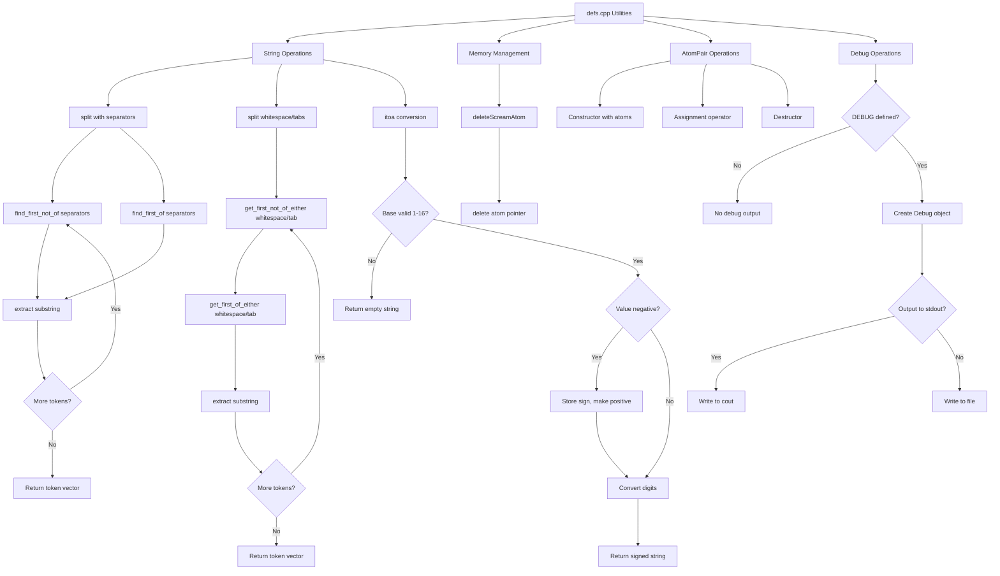

# `defs.cpp` File Analysis

## File Purpose and Primary Role

This file serves as a **utility and helper functions module** within the SCREAM project. It provides fundamental supporting functionality including:

- Memory management utilities for SCREAM_ATOM objects
- String manipulation and parsing functions (splitting strings by delimiters)
- Number-to-string conversion utilities
- A simple AtomPair class for storing pairs of atoms
- Debug output functionality (conditionally compiled)
- Basic I/O helper functions

The file acts as a foundational layer providing common operations needed throughout the SCREAM molecular modeling software.

## Key Classes, Structs, and Functions (if any)

### Classes:

- **`AtomPair`**: A simple container class that holds two `SCREAM_ATOM*` pointers, representing a pair of atoms with basic constructor, destructor, and assignment operator functionality.
- **`Debug`** (conditionally compiled): A debug output class that provides categorized logging functionality with file or stdout output options.

### Key Functions:

- **`deleteScreamAtom(SCREAM_ATOM* atom)`**: Memory cleanup function for SCREAM_ATOM objects
- **`split(const std::string& text, const std::string& separators, std::vector<std::string>& words)`**: String tokenization function using custom separators
- **`split(const std::string& text, std::vector<std::string>& words)`**: Overloaded version for splitting on whitespace and tabs
- **`itoa(int value, unsigned int base)`**: Integer-to-string conversion with custom base support
- **`get_first_of_either()`** and **`get_first_not_of_either()`**: Helper functions for string parsing with multiple separator types
- **`print(string str)`** and **`dump(SCREAM_ATOM* atom)`**: Simple output utilities

## Inputs

### Data Structures/Objects:

- **`SCREAM_ATOM*`**: Pointers to atom objects for memory management and output operations
- **`std::string`**: Text data for parsing and conversion operations
- **`std::vector<std::string>`**: Collections of strings for parsing operations and separator definitions
- **`int`** and **`unsigned int`**: Numeric values for string conversion

### File-Based Inputs:

- No direct file reading is performed in this file. The Debug class can write to files but doesn't read from them.

### Environment Variables:

- No direct environment variable usage detected in this file.

### Parameters/Configuration:

- **Base parameter** for `itoa()` function (supports bases 1-16)
- **Separator strings** for the split functions
- **Debug category strings** for the Debug class
- **Output filenames** for debug output (can be "stdout" for console output)

## Outputs

### Data Structures/Objects:

- **`std::vector<std::string>`**: Populated with tokenized strings from split operations
- **`std::string`**: Converted numeric values from `itoa()` function
- **`AtomPair`** objects: Created and managed atom pair instances

### File-Based Outputs:

- **Debug log files**: When Debug class is used with a filename other than "stdout", creates text files with categorized debug output

### Console Output (stdout/stderr):

- **String output**: Via `print()` function
- **Atom information**: Via `dump()` function (delegates to SCREAM_ATOM's dump method)
- **Debug messages**: When Debug class uses "stdout" as output target

### Side Effects:

- **Memory deallocation**: `deleteScreamAtom()` deletes SCREAM_ATOM objects
- **Vector modification**: Split functions modify input vectors by reference to populate them with parsed tokens

## External Code Dependencies (Libraries/Headers)

### Standard C++ Library:

- **`<string>`**: For std::string operations
- **`<vector>`**: For std::vector containers and allocators
- **`<iostream>`**: For cout and output stream operations
- **`<fstream>`**: For ofstream file output in Debug class
- **`<string.h>`**: For C-style string operations (strcpy)

### Internal SCREAM Project Headers:

- **`"defs.hpp"`**: Header file containing declarations for this implementation
- **`"scream_atom.hpp"`**: Header for SCREAM_ATOM class definition

### External Compiled Libraries:

- None detected - uses only standard C++ library components

## Core Logic/Algorithm Flowchart (Mermaid JS Format)

## Potential Areas for Modernization/Refactoring in SCREAM++

### 1. **Replace Raw Pointers with Smart Pointers**

- The `AtomPair` class and `deleteScreamAtom()` function use raw pointers which can lead to memory leaks and dangling pointer issues
- **Modernization**: Use `std::shared_ptr<SCREAM_ATOM>` or `std::unique_ptr<SCREAM_ATOM>` for automatic memory management
- Replace manual `delete` calls with RAII principles

### 2. **Utilize Modern C++ String and Container Features**

- The custom string splitting functions reinvent functionality available in modern C++
- **Modernization**: Replace with `std::string_view`, `std::ranges` (C++20), or established libraries like Boost.Algorithm
- Use `std::stringstream` or `std::to_string()` instead of custom `itoa()` implementation
- Consider `std::span` for the helper functions that work with multiple separators

### 3. **Improve Debug System with Modern Logging**

- The conditional compilation Debug class is primitive and uses C-style string handling
- **Modernization**: Replace with a proper logging framework (spdlog, fmt library, or custom modern logger)
- Use `std::string` instead of `char*` arrays and `strcpy()`
- Implement proper RAII for file handles and use `std::filesystem` for path operations
- Add log levels, thread safety, and structured logging capabilities
