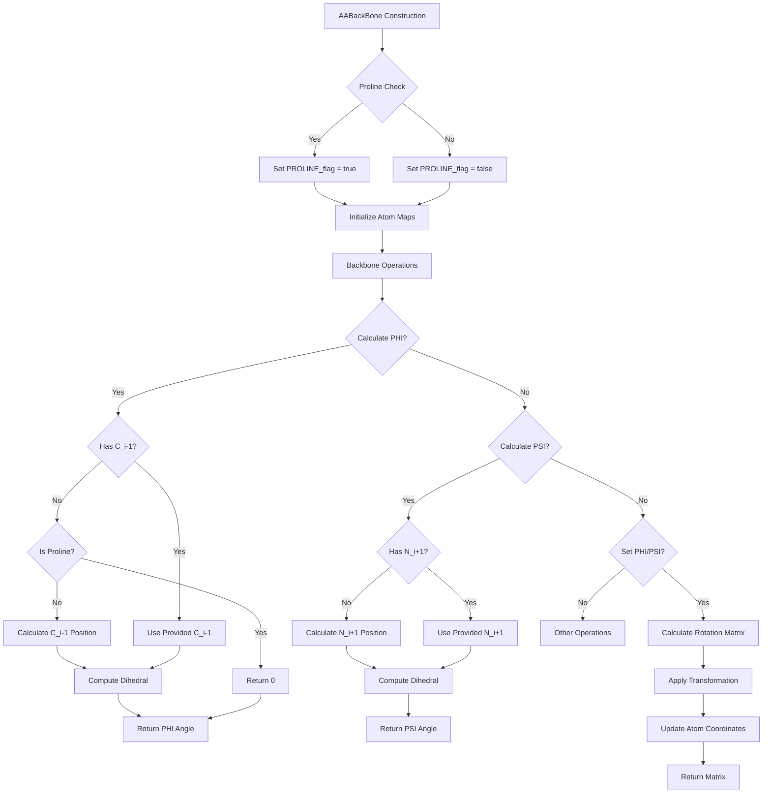

# `sc_AABackBone.cpp` File Analysis

## File Purpose and Primary Role

This file implements the `AABackBone` class, which represents the backbone structure of amino acid residues in protein modeling. It extends the base `BackBone` class to provide amino acid-specific functionality for manipulating and calculating properties of protein backbone atoms (N, CA, C, O, HN, HCA). The class is responsible for:

- Managing backbone atom positions and properties
- Calculating and setting phi/psi dihedral angles
- Handling proline-specific backbone behavior
- Providing atom accessor methods for backbone atoms
- Computing theoretical positions of missing neighboring residue atoms

## Key Classes, Structs, and Functions (if any)

### Classes:

- **`AABackBone`**: Main class representing an amino acid backbone structure
  - Inherits from `BackBone` class
  - Manages backbone atoms and their geometric relationships
  - Handles phi/psi angle calculations and modifications

### Key Member Functions:

- **Constructors**: Multiple constructors for different initialization scenarios
- **`PHI()` / `PHI(SCREAM_ATOM*)`**: Calculate phi dihedral angle
- **`PSI()` / `PSI(SCREAM_ATOM*)`**: Calculate psi dihedral angle
- **`set_PHI()` / `set_PSI()`**: Modify backbone geometry by setting dihedral angles
- **`calc_C_i_minus_one()`**: Calculate theoretical position of previous residue's C atom
- **`calc_N_i_plus_one()`**: Calculate theoretical position of next residue's N atom
- **Atom accessors**: `N()`, `CA()`, `C()`, `O()`, `HN()`, `HCA()` - return pointers to specific backbone atoms
- **`assign_atom_fftype()`**: Assign force field atom types
- **`init_atom_label_maps()`**: Initialize static mapping tables

### Static Data Members:

- **`atom_label_fftype_map`**: Maps atom labels to force field types
- **`atom_label_CHARM22_map`**: Maps atom labels to CHARMM22 partial charges

## Inputs

### Data Structures/Objects:

- **`SCREAM_ATOM*`**: Individual atom objects containing coordinates and properties
- **`vector<SCREAM_ATOM*>`**: Collections of atom pointers for backbone construction
- **`ScreamVector`**: Custom 3D vector objects for coordinate calculations
- **`ScreamMatrix`**: Custom matrix objects for rotational transformations

### File-Based Inputs:

- No direct file I/O operations in this file

### Environment Variables:

- No direct environment variable usage detected

### Parameters/Configuration:

- **`N_C_BOND_DIST`**: Hard-coded bond distance (1.32 Å) for N-C bonds
- **Force field parameters**: Stored in static maps for atom types and charges
- **Angle conversion factors**: π/180 for degree-to-radian conversions

## Outputs

### Data Structures/Objects:

- **Modified `SCREAM_ATOM` coordinates**: Functions modify atom positions in-place
- **`ScreamVector`**: Calculated 3D positions for theoretical atoms
- **`ScreamMatrix`**: Rotation matrices from angle-setting operations
- **`double`**: Calculated dihedral angles in degrees

### File-Based Outputs:

- No direct file output operations

### Console Output (stdout/stderr):

- **Warning messages**: Missing atom warnings to `cerr`
- **Error messages**: Exception details and missing atom notifications
- **Debug information**: Commented-out coordinate printing code

### Side Effects:

- **Atom coordinate modification**: `set_PHI()` and `set_PSI()` modify backbone atom positions
- **Static map initialization**: One-time initialization of class-wide mapping tables

## External Code Dependencies (Libraries/Headers)

### Standard C++ Library:

- `<vector>` - Dynamic arrays for atom collections
- `<map>` - Associative containers for atom mappings
- `<string>` - String handling for atom labels
- `<iostream>` - Console I/O operations
- `<sstream>` - String stream operations
- `<stdexcept>` - Exception handling

### Internal SCREAM Project Headers:

- `"sc_BackBone.hpp"` - Base backbone class definition
- `"sc_AABackBone.hpp"` - Header for this class
- `"scream_atom.hpp"` - Atom data structure definitions
- `"Rotlib.hpp"` - Rotamer library functionality
- `"scream_vector.hpp"` - Custom 3D vector class
- `"scream_tools.hpp"` - Utility functions (namespace scream_tools)

### External Compiled Libraries:

- None detected

## Core Logic/Algorithm Flowchart (Mermaid JS Format)

## Potential Areas for Modernization/Refactoring in SCREAM++

### 1. **Memory Management and Smart Pointers**

- Replace raw `SCREAM_ATOM*` pointers with `std::shared_ptr<SCREAM_ATOM>` or `std::unique_ptr<SCREAM_ATOM>`
- Eliminate manual `new`/`delete` operations (seen in `PHI()` method)
- Use RAII principles for automatic resource management

### 2. **Exception Handling and Error Management**

- Replace custom `AtomNotFoundException` with standard library exceptions
- Implement proper exception safety guarantees
- Replace magic return values (-999.999) with proper exception throwing
- Use `std::optional<double>` for functions that may fail to compute angles

### 3. **Modern C++ Language Features**

- Replace C-style arrays (`atom->x[0], x[1], x[2]`) with `std::array<double, 3>` or modern vector classes
- Use `constexpr` for compile-time constants (bond distances, conversion factors)
- Implement move semantics for constructors and assignment operators
- Use range-based for loops instead of iterator-based loops
- Replace hard-coded magic numbers with named constants or configuration parameters
