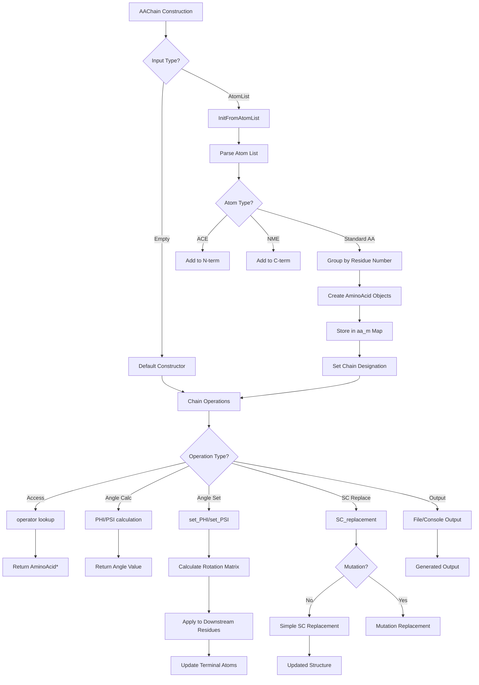

# `sc_AAChain.cpp` File Analysis

## File Purpose and Primary Role

The `AAChain` class represents a complete amino acid chain (protein backbone) within the SCREAM molecular modeling framework. It serves as a high-level container that manages a collection of `AminoAcid` objects arranged in sequence, along with optional N-terminal and C-terminal modifications. The class provides functionality for protein manipulation including:

- Construction of amino acid chains from atom lists
- Backbone dihedral angle (PHI/PSI) calculations and modifications
- Side-chain replacement and rotamer manipulation
- Structural transformations and geometric operations
- Output generation for various file formats (PDB, internal formats)

This is a core structural class that bridges individual amino acid management with higher-level protein operations.

## Key Classes, Structs, and Functions (if any)

### Primary Class: `AAChain`

- **Purpose**: Container and manager for a sequence of amino acids forming a protein chain
- **Key Data Members**:
  - `map<int, AminoAcid*> aa_m`: Maps residue numbers to AminoAcid pointers
  - `multimap<string, SCREAM_ATOM*> nterm_mm`: N-terminal modification atoms
  - `multimap<string, SCREAM_ATOM*> cterm_mm`: C-terminal modification atoms
  - `string chain_desig`: Chain identifier
  - `bool nterm_mm_on_free_store, cterm_mm_on_free_store`: Memory management flags

### Key Member Functions:

- **Constructors/Destructor**: Default, copy, atom list-based construction with proper cleanup
- **`InitFromAtomList()`**: Core initialization method that parses atom lists into structured amino acid sequence
- **`operator`**: Access individual amino acids by residue number
- **`PHI()/PSI()`**: Calculate backbone dihedral angles
- **`set_PHI()/set_PSI()`**: Modify backbone dihedral angles with coordinate propagation
- **`SC_replacement()`**: Replace side chains with new rotamers
- **`getAtomList()`**: Reconstruct complete atom list from internal structure
- **Output methods**: `print_Me()`, `pdb_append_to_filehandle()`, etc.

## Inputs

### Data Structures/Objects:

- **`ScreamAtomV`**: Vector of SCREAM_ATOM pointers for chain construction
- **`AARotamer*`**: Rotamer objects for side-chain replacement operations
- **`AminoAcid*`**: Individual amino acid objects for replacement operations
- **`vector<double>& CreateCBParameters`**: Parameters for CB atom creation during rotamer placement

### File-Based Inputs:

- **Indirect**: Does not directly read files, but processes atom data that was likely parsed from PDB or similar structure files by other components

### Environment Variables:

- **None directly used**: Environment variable dependencies would be inherited from included headers

### Parameters/Configuration:

- **Residue numbers**: Integer identifiers for amino acid positions
- **Dihedral angles**: PHI/PSI angle values in degrees/radians
- **Placement methods**: String identifiers for rotamer placement algorithms ("Default", etc.)
- **Chain identifiers**: Single character chain designators

## Outputs

### Data Structures/Objects:

- **`ScreamAtomV`**: Complete atom lists reconstructed from internal structure
- **`vector<int>`**: Lists of residue numbers present in the chain
- **`ScreamMatrix`**: Transformation matrices from dihedral angle modifications
- **Modified coordinates**: In-place coordinate updates for structural transformations

### File-Based Outputs:

- **PDB format**: Via `pdb_append_to_filehandle()` - standard PDB coordinate records
- **Internal format**: Via `append_to_filehandle()` - custom SCREAM format
- **Connection info**: Via `append_to_ostream_connect_info()` - bond connectivity data
- **Chi angle data**: Via `print_chi_angle_spread()` - side-chain dihedral angles

### Console Output (stdout/stderr):

- **Debug information**: Residue counts, chain designations, processing status
- **Error messages**: Missing residues, failed lookups with `exit(8)` calls
- **Warning messages**: Zero-atom chains, mutation notifications

### Side Effects:

- **Memory management**: Creates/deletes AminoAcid objects and SCREAM_ATOM structures
- **Coordinate modification**: Direct manipulation of atom coordinates during transformations
- **Global atom numbering**: Modifies atom coordinate arrays in-place

## External Code Dependencies (Libraries/Headers)

### Standard C++ Library:

- **`<cassert>`**: Assertion macros for debugging
- **`<map>`**: STL map containers for residue storage
- **`<iostream>`**: Stream I/O operations
- **`<cstdlib>`**: Standard library utilities (exit functions)

### Internal SCREAM Project Headers:

- **`"defs.hpp"`**: Core definitions and constants
- **`"scream_atom.hpp"`**: SCREAM_ATOM structure and ScreamAtomV typedef
- **`"sc_ProteinComponent.hpp"`**: Base protein component functionality
- **`"sc_AminoAcid.hpp"`**: Individual amino acid management
- **`"scream_tools.hpp"`**: Utility functions (three_letter_AA conversion)
- **`"sc_AAChain.hpp"`**: Class declaration header

### External Compiled Libraries:

- **None**: Uses only standard C++ library and internal SCREAM components

## Core Logic/Algorithm Flowchart (Mermaid JS Format)

## Potential Areas for Modernization/Refactoring in SCREAM++

### 1. **Memory Management and Smart Pointers**

- **Current Issues**: Extensive use of raw pointers with manual `new`/`delete`, potential for memory leaks, complex ownership semantics
- **Modernization**: Replace raw pointers with `std::unique_ptr<AminoAcid>` and `std::shared_ptr<SCREAM_ATOM>`, use RAII principles, eliminate manual memory management
- **Benefits**: Automatic cleanup, exception safety, clearer ownership semantics

### 2. **Container Modernization and API Design**

- **Current Issues**: Heavy reliance on `std::map` with integer keys, manual iterator loops, C-style error handling with `exit()` calls
- **Modernization**: Use range-based for loops, consider `std::vector` with contiguous residue numbering, replace `exit()` with exception handling, add `const`-correctness
- **Benefits**: Better performance, safer error handling, more maintainable code, better integration with modern C++ practices

### 3. **Separation of Concerns and Class Responsibilities**

- **Current Issues**: `AAChain` handles too many responsibilities (I/O, coordinate transformation, memory management, data access), large monolithic methods
- **Modernization**: Split into separate classes (e.g., `ChainBuilder`, `ChainIO`, `ChainGeometry`), use strategy pattern for different output formats, implement visitor pattern for operations
- **Benefits**: Single responsibility principle, easier testing, better extensibility, clearer interfaces
