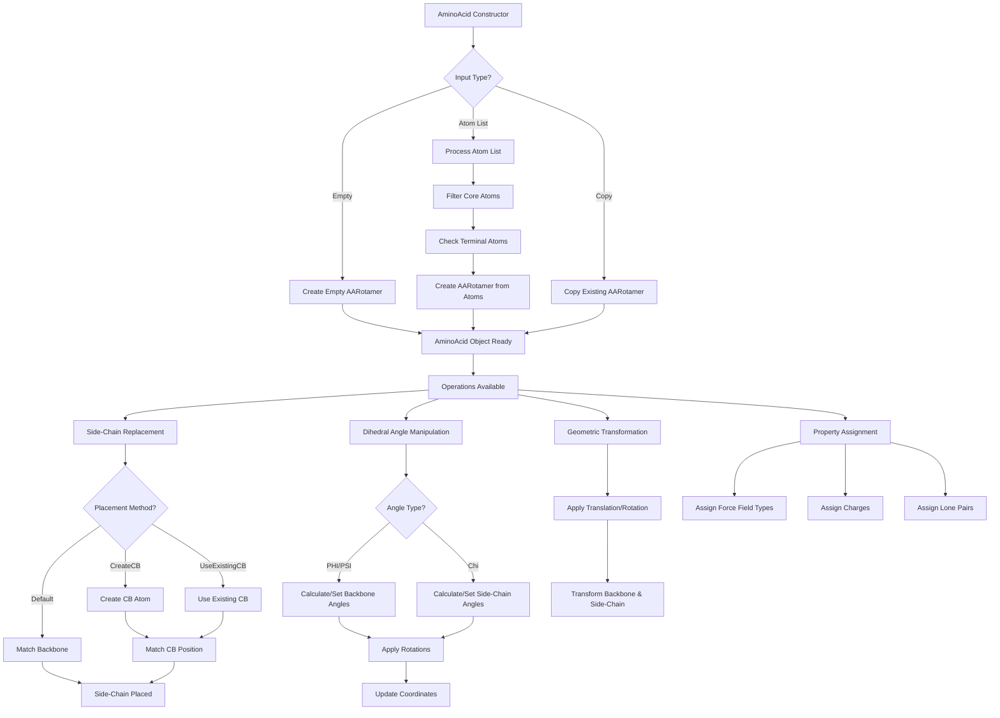

# `sc_AminoAcid.cpp` File Analysis

## File Purpose and Primary Role

This file implements the `AminoAcid` class, which serves as a high-level representation of amino acid residues in the SCREAM molecular modeling software. The class acts as a container and interface for managing both the backbone and side-chain components of amino acids, providing functionality for geometric manipulation (rotations, translations), energy calculations, and structural modifications. It essentially wraps an `AARotamer` object and provides amino acid-specific operations like dihedral angle calculations (PHI, PSI, chi angles) and side-chain replacement operations.

## Key Classes, Structs, and Functions (if any)

### Classes:

- **`AminoAcid`**: The primary class that represents a complete amino acid residue
  - Manages backbone and side-chain components through an `AARotamer` pointer
  - Provides constructors for various initialization scenarios (empty, from atom lists, copy operations)
  - Implements geometric transformations and dihedral angle manipulations

### Key Member Functions:

- **Constructors**: Multiple constructors for different initialization methods
- **`SC_replacement()`**: Performs side-chain replacement using different placement methods
- **Dihedral angle functions**: `PHI()`, `PSI()`, `set_PHI()`, `set_PSI()`, `chi1()-chi5()`
- **Atom access functions**: `get_N()`, `get_CA()`, `get_CB()`, `getAtomList()`
- **Geometric operations**: `translate()`, `transform()`
- **Output functions**: `print_Me()`, `pdb_append_to_filehandle()`

## Inputs

### Data Structures/Objects:

- **`ScreamAtomV`**: Vector of atom pointers used in constructor for building amino acid from atom list
- **`AABackBone`** and **`AASideChain`**: For constructor taking separate backbone and side-chain objects
- **`AARotamer*`**: Used in side-chain replacement operations
- **`AminoAcid*`**: Previous/next amino acid pointers for dihedral angle calculations
- **`ScreamVector`** and **`ScreamMatrix`**: For geometric transformations
- **`vector<double>`**: Parameters for CB creation and rotamer matching

### File-Based Inputs:

- No direct file I/O operations are performed in this implementation file
- File inputs are handled by underlying classes (`AARotamer`, `AABackBone`, `AASideChain`)

### Environment Variables:

- No direct environment variable usage detected in this file

### Parameters/Configuration:

- **`placementMethod`**: String parameter controlling side-chain placement strategy ("Default", "CreateCB", "UseExistingCB")
- **`CreateCBParameters`**: Vector of doubles for CB atom creation and rotamer matching
- **`scheme`**: String parameter for charge assignment method
- **`AA_STATE`**: Integer parameter for amino acid state in charge assignment

## Outputs

### Data Structures/Objects:

- **`ScreamAtomV`**: List of atoms from `getAtomList()`, `get_sc_atoms()`, `get_bb_atoms()`
- **`SCREAM_ATOM*`**: Individual atom pointers from getter functions
- **`ScreamMatrix`**: Rotation matrices returned by dihedral angle setting functions
- **`double`**: Dihedral angle values and total charge calculations

### File-Based Outputs:

- **PDB format output**: Via `pdb_append_to_filehandle()` method
- **Custom format output**: Via `append_to_filehandle()` method
- **Connection information**: Via `append_to_ostream_connect_info()` method

### Console Output (stdout/stderr):

- Debug information when `Debug` objects are active
- Atom and structure information via `print_Me()` and `print_ordered_by_n()` methods

### Side Effects:

- Modifies internal `AARotamer` object state
- Performs geometric transformations on backbone and side-chain components
- Updates atomic coordinates and properties

## External Code Dependencies (Libraries/Headers)

### Standard C++ Library:

- **`<iostream>`**: For I/O operations and stream handling
- **`<typeinfo>`**: For runtime type information
- **`<string>`**: String operations (implicitly used)
- **`<vector>`**: Vector containers (implicitly used)
- **`<map>`**: Map containers (implicitly used)

### Internal SCREAM Project Headers:

- **`defs.hpp`**: Core definitions and constants
- **`sc_AminoAcid.hpp`**: Header file for this implementation
- **`sc_BackBone.hpp`** and **`sc_AABackBone.hpp`**: Backbone representation classes
- **`sc_SideChain.hpp`** and **`sc_AASideChain.hpp`**: Side-chain representation classes
- **`Rotamer.hpp`** and **`AARotamer.hpp`**: Rotamer library classes
- **`scream_tools.hpp`**: Utility functions for string processing and atom identification
- **`scream_vector.hpp`** and **`scream_matrix.hpp`**: Custom vector and matrix classes

### External Compiled Libraries:

- None detected - uses only standard C++ library and internal SCREAM components

## Core Logic/Algorithm Flowchart (Mermaid JS Format)

## Potential Areas for Modernization/Refactoring in SCREAM++

### 1. **Memory Management with Smart Pointers**

The current implementation uses raw pointers and manual `new`/`delete` operations (e.g., `this->rot = new AARotamer()`). This should be replaced with smart pointers (`std::unique_ptr` or `std::shared_ptr`) to prevent memory leaks and improve exception safety. The destructor's manual `delete rot` could be eliminated with proper RAII.

### 2. **Modern C++ Container Usage and API Design**

The code uses custom container types like `ScreamAtomV` and relies heavily on `multimap<string, SCREAM_ATOM*>` for atom storage. This could be modernized with:

- Standard containers with proper type safety
- Range-based for loops instead of iterator-based loops
- `std::optional` for functions that may return null pointers (like `get_CB()`)
- Const-correctness improvements and better encapsulation

### 3. **Error Handling and Method Interfaces**

The current code has minimal error handling and uses unsafe patterns like returning raw pointers that may be null. Improvements could include:

- Exception-based error handling instead of returning null pointers
- Better validation of input parameters (e.g., checking for valid placement methods)
- More descriptive return types and method signatures
- Elimination of magic strings for placement methods in favor of enums or constants
