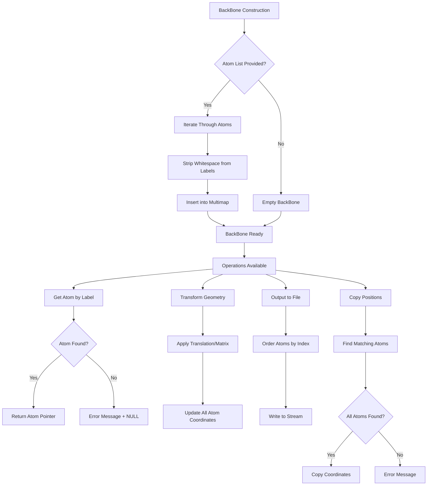

# `sc_BackBone.cpp` File Analysis

## File Purpose and Primary Role

This file implements the `BackBone` class, which represents and manages the backbone atoms of protein structures in the SCREAM molecular modeling software. The class serves as a container and manipulation interface for collections of backbone atoms, providing functionality for geometric transformations, file I/O operations, atom access, and structural analysis. It acts as an intermediate layer between individual atoms (`SCREAM_ATOM`) and higher-level protein structure representations.

## Key Classes, Structs, and Functions (if any)

### Primary Class:

- **`BackBone`**: The main class that manages collections of backbone atoms
  - Stores atoms in a `multimap<string, SCREAM_ATOM*>` indexed by atom labels
  - Provides geometric transformations (translation, rotation/transformation)
  - Handles file output in multiple formats
  - Manages atom access and manipulation

### Key Member Functions:

- **Constructors**: Default constructor and constructor from `ScreamAtomV` (vector of atom pointers)
- **`print_Me()`**: Debug output of all atoms in the backbone
- **`get(const string atom_l)`**: Retrieve specific atoms by label
- **`translate(const ScreamVector& V)`**: Apply translation transformation
- **`transform(const ScreamMatrix& M)`**: Apply matrix transformation (rotation/scaling)
- **`append_to_filehandle()`**: Write atoms to output stream
- **`pdb_append_to_filehandle()`**: Write atoms in PDB format
- **`copy_atom_positions()`**: Copy coordinates from another BackBone instance
- **`total_charge()`**: Calculate total charge of all atoms
- **`fix_toggle(bool value)`**: Set/unset fixation status for all atoms

## Inputs

### Data Structures/Objects:

- **`ScreamAtomV`**: Vector of `SCREAM_ATOM*` pointers (used in constructor)
- **`ScreamVector`**: 3D vector for translation operations
- **`ScreamMatrix`**: 3x3 matrix for geometric transformations
- **`BackBone*`**: Another BackBone instance for position copying
- **`string`**: Atom labels for atom retrieval
- **`ostream*`**: Output stream pointers for file writing

### File-Based Inputs:

- This file does not directly read from external data files
- Input atoms are typically loaded by other modules and passed to the constructor

### Environment Variables:

- No direct environment variable dependencies identified in this file

### Parameters/Configuration:

- Atom labels (strings) used for atom identification and retrieval
- Boolean flags for atom fixation status
- Geometric transformation parameters (vectors and matrices)

## Outputs

### Data Structures/Objects:

- **`SCREAM_ATOM*`**: Individual atom pointers returned by `get()` method
- **`vector<SCREAM_ATOM*>`**: Collection of all atoms returned by `get_atoms()`
- **`double`**: Total charge value from `total_charge()`
- **Modified atom coordinates**: Through transformation and copying operations

### File-Based Outputs:

- **Standard format output**: Via `append_to_filehandle()` method
- **PDB format output**: Via `pdb_append_to_filehandle()` method
- **Connection information**: Via `append_to_ostream_connect_info()` method

### Console Output (stdout/stderr):

- **Debug information**: Atom dumps via `print_Me()` and `print_ordered_by_n()`
- **Error messages**: When atoms cannot be found in `get()` and `copy_atom_positions()`
- **Diagnostic output**: Atom information during debugging operations

### Side Effects:

- Modifies atom coordinates through transformation operations
- Changes atom fixation status via `fix_toggle()`
- Updates atom positions through `copy_atom_positions()`

## External Code Dependencies (Libraries/Headers)

### Standard C++ Library:

- **`<vector>`**: For dynamic arrays and STL containers
- **`<map>`**: For ordered associative containers
- **`<string>`**: For string handling and manipulation
- **`<iostream>`**: For input/output stream operations
- **`<sstream>`**: For string stream operations

### Internal SCREAM Project Headers:

- **`sc_BackBone.hpp`**: Header file for the BackBone class declaration
- **`scream_atom.hpp`**: Defines `SCREAM_ATOM` structure and `ScreamAtomV` type
- **`Rotlib.hpp`**: Rotamer library definitions (included but may not be directly used)
- **`scream_vector.hpp`**: Custom 3D vector class (`ScreamVector`)
- **`scream_tools.hpp`**: Utility functions (specifically `strip_whitespace()`)

### External Compiled Libraries:

- No external third-party libraries identified

## Core Logic/Algorithm Flowchart (Mermaid JS Format)

## Potential Areas for Modernization/Refactoring in SCREAM++

### 1. **Smart Pointer Usage and Memory Safety**

The current implementation uses raw pointers (`SCREAM_ATOM*`) throughout, which poses risks for memory management and ownership clarity. Modern C++ should use `std::shared_ptr<SCREAM_ATOM>` or `std::unique_ptr<SCREAM_ATOM>` to provide automatic memory management and clear ownership semantics.

### 2. **Replace Raw Pointers with References and Modern Containers**

The frequent use of `ostream*` parameters should be replaced with `ostream&` references to eliminate null pointer risks. Additionally, the `multimap<string, SCREAM_ATOM*>` could be modernized to use smart pointers and potentially replaced with `std::unordered_map` for better performance if ordering by label is not critical.

### 3. **Enhanced Error Handling and Type Safety**

The current error handling relies on `cerr` output and returning `NULL` pointers, which is error-prone. Modern C++ should use exceptions (`std::runtime_error`) or `std::optional<>` return types for better error handling. Additionally, the string-based atom lookup could be replaced with type-safe enum classes or constexpr string constants to prevent typos and improve compile-time checking.
