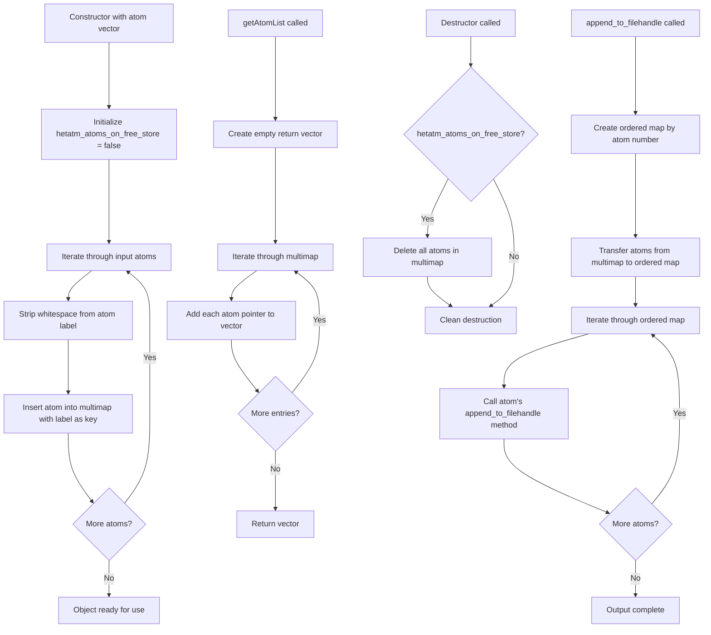

# `sc_Hetatm.cpp` File Analysis

## File Purpose and Primary Role

The `sc_Hetatm.cpp` file implements the `Hetatm` class, which represents and manages HETATM records in PDB (Protein Data Bank) files. HETATM records contain information about non-standard residues, ligands, water molecules, and other heteroatoms that are not part of the standard protein backbone. This class serves as a container for storing, organizing, and outputting these heteroatom structures within the SCREAM molecular modeling framework.

## Key Classes, Structs, and Functions (if any)

### Primary Class: `Hetatm`

- **Purpose**: Manages collections of heteroatoms using a multimap data structure
- **Key Methods**:
  - **Constructors**: Default constructor, constructor from atom vector, copy constructor
  - **`getAtomList()`**: Returns a vector of all stored SCREAM_ATOM pointers
  - **`print_Me()`**: Outputs heteroatom information to console
  - **`append_to_filehandle()`**: Writes ordered heteroatom data to an output stream
  - **`append_to_ostream_connect_info()`**: Outputs connectivity information for heteroatoms
  - **`copy()`**: Creates a copy of the Hetatm object (incomplete implementation)

## Inputs

### Data Structures/Objects:

- **`vector<SCREAM_ATOM*>`**: Vector of pointers to SCREAM_ATOM objects used in constructor
- **`SCREAM_ATOM*`**: Individual atom objects containing atomic data (coordinates, labels, etc.)
- **`ostream*`**: Output stream pointers for writing data

### File-Based Inputs:

- This file does not directly read from external data files. It processes atom data that has already been parsed from PDB files by other components.

### Environment Variables:

- No direct usage of environment variables detected in this file.

### Parameters/Configuration:

- **`hetatm_atoms_on_free_store`**: Boolean flag controlling memory management behavior
- **Atom labels**: String identifiers used as keys in the multimap for organizing atoms

## Outputs

### Data Structures/Objects:

- **`vector<SCREAM_ATOM*>`**: Returns collections of heteroatom pointers via `getAtomList()`
- **`ProteinComponent*`**: Returns a new Hetatm object through the `copy()` method
- **Modified multimap**: Internal `hetatm_mm` multimap storing organized heteroatom data

### File-Based Outputs:

- **PDB-format output**: Writes HETATM records to output streams in PDB format through `append_to_filehandle()`
- **Connectivity information**: Outputs CONECT records via `append_to_ostream_connect_info()`

### Console Output (stdout/stderr):

- **Heteroatom listings**: `print_Me()` outputs heteroatom information to standard output
- No error messages or debug output detected in this file

### Side Effects:

- **Memory management**: Destructor deletes dynamically allocated atoms if `hetatm_atoms_on_free_store` is true
- **Stream modification**: Appends data to provided output streams

## External Code Dependencies (Libraries/Headers)

### Standard C++ Library:

- **`<map>`**: For multimap and map containers
- **`<vector>`**: For vector containers
- **`<fstream>`**: For file stream operations
- **`<iostream>`**: For input/output stream operations
- **`<string>`**: For string operations

### Internal SCREAM Project Headers:

- **`sc_Hetatm.hpp`**: Header file for the Hetatm class
- **`scream_atom.hpp`**: Defines the SCREAM_ATOM structure
- **`scream_tools.hpp`**: Utility functions (uses `strip_whitespace()`)
- **`sc_ProteinComponent.hpp`**: Base class for protein components

### External Compiled Libraries:

- None detected - uses only standard C++ library components

## Core Logic/Algorithm Flowchart (Mermaid JS Format)

## Potential Areas for Modernization/Refactoring in SCREAM++

### 1. Memory Management with Smart Pointers

- **Issue**: Manual memory management using raw pointers and explicit `delete` calls in destructor
- **Solution**: Replace `SCREAM_ATOM*` with `std::unique_ptr<SCREAM_ATOM>` or `std::shared_ptr<SCREAM_ATOM>` to ensure automatic memory management and prevent memory leaks

### 2. Rule of Five Implementation

- **Issue**: Copy constructor is declared but not implemented, missing move semantics
- **Solution**: Properly implement copy constructor, copy assignment operator, move constructor, move assignment operator, and destructor following the Rule of Five for robust object lifecycle management

### 3. Container and Iterator Modernization

- **Issue**: Uses verbose iterator syntax and C++98-style loops
- **Solution**: Replace manual iterator loops with range-based for loops (C++11+), use `auto` keyword for type deduction, and consider using `std::unordered_multimap` for potentially better performance than `std::multimap`
