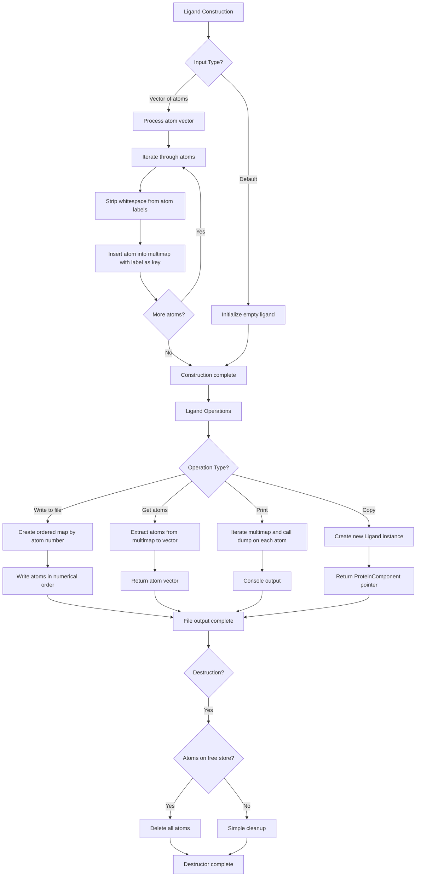

# `sc_Ligand.cpp` File Analysis

## File Purpose and Primary Role

The `sc_Ligand.cpp` file implements the `Ligand` class, which represents and manages ligand molecules (small molecules that bind to proteins) within the SCREAM molecular modeling software. The primary responsibility is to store, organize, and manipulate collections of atoms that make up ligand structures. It provides functionality for atom management, file I/O operations, and serves as a concrete implementation of the `ProteinComponent` interface for ligand-specific operations.

## Key Classes, Structs, and Functions (if any)

### Primary Class: `Ligand`

- **Purpose**: Represents a ligand molecule as a collection of atoms with associated metadata
- **Key Data Member**: `multimap<string, SCREAM_ATOM*> lig_mm` - stores atoms indexed by their labels
- **Memory Management Flag**: `ligand_atoms_on_free_store` - tracks whether atoms need manual deletion

### Key Member Functions:

- **Constructors**: Default constructor, vector-based constructor, copy constructor (incomplete)
- **`getAtomList()`**: Returns all atoms as a vector for external processing
- **`print_Me()`**: Outputs ligand structure to console for debugging
- **`append_to_filehandle()`**: Writes ligand atoms to output stream in ordered format
- **`append_to_ostream_connect_info()`**: Outputs connectivity information for atoms
- **`copy()`**: Creates a copy of the ligand (incomplete implementation)

## Inputs

### Data Structures/Objects:

- **`vector<SCREAM_ATOM*>`**: Primary input for ligand construction containing pointers to atom objects
- **`SCREAM_ATOM*`**: Individual atom objects with properties like `atomLabel`, `n` (atom number), and molecular data
- **`ostream*`**: Output stream pointers for file writing operations

### File-Based Inputs:

- **None directly**: This file does not directly read from external data files. It operates on pre-parsed atom data structures.

### Environment Variables:

- **None identified**: No direct usage of environment variables in this file.

### Parameters/Configuration:

- **Atom labeling scheme**: Uses `scream_tools::strip_whitespace()` to normalize atom labels
- **Memory management policy**: Controlled by `ligand_atoms_on_free_store` flag

## Outputs

### Data Structures/Objects:

- **`vector<SCREAM_ATOM*>`**: Returns collections of atom pointers via `getAtomList()`
- **`ProteinComponent*`**: Returns new Ligand instances through polymorphic `copy()` method
- **Modified atom ordering**: Creates `map<int, SCREAM_ATOM*>` for ordered output operations

### File-Based Outputs:

- **Molecular structure files**: Via `append_to_filehandle()` - writes atom coordinate and property data
- **Connectivity files**: Via `append_to_ostream_connect_info()` - outputs bond/connection information

### Console Output (stdout/stderr):

- **Debug information**: `print_Me()` calls `dump()` on each atom for diagnostic output
- **Atom properties**: Coordinates, labels, and molecular properties for each atom in the ligand

### Side Effects:

- **Memory management**: Destructor deletes atoms when `ligand_atoms_on_free_store` is true
- **Stream modification**: Appends data to provided output streams without closing them

## External Code Dependencies (Libraries/Headers)

### Standard C++ Library:

- **`<map>`**: For `multimap<string, SCREAM_ATOM*>` storage and ordered atom mapping
- **`<vector>`**: For atom collections and return values
- **`<fstream>`**: For file stream operations (though only `ostream` used directly)
- **`<iostream>`**: For standard I/O operations

### Internal SCREAM Project Headers:

- **`"sc_Ligand.hpp"`**: Class declaration and interface definition
- **`"scream_atom.hpp"`**: Defines `SCREAM_ATOM` structure/class
- **`"scream_tools.hpp"`**: Utility functions like `strip_whitespace()`
- **`"sc_ProteinComponent.hpp"`**: Base class interface for protein components

### External Compiled Libraries:

- **None identified**: Uses only standard C++ library components

## Core Logic/Algorithm Flowchart (Mermaid JS Format)

## Potential Areas for Modernization/Refactoring in SCREAM++

### 1. Memory Management Modernization

- **Replace raw pointers with smart pointers**: Use `std::shared_ptr<SCREAM_ATOM>` or `std::unique_ptr<SCREAM_ATOM>` to eliminate manual memory management and the `ligand_atoms_on_free_store` flag
- **RAII compliance**: Automatic memory management would prevent potential memory leaks and make the code exception-safe

### 2. STL Container and Algorithm Usage

- **Consider `std::unordered_multimap`** for potentially better performance with string keys
- **Use STL algorithms**: Replace manual loops with `std::for_each`, `std::transform`, and range-based for loops (C++11+)
- **Const-correctness improvements**: Many methods could benefit from better const-correctness and noexcept specifications

### 3. API Design and Error Handling

- **Complete copy constructor implementation**: The current copy constructor is empty, which could lead to shallow copying issues
- **Add proper error handling**: Functions like `append_to_filehandle()` should handle potential I/O errors
- **Move semantics**: Add move constructor and move assignment operator for efficiency with large ligand objects
- **Factory pattern**: Consider a factory class for ligand creation to handle different input formats more elegantly
