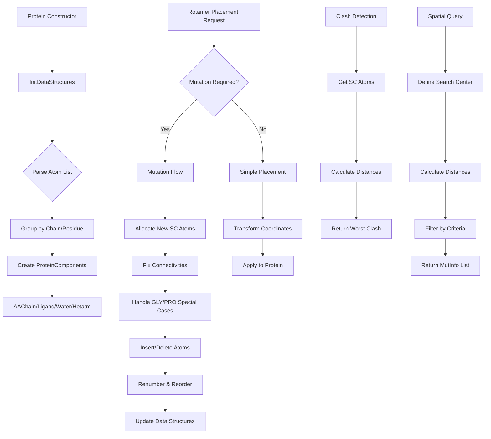

# `sc_Protein.cpp` File Analysis

## File Purpose and Primary Role

The `sc_Protein.cpp` file implements the core `Protein` class, which serves as the central molecular system container in the SCREAM project. This class manages complete protein structures, including amino acid chains, ligands, water molecules, and other molecular components. It provides functionality for protein manipulation, mutation operations, rotamer placement, clash detection, and coordinate analysis. The Protein class acts as the primary interface for molecular modeling operations, coordinating between different protein components and managing the overall molecular system state.

## Key Classes, Structs, and Functions (if any)

**Primary Class:**

- **`Protein`**: The main class managing complete protein molecular systems

**Key Public Methods:**

- **Constructor/Destructor**: `Protein(ScreamAtomV* atom_list)`, `~Protein()` - Initialize and cleanup protein structures
- **Component Access**: `get_AAChain()`, `get_Ligand()`, `operator` - Access protein components
- **Mutation Operations**: `ntrlRotamerPlacement()`, `mutation()`, `rotamerClusterPlacement()` - Perform mutations and rotamer placement
- **Conformer Operations**: `conformerPlacement()`, `conformerExtraction()` - Handle conformational changes
- **Analysis Methods**: `sc_clash()`, `sc_CRMS()`, `conformer_clash()` - Calculate clashes and coordinate comparisons
- **Structure Modification**: `addHydrogens()`, `addConnectivity()`, `assignFFType()` - Add structural information
- **Spatial Queries**: `residuesAroundAtom()`, `residuesAroundResidue()`, `residuesAroundChain()` - Find nearby residues
- **I/O Operations**: `print_Me()`, `append_to_filehandle()`, `pdb_append_to_filehandle()` - Output protein structures

**Key Private Helper Methods:**

- **Mutation Helpers**: `_mutationHelpers_*()` functions for managing complex mutation operations
- **Ordering Functions**: `_fix_entire_atom_list_ordering()`, `_fix_residue_in_atom_list_ordering()` - Maintain proper atom ordering
- **Memory Management**: Various helpers for allocation and deallocation during mutations

## Inputs

**Data Structures/Objects:**

- `ScreamAtomV*` - Vector of SCREAM_ATOM pointers representing the molecular system
- `AARotamer*` - Amino acid rotamer objects for placement operations
- `Rotamer*` - General rotamer/conformer objects
- `RotConnInfo*` - Connectivity information for rotamers
- `MutInfo` - Mutation information objects specifying residue positions and types
- `SCREAM_RTF*` - Residue topology file objects

**File-Based Inputs:**

- **RTF files**: Residue topology files (via `SCREAM_NEW_RTF` environment variable) containing atom types, bonds, and charges
- **Rotamer library files**: AA rotamer libraries (via `SCREAM_NEW_OLDLIB` environment variable) in `.lib` format

**Environment Variables:**

- `SCREAM_NEW_RTF` - Path to SCREAM residue topology file
- `SCREAM_NEW_OLDLIB` - Path to rotamer library directory

**Parameters/Configuration:**

- `placementMethod` - String specifying rotamer placement method (default: "Default")
- `CreateCBParameters` - Vector of 4 doubles for CB atom creation parameters
- Distance thresholds for clash detection and spatial queries
- Chain designations and residue position numbers for targeting operations

## Outputs

**Data Structures/Objects:**

- Modified `Protein` object with updated atomic coordinates and connectivity
- `ScreamAtomV` - Vectors of atoms for various queries (sidechain atoms, nearby residues)
- `vector<MutInfo>` - Lists of residues meeting spatial criteria
- `AARotamer*` - Extracted rotamer objects
- Energy values (double) for clash detection and strain energy calculations

**File-Based Outputs:**

- Protein structure output via `append_to_filehandle()` (BGF format)
- PDB format output via `pdb_append_to_filehandle()`

**Console Output (stdout/stderr):**

- Protein initialization messages ("Total atoms in this system: X")
- Component creation messages ("New SCREAM Chain Initialized...")
- Mutation notifications ("CYS ==> ALA Mutation!")
- Debug information when DEBUG flag is enabled
- Hydrogen addition progress ("Hydrogens added: X")
- Error messages for missing chains/residues

**Side Effects:**

- Modifies atomic coordinates during rotamer placement and mutations
- Updates connectivity information between atoms
- Adds/removes atoms during mutations (especially for GLY/PRO special cases)
- Modifies residue names and atom properties
- Updates internal mapping structures for tracking mutations

## External Code Dependencies (Libraries/Headers)

**Standard C++ Library:**

- `<vector>`, `<map>`, `<set>` - STL containers
- `<string>` - String manipulation
- `<iostream>`, `<fstream>` - I/O operations
- `<cassert>` - Assertions
- `<algorithm>` - STL algorithms (sort, find, etc.)
- `<stdexcept>` - Exception handling
- `<stdlib.h>` - C standard library functions

**Internal SCREAM Project Headers:**

- `"defs.hpp"` - Basic definitions
- `"sc_bgf_handler.hpp"` - BGF file handling
- `"scream_vector.hpp"`, `"scream_matrix.hpp"` - Custom vector/matrix classes
- `"sc_Protein.hpp"` - Protein class header
- `"sc_ProteinComponent.hpp"` - Base protein component class
- `"scream_atom.hpp"` - SCREAM_ATOM class
- `"sc_AAChain.hpp"`, `"sc_Ligand.hpp"`, `"sc_Water.hpp"`, `"sc_Hetatm.hpp"` - Component classes
- `"scream_tools.hpp"` - Utility functions
- `"sc_SideChain.hpp"` - Sidechain management
- `"Rotamer.hpp"`, `"AARotamer.hpp"`, `"Rotlib.hpp"` - Rotamer handling
- `"scream_rtf.hpp"` - RTF file parsing

## Core Logic/Algorithm Flowchart (Mermaid JS Format)

## Potential Areas for Modernization/Refactoring in SCREAM++

1. **Memory Management Modernization**: The code extensively uses raw pointers and manual `new`/`delete` operations, particularly in mutation operations. Modern C++ should use `std::unique_ptr` and `std::shared_ptr` for automatic memory management. The complex mutation helper functions that manually track memory allocation/deallocation could be significantly simplified with RAII principles.

2. **Container and Algorithm Modernization**: Replace custom atom vectors (`ScreamAtomV`) with standard containers and leverage modern STL algorithms. The manual sorting and searching operations (e.g., `_fix_entire_atom_list_ordering()`) could use range-based for loops, `std::ranges` algorithms, and structured bindings for clearer, more efficient code.

3. **Error Handling and API Design**: The current code uses `exit(2)` calls and basic error messages for error handling. A modern design should use exceptions or `std::expected`/`std::optional` return types. The large monolithic class could be decomposed into smaller, more focused classes following SOLID principles, with clearer separation between mutation operations, spatial queries, and I/O operations.
