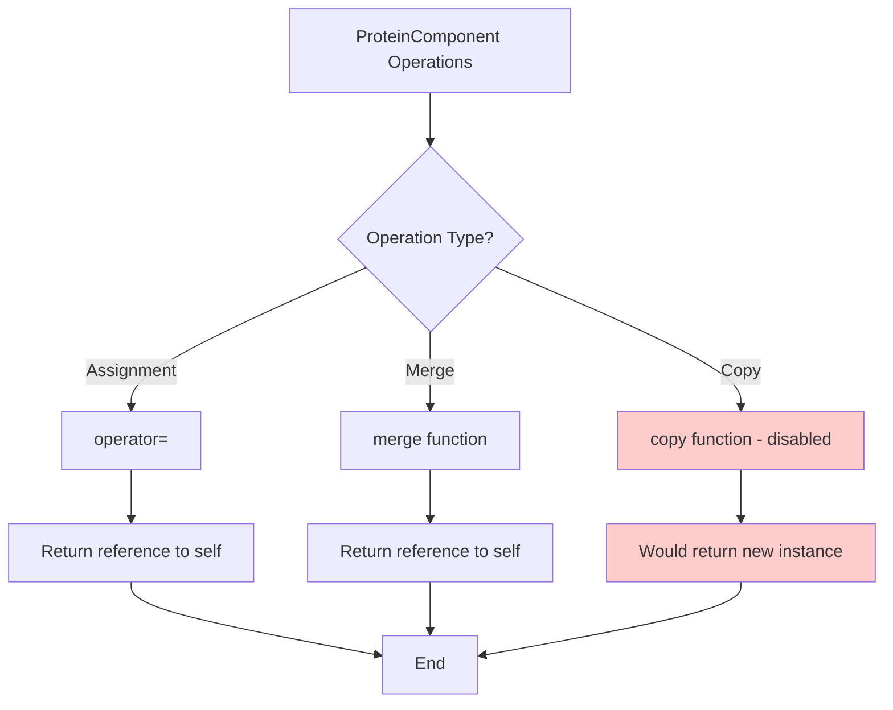

# `sc_ProteinComponent.cpp` File Analysis

## File Purpose and Primary Role

This file contains the implementation of the `ProteinComponent` class for the SCREAM molecular modeling software. Based on the limited implementation present, this appears to be a base class or interface designed to represent components of protein structures (likely amino acid residues, side chains, or other protein subunits). The class provides fundamental operations for copying, assignment, and merging protein components, which are essential for molecular modeling operations like side-chain placement and protein manipulation.

## Key Classes, Structs, and Functions (if any)

- **`ProteinComponent` class**: The primary class implemented in this file
  - `operator=`: Assignment operator for copying one ProteinComponent to another
  - `merge`: Method for combining/merging two ProteinComponent instances
  - `copy` (commented out): Copy method that would create a new instance (currently disabled)

Note: The actual class declaration is not visible in this implementation file - it would be defined in the corresponding header file `sc_ProteinComponent.hpp`.

## Inputs

- **Data Structures/Objects**:
  - `const ProteinComponent&` - Input for the assignment operator
  - `ProteinComponent&` - Input for the merge function
- **File-Based Inputs**: None directly observed in this implementation file
- **Environment Variables**: None directly observed in this implementation file
- **Parameters/Configuration**: None directly observed in this implementation file

## Outputs

- **Data Structures/Objects**:
  - `ProteinComponent&` - Returns reference to modified object from both `operator=` and `merge` methods
- **File-Based Outputs**: None observed in this implementation file
- **Console Output (stdout/stderr)**: None observed in this implementation file
- **Side Effects**:
  - The assignment operator and merge function modify the current object's state (though current implementations are minimal/placeholder)

## External Code Dependencies (Libraries/Headers)

- **Standard C++ Library**: None explicitly included in this implementation file
- **Internal SCREAM Project Headers**:
  - `sc_ProteinComponent.hpp` - The corresponding header file for this class
- **External Compiled Libraries**: None observed

## Core Logic/Algorithm Flowchart (Mermaid JS Format)

## Potential Areas for Modernization/Refactoring in SCREAM++

1. **Implement Proper Copy Semantics**: The current implementation has placeholder methods that don't actually perform any operations. Modern C++ should implement:

   - Proper copy constructor and copy assignment operator following the Rule of Five
   - Move semantics (move constructor and move assignment operator)
   - Consider using `= default` or `= delete` where appropriate

2. **Add Const-Correctness and Better Interface Design**:

   - The `merge` function takes a non-const reference but may not need to modify the input
   - Consider making the copy method `const` and returning by value or smart pointer
   - Add proper documentation and preconditions/postconditions

3. **Implement RAII and Smart Pointer Usage**:
   - If the class manages resources, replace any raw pointers with smart pointers (`std::unique_ptr`, `std::shared_ptr`)
   - Ensure proper exception safety in all operations
   - Consider using standard library containers and algorithms where appropriate instead of manual memory management

Note: The current implementation appears to be in a very early or placeholder state, with methods that don't perform meaningful operations beyond returning references to self.
