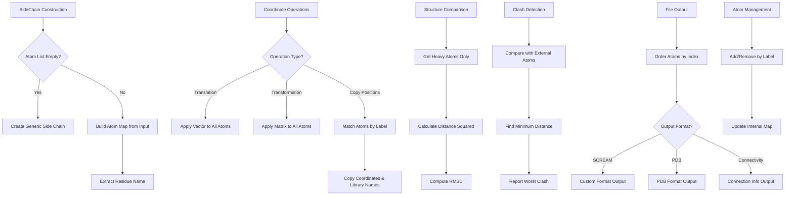

# `sc_SideChain.cpp` File Analysis

## File Purpose and Primary Role

This file implements the `SideChain` class, which is a core component of the SCREAM molecular modeling software responsible for representing and manipulating protein side chains. The class serves as a container and manager for collections of atoms that make up amino acid side chains, providing functionality for geometric transformations, structural comparisons, coordinate manipulation, and input/output operations. It acts as an abstraction layer between individual atoms and higher-level protein structure operations.

## Key Classes, Structs, and Functions (if any)

### Primary Class: `SideChain`

**Constructors:**

- `SideChain()` - Default constructor creating a generic side chain
- `SideChain(const ScreamAtomV& atom_list_a)` - Constructor from atom vector

**Key Methods:**

- `fix_toggle(bool value)` - Sets/unsets atom position constraints
- `print_Me()` / `print_ordered_by_n()` - Debug output functions
- `append_to_filehandle()` / `pdb_append_to_filehandle()` - File output methods
- `translate(const ScreamVector& V)` - Translational transformation
- `transform(const ScreamMatrix& M)` - Matrix transformation
- `rms()` / `rms_heavyatom()` - RMSD calculations between side chains
- `copy_atom_positions()` / `copy_atom_positions_and_library_name()` - Coordinate copying
- `worst_clash_distance()` - Clash detection with other atoms
- `get(const string atom_l)` - Atom retrieval by label
- `total_charge()` - Calculate total electrostatic charge
- `get_atoms()` - Return all atoms as vector

## Inputs

### Data Structures/Objects:

- **`ScreamAtomV`** (vector of `SCREAM_ATOM*`) - Input atom collections for construction
- **`SCREAM_ATOM*`** - Individual atom pointers for manipulation and comparison
- **`ScreamVector`** - 3D vectors for translation operations
- **`ScreamMatrix`** - 3x3 transformation matrices for rotations/scaling
- **`vector<SCREAM_ATOM*>`** - External atom collections for clash detection
- **`SideChain*`** - Other side chain instances for comparison and copying operations
- **`string`** - Atom labels for retrieval and manipulation
- **`ostream*`** - Output stream pointers for file writing

### File-Based Inputs:

- No direct file reading is performed in this implementation file
- The class operates on atoms that were presumably loaded from structure files elsewhere in the codebase

### Environment Variables:

- No direct environment variable usage detected in this file

### Parameters/Configuration:

- **Atom labels** - String identifiers used for atom lookup and manipulation
- **Residue names** - Three-letter amino acid codes stored in `SC_name`
- **Boolean flags** - For controlling atom fixing/unfixing states
- **Coordinate data** - x,y,z positions stored in atom objects
- **Library names** - Rotamer library identifiers for conformational states

## Outputs

### Data Structures/Objects:

- **Modified `SCREAM_ATOM*` objects** - Atoms with updated coordinates, library names, or fix states
- **`double`** - RMSD values, clash distances, total charges
- **`vector<SCREAM_ATOM*>`** - Collections of atoms from the side chain
- **`SCREAM_ATOM*`** - Individual atom pointers retrieved by label
- **`multimap<string, SCREAM_ATOM*>`** - Internal atom storage accessible via getter

### File-Based Outputs:

- **Structure files** - Via `append_to_filehandle()` and `pdb_append_to_filehandle()`
- **Connectivity files** - Via `append_to_ostream_connect_info()`
- Output format appears to be custom SCREAM format and PDB format

### Console Output (stdout/stderr):

- **Debug information** - Atom dumps via `dump()` calls
- **Error messages** - "SIDECHAIN ATOM NOT FOUND!" when atoms are missing
- **Clash reporting** - "Worst clash atom: bgf line:" followed by atom details
- **Atom search debugging** - Various iterator-based atom listing

### Side Effects:

- **Coordinate modification** - Updates x,y,z positions of constituent atoms
- **Library name assignment** - Modifies rotamer library identifiers in atoms
- **Fix state changes** - Sets constraint flags on atoms
- **Atom addition/removal** - Modifies internal atom collection

## External Code Dependencies (Libraries/Headers)

### Standard C++ Library:

- **`<cstdlib>`** - Standard C library functions (exit())
- **`<vector>`** - Dynamic arrays for atom collections
- **`<map>`** - Ordered associative containers for atom ordering
- **`<string>`** - String class for atom labels and names
- **`<sstream>`** - String stream operations
- **`<iostream>`** - Input/output stream operations
- **`<math.h>`** - Mathematical functions (sqrt())

### Internal SCREAM Project Headers:

- **`"defs.hpp"`** - Core definitions and macros
- **`"scream_atom.hpp"`** - `SCREAM_ATOM` class definition and atom-related types
- **`"Rotlib.hpp"`** - Rotamer library functionality
- **`"scream_tools.hpp"`** - Utility functions (whitespace stripping, heavy atom detection)
- **`"sc_SideChain.hpp"`** - Header file for the `SideChain` class declaration

### External Compiled Libraries:

- No external compiled libraries detected - uses only standard C++ and internal SCREAM components

## Core Logic/Algorithm Flowchart (Mermaid JS Format)

## Potential Areas for Modernization/Refactoring in SCREAM++

### 1. **Memory Management and Smart Pointers**

The current implementation uses raw pointers (`SCREAM_ATOM*`) throughout, which can lead to memory leaks and ownership issues. Modern C++ should use `std::unique_ptr<SCREAM_ATOM>` or `std::shared_ptr<SCREAM_ATOM>` depending on ownership semantics. The multimap could become `std::multimap<std::string, std::unique_ptr<SCREAM_ATOM>>`.

### 2. **Replace C-style Arrays and Manual Indexing**

The coordinate access pattern `itr->second->x[i]` with manual loops `for (int i = 0; i <= 2; ++i)` should be replaced with proper 3D vector classes. Consider using `std::array<double, 3>` or a modern linear algebra library like Eigen with `Eigen::Vector3d` for better type safety and mathematical operations.

### 3. **Error Handling and Exception Safety**

The current code uses `exit(2)` and `exit(8)` for error conditions, which terminates the entire program. Modern C++ should use exceptions (e.g., `std::runtime_error`, custom exception classes) for recoverable errors and proper RAII principles. The `get()` method returning `NULL` should throw an exception or return `std::optional<SCREAM_ATOM*>` to make error handling explicit.
