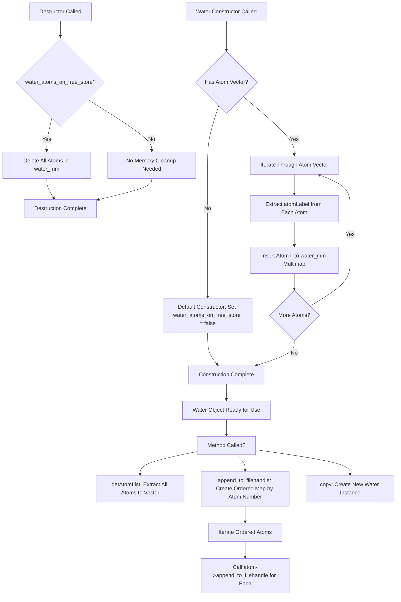

# `sc_Water.cpp` File Analysis

## File Purpose and Primary Role

This file implements the `Water` class, which represents water molecules within the SCREAM molecular modeling system. The class manages collections of water atoms (`SCREAM_ATOM*`) and provides functionality for storing, accessing, and outputting water molecule data. It serves as a specialized component within the protein modeling framework, likely used for representing solvent molecules or crystallographic water molecules in protein structures. The class inherits from `ProteinComponent`, indicating it's part of a larger hierarchy for managing different molecular components.

## Key Classes, Structs, and Functions (if any)

### Water Class

- **Purpose**: Manages water molecule atom collections and provides I/O operations
- **Key Members**:
  - `water_mm`: A `multimap<string, SCREAM_ATOM*>` storing atoms indexed by their labels
  - `water_atoms_on_free_store`: Boolean flag tracking memory management responsibility

### Key Methods:

- **Constructors**: Default constructor and constructor accepting atom vector
- **`getAtomList()`**: Returns all atoms as a vector
- **`print_Me()`**: Outputs water data to console
- **`append_to_filehandle()`**: Writes atom data to specified output stream in ordered format
- **`append_to_ostream_connect_info()`**: Outputs connection/bonding information
- **`copy()`**: Creates a copy of the Water object (returns `ProteinComponent*`)

## Inputs

### Data Structures/Objects:

- **`vector<SCREAM_ATOM*>`**: Vector of atom pointers used in parameterized constructor
- **`SCREAM_ATOM*`**: Individual atom objects containing molecular data (atomLabel, atomic number `n`, etc.)
- **`ostream*`**: Output stream pointers for file writing operations

### File-Based Inputs:

- No direct file reading is performed in this file. The class operates on pre-existing `SCREAM_ATOM` objects that would have been populated from molecular data files elsewhere in the system.

### Environment Variables:

- No direct environment variable usage detected in this file.

### Parameters/Configuration:

- Atom ordering is based on the `n` member (atomic number) of `SCREAM_ATOM` objects
- Memory management behavior controlled by `water_atoms_on_free_store` flag

## Outputs

### Data Structures/Objects:

- **`vector<SCREAM_ATOM*>`**: List of all atoms in the water molecule(s) via `getAtomList()`
- **`ProteinComponent*`**: Copy of the Water object via `copy()` method
- **Modified `multimap<string, SCREAM_ATOM*>`**: Internal storage of atoms indexed by label

### File-Based Outputs:

- Water atom data written to output streams via `append_to_filehandle()`
- Connection/bonding information written via `append_to_ostream_connect_info()`
- Output format determined by individual `SCREAM_ATOM` append methods

### Console Output (stdout/stderr):

- `print_Me()` outputs all water data to `cout` (console output)

### Side Effects:

- Manages memory for `SCREAM_ATOM` objects when `water_atoms_on_free_store` is true
- Modifies internal `water_mm` multimap during construction

## External Code Dependencies (Libraries/Headers)

### Standard C++ Library:

- `<vector>`: For atom list storage and manipulation
- `<map>`: For ordered atom storage and multimap container
- `<algorithm>`: For STL algorithms (though not explicitly used in visible code)

### Internal SCREAM Project Headers:

- `"sc_Water.hpp"`: Header file for the Water class declaration
- `"sc_ProteinComponent.hpp"`: Base class header for component hierarchy
- `"scream_atom.hpp"`: Header defining the `SCREAM_ATOM` structure/class

### External Compiled Libraries:

- None detected - uses only standard C++ library components

## Core Logic/Algorithm Flowchart (Mermaid JS Format)

## Potential Areas for Modernization/Refactoring in SCREAM++

### 1. **Smart Pointer Implementation**

Replace raw `SCREAM_ATOM*` pointers with `std::unique_ptr<SCREAM_ATOM>` or `std::shared_ptr<SCREAM_ATOM>`. This would eliminate the need for the `water_atoms_on_free_store` flag and manual memory management in the destructor, making the code safer and more maintainable.

### 2. **Container and Algorithm Modernization**

Replace the current multimap-to-ordered-map pattern in `append_to_filehandle()` with modern C++ algorithms like `std::sort()` combined with range-based for loops. Consider using `std::unordered_map` for better performance if order isn't critical, or maintain a `std::vector` alongside the map for ordered access.

### 3. **Interface Design and Const-Correctness**

The `copy()` method returns a raw pointer to `ProteinComponent*`, which creates ownership ambiguity. Modern C++ would benefit from either returning a smart pointer or implementing proper copy/move semantics. Additionally, some methods could benefit from better const-correctness and more descriptive return types (e.g., returning `std::optional` for operations that might fail).
