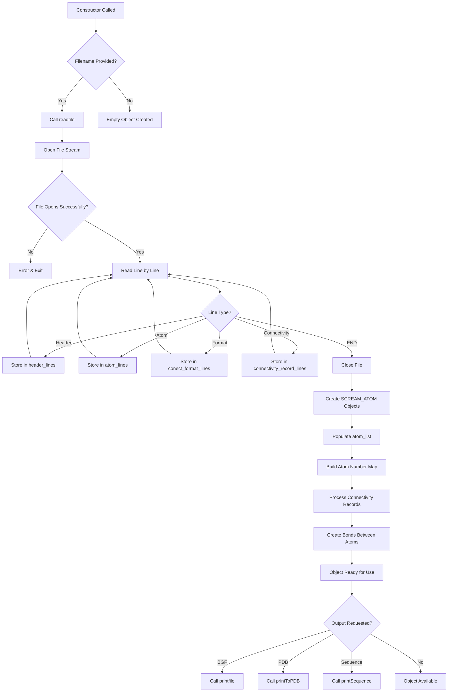

# `sc_bgf_handler.cpp` File Analysis

## File Purpose and Primary Role

This file implements the `bgf_handler` class, which serves as the primary interface for reading, writing, and manipulating molecular structure files in BGF (BioGraf) and PDB formats within the SCREAM project. It acts as a file I/O manager and molecular data container, handling the parsing of atomic coordinates, connectivity information, and metadata from structure files, and providing methods to output this data in various formats.

## Key Classes, Structs, and Functions (if any)

### Primary Class: `bgf_handler`

- **Purpose**: Main class for handling molecular structure file I/O operations
- **Key Constructors**:
  - Default constructor
  - Constructor with filename parameter for immediate file loading
  - Copy constructor with deep copying of atomic data and connectivity
- **Key Methods**:
  - `readfile()`: Reads BGF format files and populates internal data structures
  - `readPDB()`: Reads PDB format files with similar functionality
  - `printToFile()`: Outputs molecular data in BGF format
  - `printPDB()`: Outputs molecular data in PDB format
  - `printSequenceToFile()`: Extracts and outputs amino acid sequences
  - `returnSequence()`: Returns amino acid sequence as string

### Private Helper Methods

- `make_bonds()`: Processes connectivity records to establish atomic bonds
- `make_pdb_bonds()`: Specialized bond creation for PDB format files
- `printfile()`: Core BGF file writing functionality
- `printToPDB()`: Core PDB file writing functionality

## Inputs

### Data Structures/Objects

- `ScreamAtomV` (vector of `SCREAM_ATOM*`): Primary container for atomic data
- `stringV`: Vectors of strings for storing file lines by category
- `SCREAM_ATOM*`: Individual atom objects with coordinates and properties
- Connectivity maps (`map<SCREAM_ATOM*, int>`) for bond information

### File-Based Inputs

- **BGF files**: BioGraf format molecular structure files containing:
  - Header information (DESCRP, BIOGRF version)
  - Atomic coordinates and properties
  - Format specifications
  - Connectivity records (CONECT lines)
- **PDB files**: Protein Data Bank format files with similar atomic and connectivity data

### Parameters/Configuration

- BIOGRF version number (default: 332)
- Forcefield specification (hardcoded as "DREIDING")
- File format specifications for atomic and connectivity records

## Outputs

### Data Structures/Objects

- Populated `atom_list` (ScreamAtomV) containing all molecular atoms
- Internal string vectors storing categorized file content:
  - `header_lines`: File header information
  - `atom_lines`: Raw atomic data lines
  - `conect_format_lines`: Connectivity format specifications
  - `connectivity_record_lines`: Bond connectivity data

### File-Based Outputs

- **BGF format files**: Complete molecular structure files with headers, atoms, and connectivity
- **PDB format files**: Standard PDB format output
- **Sequence files**: Single-line amino acid sequences using one-letter codes

### Console Output (stdout/stderr)

- Progress information: "Number of atoms in system: X"
- Constructor/destructor status messages
- Debug information when DEBUG flag is enabled
- Error messages for file opening failures

### Side Effects

- Manages dynamic memory allocation/deallocation for `SCREAM_ATOM` objects
- Modifies atom connectivity maps during bond creation
- Clears and repopulates internal data structures during file reading

## External Code Dependencies

### Standard C++ Library

- `<string>`: String manipulation and storage
- `<vector>`: Dynamic arrays for atom and line storage
- `<map>`: Associative containers for atom lookup and connectivity
- `<iostream>`: Input/output stream operations
- `<fstream>`: File stream operations
- `<algorithm>`: STL algorithms (though minimal usage visible)

### Internal SCREAM Project Headers

- `"scream_atom.hpp"`: Defines the `SCREAM_ATOM` class and related types
- `"scream_tools.hpp"`: Utility functions for string processing and format detection
- `"sc_bgf_handler.hpp"`: Header file for this class
- `"defs.hpp"`: Project-wide definitions and constants

## Core Logic/Algorithm Flowchart (Mermaid JS Format)

## Potential Areas for Modernization/Refactoring in SCREAM++

### 1. Memory Management with Smart Pointers

The current code uses raw pointers with manual `new`/`delete` operations for `SCREAM_ATOM` objects, creating potential for memory leaks and requiring explicit destructor logic. Modern C++ should use `std::unique_ptr<SCREAM_ATOM>` or `std::shared_ptr<SCREAM_ATOM>` to automatically manage memory and eliminate the need for manual cleanup.

### 2. File I/O and Error Handling Improvements

The current file reading logic uses C-style character arrays and basic error handling with `exit()` calls. This should be modernized to use:

- `std::string` with `std::getline()` instead of character arrays
- RAII-based file handling with automatic resource cleanup
- Exception-based error handling instead of `exit()` calls
- Optional return types or error codes for better error propagation

### 3. Type Safety and API Design

The code uses type aliases like `ScreamAtomV` and passes raw pointers frequently. Modern improvements would include:

- Using `std::vector<std::unique_ptr<SCREAM_ATOM>>` instead of custom vector typedefs
- Const-correctness improvements throughout the API
- Move semantics for efficient object transfers
- Template-based generic file format handling instead of separate BGF/PDB methods
