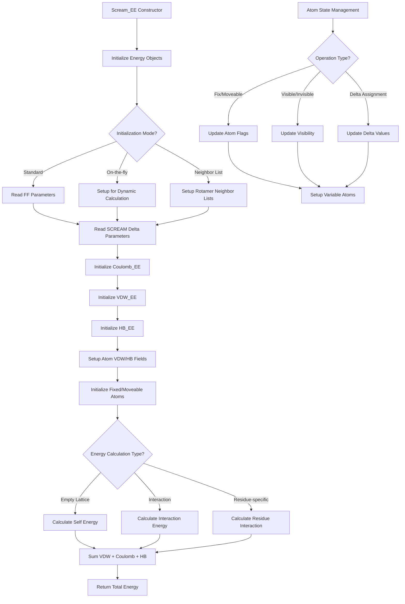

# `scream_EE.cpp` File Analysis

## File Purpose and Primary Role

The `scream_EE.cpp` file implements the `Scream_EE` class, which serves as the main energy evaluation engine for the SCREAM molecular modeling software. This class orchestrates the calculation of different types of molecular interactions including Coulomb (electrostatic), van der Waals (VDW), and hydrogen bonding (HB) energies. It acts as a central coordinator that manages multiple energy calculation components and provides both "empty lattice" (self-energy) and interaction energy calculations for protein side-chain placement optimization.

## Key Classes, Structs, and Functions (if any)

### Primary Class

- **`Scream_EE`**: Main energy evaluation class that coordinates all energy calculations
  - Constructor/Destructor: Manages memory for energy calculation objects
  - Multiple `init()` variants: Different initialization modes for various calculation scenarios
  - Energy calculation methods: Both empty lattice and interaction energy calculations
  - Atom state management: Controls fixed/moveable and visible/invisible atom states

### Key Methods

- **`calc_empty_lattice_E()`**: Calculates self-energy of a mutation
- **`calc_all_interaction_E()`**: Computes interaction energies between atoms
- **`calc_residue_interaction_E()`**: Calculates interaction energy between specific residues
- **`init_after_addedMutInfoRotConnInfo()`**: Initializes the system after adding mutation information
- **`_initScreamAtomVdwHbFields()`**: Sets up VDW and hydrogen bonding parameters for atoms
- **`_read_FF_param_file()`**: Reads force field parameter files
- **`_read_SCREAM_delta_param_file()`**: Reads SCREAM-specific delta parameter files

## Inputs

### Data Structures/Objects

- **`Protein* ptn`**: Main protein structure containing atomic information
- **`vector<std::string> stringV_`**: Vector of mutation information strings
- **`MutInfo`**: Mutation information objects containing chain, position, and residue type
- **`RotConnInfo*`**: Rotamer connectivity information for side-chain conformations
- **`ScreamParameters*`**: Configuration parameters object
- **`ClashCollection*`**: Collection of atomic clashes for constraint handling
- **`AARotamer*`**: Amino acid rotamer objects for side-chain placement

### File-Based Inputs

- **Force Field Parameter File (`FF_file`)**: Contains VDW, hydrogen bonding, and electrostatic parameters
  - Sections: VDW, MPSIM_HB, DIELCTRIC
  - Formats: Parameter definitions for different atom types
- **SCREAM Delta Parameter File (`delta_file`)**: Contains SCREAM-specific energy modifications
- **Each Atom Delta File (`eachAtomDeltaFile`)**: Optional per-atom delta value specifications

### Environment Variables

- No direct environment variable usage detected in this file

### Parameters/Configuration

- **`_calcNonPolarHydrogen_flag`**: Controls whether non-polar hydrogens are included in calculations
- **`_CBCalc_flag`**: Controls whether C-beta atoms are included in calculations
- **Dielectric constants**: For electrostatic calculations
- **Delta calculation modes**: "FULL", "FLAT", "SCALED" for energy modifications

## Outputs

### Data Structures/Objects

- **Modified `SCREAM_ATOM` objects**: Atoms with updated VDW, HB, and delta field values
- **Energy values (double)**: Various energy components and totals
- **Updated protein conformations**: After rotamer placement operations

### File-Based Outputs

- No direct file output detected in this file

### Console Output (stdout/stderr)

- **Energy breakdowns**: VDW, Coulomb, HB energy components
- **Debug information**: Initialization progress, method completion status
- **Warning messages**: Missing parameter files, unmatched atom types
- **Error messages**: File access failures, parameter parsing issues

### Side Effects

- **Memory allocation/deallocation**: Creates and manages energy calculation objects
- **Atom state modifications**: Changes fixed/moveable and visible/invisible flags
- **Force field parameter assignment**: Updates atom VDW and HB parameters
- **Protein conformation changes**: Through rotamer placement operations

## External Code Dependencies (Libraries/Headers)

### Standard C++ Library

- **`<sstream>`**: String stream operations for parsing
- **`<string>`**: String handling
- **`<vector>`**: Dynamic arrays
- **`<map>`**: Associative containers for parameter storage
- **`<iostream>`**: Input/output operations
- **`<fstream>`**: File stream operations

### Internal SCREAM Project Headers

- **`"defs.hpp"`**: Common definitions and utility functions
- **`"RotConnInfo.hpp"`**: Rotamer connectivity information
- **`"scream_EE.hpp"`**: Header file for this class
- **`"ClashCollection.hpp"`**: Clash detection and handling

### External Compiled Libraries

- None detected - SCREAM appears to be self-contained

## Core Logic/Algorithm Flowchart (Mermaid JS Format)

## Potential Areas for Modernization/Refactoring in SCREAM++

### 1. **Memory Management with Smart Pointers**

The current code uses extensive raw pointer management with manual `new`/`delete` operations. This could be modernized using:

- `std::unique_ptr` for owned objects like `coulomb_EE`, `vdw_EE`, `hb_EE`
- `std::shared_ptr` for shared resources like `RotConnInfo*`
- RAII principles to eliminate manual memory management and reduce memory leak risks

### 2. **Replace C-style String and File Operations**

The file reading and parsing logic uses C-style operations that could benefit from modern C++ approaches:

- Replace `char line_ch[256]` arrays with `std::string` and `std::getline()`
- Use `std::filesystem` for file operations and path handling
- Implement structured parsing with `std::stringstream` or custom parser classes
- Add proper exception handling for file operations instead of `exit(8)` calls

### 3. **Improve API Design and Error Handling**

The current interface has several areas for improvement:

- Replace multiple `init()` method variants with a builder pattern or configuration object
- Use `std::optional` or custom result types instead of returning raw energy values with error states
- Implement proper exception hierarchy instead of console output for error conditions
- Create strongly-typed enums for calculation modes ("FULL", "FLAT", "SCALED") instead of string comparisons
- Use `const`-correctness more extensively throughout the API
