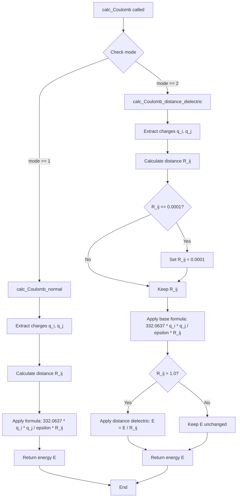

# `scream_E_functionals_coulomb.cpp` File Analysis

## File Purpose and Primary Role

This file implements the `SCREAM_Coulomb_OBJ` class, which is responsible for calculating Coulomb (electrostatic) energy interactions between atoms in the SCREAM molecular modeling software. The class provides two different modes for computing electrostatic interactions: normal Coulomb interactions and distance-dependent dielectric Coulomb interactions. This is a core energy calculation component used in protein side-chain placement and molecular energy evaluation.

## Key Classes, Structs, and Functions (if any)

### Primary Class: `SCREAM_Coulomb_OBJ`

- **Purpose**: Encapsulates Coulomb energy calculation functionality with configurable dielectric properties and calculation modes
- **Key Methods**:
  - `calc_Coulomb()`: Main interface for calculating Coulomb energy between two atoms
  - `calc_Coulomb_normal()`: Standard Coulomb energy calculation with constant dielectric
  - `calc_Coulomb_distance_dielectric()`: Distance-dependent dielectric Coulomb calculation
  - `read_param_line()`: Parses a single parameter line to set dielectric constant
  - `read_param_file()`: Reads forcefield parameter files to configure the object

### Key Functions

- **Constructors**: Default constructor and parameterized constructor for setting calculation mode and dielectric constant
- **Destructor**: Standard cleanup (currently empty)

## Inputs

### Data Structures/Objects

- **`SCREAM_ATOM*`**: Pointers to atom objects containing charge information (`q[0]`) and coordinate data for distance calculation
- **`double dielectric`**: Dielectric constant parameter (though noted as unused in the main `calc_Coulomb` method)
- **`string mode_str`**: Mode specification ("DistanceDependent" or default normal mode)

### File-Based Inputs

- **Forcefield parameter files**: Files containing `DIELCTRIC` keyword followed by dielectric constant values
- **Parameter format**: Space-separated values where the second field contains the dielectric constant

### Environment Variables

- None directly used in this file

### Parameters/Configuration

- **`epsilon`**: Dielectric constant (default: 1.0)
- **`mode`**: Calculation mode (1 = normal, 2 = distance-dependent)
- **Conversion factor**: Hard-coded value of 332.0637 for unit conversion

## Outputs

### Data Structures/Objects

- **`double`**: Coulomb energy value returned by calculation methods

### File-Based Outputs

- None directly written by this file

### Console Output (stdout/stderr)

- **Parameter echoing**: Prints parameter lines when reading `DIELCTRIC` sections
- **Error messages**: File opening errors sent to `stderr`
- **Commented debug output**: Strong electrostatic interaction warnings (currently commented out)

### Side Effects

- **Object state modification**: Updates `epsilon` member variable when reading parameters
- **Program termination**: Calls `exit(8)` if forcefield file cannot be opened

## External Code Dependencies (Libraries/Headers)

### Standard C++ Library

- `<cstdlib>`: For `atof()` and `exit()`
- `<stdlib.h>`: Alternative standard library inclusion

### Internal SCREAM Project Headers

- `"defs.hpp"`: Likely contains common definitions, utility functions (e.g., `split()`), and includes
- `"scream_E_functionals_coulomb.hpp"`: Header file for the `SCREAM_Coulomb_OBJ` class declaration

### External Compiled Libraries

- None identified

## Core Logic/Algorithm Flowchart (Mermaid JS Format)

## Potential Areas for Modernization/Refactoring in SCREAM++

### 1. **Replace C-style String Handling and File I/O**

- Replace C-style `char` arrays and `atof()` with modern C++ string parsing (`std::stod`, `std::stringstream`)
- Use RAII-based file handling with proper exception handling instead of `exit()` calls
- Implement proper error handling with exceptions rather than program termination

### 2. **Improve API Design and Parameter Management**

- Create a dedicated parameter/configuration class instead of parsing parameters directly in the energy calculation class
- Use `const` correctness more extensively (e.g., `const SCREAM_ATOM*` parameters)
- Replace magic numbers (332.0637, 0.0001, 1.0) with named constants or configurable parameters
- Consider using `std::optional` for optional parameters like dielectric constant

### 3. **Enhanced Type Safety and Modern C++ Features**

- Use `enum class` for calculation modes instead of integer constants
- Implement proper constructor delegation and member initialization lists
- Consider using `std::variant` or strategy pattern for different calculation modes
- Add comprehensive input validation and bounds checking for physical parameters
- Replace raw pointers with smart pointers or references where appropriate
