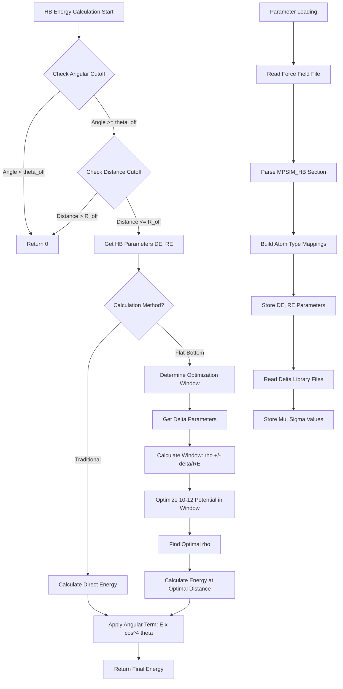

# `scream_E_functionals_hb.cpp` File Analysis

## File Purpose and Primary Role

This file implements hydrogen bonding energy calculations for the SCREAM molecular modeling software. It provides multiple computational strategies for calculating hydrogen bond energies between donor and acceptor atoms, including traditional fixed-geometry approaches and the novel "flat-bottom strategy" described in the 2008 JCTC paper. The file serves as the core engine for hydrogen bonding energy evaluation during protein side-chain placement optimization.

## Key Classes, Structs, and Functions (if any)

### Classes:

- **`SCREAM_HB_fields`**: Simple data container holding hydrogen bond parameters (DE - depth of energy well, RE - equilibrium distance)
- **`HB_delta_fields`**: Container for statistical parameters (mu, sigma) used in the flat-bottom strategy for flexible hydrogen bond distance optimization
- **`SCREAM_HB_OBJ`**: Main hydrogen bonding calculation engine containing:
  - Parameter dictionaries and atom type mappings
  - Multiple energy calculation methods
  - File I/O for force field parameters and delta libraries
- **`SCREAM_HB_BASE_FUNCTIONAL_OBJ`**: Abstract base class for hydrogen bond functional objects
- **`SCREAM_calc_full_delta_HB`**: Concrete implementation using per-atom delta parameters
- **`SCREAM_calc_flat_delta_HB`**: Concrete implementation using uniform delta parameters

### Key Functions:

- **`calc_HB_Dre()`**: Traditional Dreiding-style hydrogen bond energy calculation
- **`calc_Scream_HB()`**: Enhanced method with neighborhood search optimization
- **`calc_full_delta_HB()`**: Full implementation of flat-bottom strategy using atom-specific flexibility parameters
- **`calc_flat_delta_HB()`**: Simplified flat-bottom method with uniform flexibility parameters
- **`calc_scaled_inner_wall_HB()`**: Energy calculation with scaling for repulsive regions
- **`_optimize_10_12()`**: Core optimization routine for 10-12 Lennard-Jones-style potential

## Inputs

### Data Structures/Objects:

- **`SCREAM_ATOM*`**: Pointers to acceptor (A), hydrogen (H), and donor (D) atoms containing:
  - Coordinates for distance and angle calculations
  - Force field type information (`stripped_atomType`, `hb_da`)
  - Flexibility parameters (`delta`) for flat-bottom calculations
  - Residue information (`resName`, `atomLabel`, `library_name`)

### File-Based Inputs:

- **Force field parameter files** (e.g., `dreidii322-mpsim.par`): Contains hydrogen bond parameters in `MPSIM_HB` sections with format: `AcceptorType DonorType-H Energy_Depth Equilibrium_Distance`
- **Delta parameter files**: Contain atom-specific flexibility parameters with format: `LibraryType ResidueType AtomLabel Mu Sigma`

### Parameters/Configuration:

- **Distance cutoffs**: `R_on` (0.0), `R_off` (5.0 Å) for hydrogen bond range
- **Angular cutoffs**: `theta_on` (180°), `theta_off` (90°) for acceptor-hydrogen-donor angle
- **Neighborhood search delta**: Default 0.15 (15% of RE) for optimization window
- **Scaling factors**: For inner wall modification in scaled calculations

## Outputs

### Data Structures/Objects:

- **Energy values** (double): Hydrogen bond interaction energies in kcal/mol
- **Modified SCREAM_ATOM objects**: Updates `hb_da` and `delta` fields during calculations
- **Populated internal dictionaries**:
  - `hb_dict`: Maps atom type pairs to energy parameters
  - `hb_delta_library_dict`: Maps library/residue/atom combinations to flexibility parameters

### Console Output (stdout/stderr):

- **Error messages**: For missing hydrogen bond parameters or delta values
- **Debug information**: Atom dumps and energy values (when debugging enabled)
- **File access errors**: When parameter files cannot be opened

### Side Effects:

- **Memory allocation**: Creates `SCREAM_HB_fields` and `HB_delta_fields` objects
- **Atom object modification**: Populates `hb_da` indices and `delta` values during calculations
- **Global state initialization**: Builds internal lookup tables on first use

## External Code Dependencies

### Standard C++ Library:

- `<cstdlib>`: For `atof()`, `exit()` functions
- `<math.h>`: For trigonometric functions (`cos()`, `pow()`)
- `<string>`: String manipulation and storage
- `<cassert>`: Assertion macros
- `<iostream>`: Stream I/O operations
- `<fstream>`: File stream operations
- `<sstream>`: String stream operations
- `<map>`: STL map containers for parameter storage
- `<vector>`: STL vector containers

### Internal SCREAM Project Headers:

- `"defs.hpp"`: Project-wide definitions and constants
- `"scream_vector.hpp"`: Custom 3D vector mathematics class
- `"scream_tools.hpp"`: Utility functions including `split()` and `Debug` class
- `"scream_E_functionals_hb.hpp"`: Header declarations for this implementation

## Core Logic/Algorithm Flowchart

## Potential Areas for Modernization/Refactoring in SCREAM++

### 1. Memory Management and RAII

Replace raw pointers and manual `new`/`delete` with modern C++ smart pointers (`std::unique_ptr`, `std::shared_ptr`). The current code has potential memory leaks and requires careful manual cleanup in destructors. Modern RAII principles would eliminate these risks and simplify resource management.

### 2. Parameter Loading and Configuration

Replace the current string-parsing approach with a modern configuration system using structured formats (JSON, YAML, or TOML) with proper validation. The current `split()` and manual parsing is error-prone and difficult to extend. A schema-based approach would provide better error reporting and easier maintenance.

### 3. Function Interface Design and Type Safety

Refactor the multiple calculation methods into a cleaner strategy pattern with strongly-typed parameters instead of multiple similar functions with different parameter lists. The current approach with functions like `calc_full_delta_HB()`, `calc_flat_delta_HB()`, etc., leads to code duplication and unclear interfaces. A unified interface with configuration objects would be more maintainable and type-safe.
