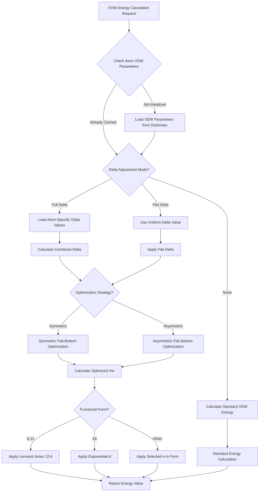

# `scream_E_functionals_vdw.cpp` File Analysis

## File Purpose and Primary Role

This file implements the Van der Waals (VDW) energy calculation subsystem for the SCREAM protein side-chain placement software. It provides multiple VDW functional forms (6-8, 6-9, 6-10, 6-12, X6, Morse) and implements the core "flat-bottom strategy" methodology described in the 2008 JCTC paper. The file handles both traditional VDW calculations and SCREAM's innovative delta-adjusted energy calculations that use neighborhood uncertainty to improve side-chain placement accuracy.

## Key Classes, Structs, and Functions (if any)

### Classes:

- **`VDW_fields`**: Stores basic VDW parameters (RNB, DENB, SCALE) for atom types
- **`VDW_delta_fields`**: Stores delta adjustment parameters (mu, sigma) for SCREAM methodology
- **`SCREAM_VDW_OBJ`**: Main VDW calculation engine that manages parameter dictionaries and implements various energy functionals
- **`SCREAM_VDW_BASE_FUNCTIONAL_OBJ`**: Abstract base class for VDW functional objects
- **Multiple derived functional classes**: `SCREAM_calc_full_delta_VDW_6_12`, `SCREAM_calc_flat_delta_asym_VDW_6_12`, etc.

### Key Functions:

- **`calc_VDW_6_12()`**: Standard Lennard-Jones 12-6 potential
- **`calc_VDW_X6()`**: Exponential-6 potential with configurable scale parameter
- **`calc_full_delta_VDW_6_12()`**: Delta-adjusted 6-12 potential using atom-specific uncertainty
- **`calc_flat_delta_asym_VDW_6_12()`**: Asymmetric flat-bottom delta adjustment
- **`_symmetric_optimize_LJ_vdw_functional()`**: Core optimization for flat-bottom strategy
- **`_asymmetric_optimize_LJ_vdw_functional()`**: Asymmetric variant of optimization

## Inputs

### Data Structures/Objects:

- **`SCREAM_ATOM*`**: Primary input objects containing atomic coordinates, types, and pre-computed VDW parameters
- **`AtomResInfo`**: Structure containing residue name and atom label for parameter lookup
- **`string ff_type`**: Force field atom type identifiers
- **`double t`**: Temperature-like parameter for delta scaling (typically n_sigma values)

### File-Based Inputs:

- **Force field parameter files**: Read via `read_param_file()` containing VDW section with atom types and RNB/DENB/SCALE values
- **SCREAM delta files**: Read via `read_Scream_delta_file()` containing library-specific delta parameters (format: Library_Type, Residue_Name, Atom_Label, mu, sigma)

### Parameters/Configuration:

- **`neighborhood_search_delta`**: Fixed delta value (0.15) for basic SCREAM optimization
- **Functional form selection**: Choice between 6-7, 6-8, 6-9, 6-10, 6-11, 6-12, and X6 potentials
- **Delta adjustment mode**: Full delta (atom-specific) vs. flat delta (uniform) vs. asymmetric variants

## Outputs

### Data Structures/Objects:

- **`double`**: Energy values returned by all calculation functions
- **Modified `SCREAM_ATOM` objects**: VDW parameters (vdw_r, vdw_d, vdw_s) and delta values cached in atom objects
- **Populated parameter dictionaries**: `vdw_dict` and `vdw_delta_library_dict` filled from input files

### Console Output (stdout/stderr):

- **Error messages**: Missing atom types in parameter files, missing delta values
- **Debug information**: File reading status and parameter validation (via Debug class)
- **Fatal error exits**: Missing parameter files or critical parameter lookup failures

### Side Effects:

- **Lazy initialization**: VDW parameters cached in SCREAM_ATOM objects on first access
- **Memory allocation**: Dynamic allocation of VDW_fields and VDW_delta_fields objects
- **Global state modification**: Population of internal parameter dictionaries

## External Code Dependencies

### Standard C++ Library:

- `<stdlib.h>`: Memory allocation and string conversion (atof)
- `<string>`: String manipulation and comparison
- `<iostream>`: Console I/O for errors and debug output
- `<fstream>`: File reading for parameter and delta files
- `<cassert>`: Assertion macros for debugging
- `<map>`: STL containers for parameter storage

### Internal SCREAM Project Headers:

- `"defs.hpp"`: Project-wide definitions and basic types
- `"scream_E_functionals_vdw.hpp"`: Header declarations for this implementation
- `"scream_tools.hpp"`: Utility functions including string manipulation and Debug class

## Core Logic/Algorithm Flowchart (Mermaid JS Format)

## Potential Areas for Modernization/Refactoring in SCREAM++

### 1. **Memory Management and RAII**

Replace manual `new`/`delete` with smart pointers (`std::unique_ptr`, `std::shared_ptr`) throughout the class hierarchy. The destructor's manual cleanup of map contents is error-prone and could benefit from automatic memory management. Consider using value semantics where possible instead of pointer-based designs.

### 2. **Type Safety and Modern C++ Features**

Replace C-style casts and raw function pointers with modern alternatives. Use `enum class` for functional form selection instead of implicit string-based switching. Implement proper exception handling instead of `exit()` calls for error conditions. Consider `std::variant` or polymorphism for handling different VDW functional forms.

### 3. **API Design and Const-Correctness**

The current design modifies `SCREAM_ATOM` objects as a side effect of energy calculations, violating const-correctness and making the code harder to reason about. Consider separating parameter caching from energy calculation, using immutable parameter objects, and implementing a cleaner functional-style API that doesn't rely on object mutation during calculations.
