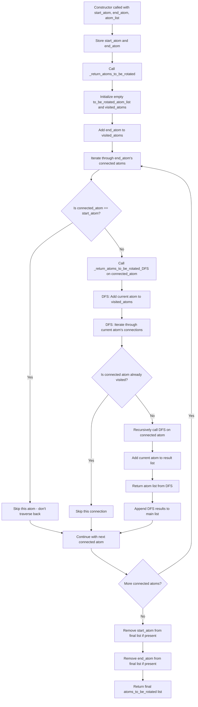

# `scream_Rotation.cpp` File Analysis

## File Purpose and Primary Role

This file implements the `Scream_Rotation` class, which is responsible for identifying and managing atoms that need to be rotated around a specific bond (rotation axis) in molecular structures. The primary purpose is to determine which atoms will move when a particular bond is rotated during conformational sampling or side-chain placement operations. This is a critical component for molecular modeling as it defines the scope of atomic movement during rotational degrees of freedom exploration.

## Key Classes, Structs, and Functions (if any)

### Classes:

- **`Scream_Rotation`**: Main class for handling rotational bond analysis
  - **Constructor (default)**: Empty default constructor
  - **Constructor (parameterized)**: Takes start atom, end atom, and atom list to initialize rotation analysis
  - **Destructor**: Empty destructor

### Key Member Functions:

- **`_return_atoms_to_be_rotated()`**: Main algorithm that identifies all atoms that will move when rotating around the bond defined by start_atom and end_atom
- **`_return_atoms_to_be_rotated_DFS()`**: Depth-first search helper function that recursively traverses the molecular graph to find connected atoms

### Key Member Variables:

- `start_atom`: Pointer to the starting atom of the rotation axis
- `end_atom`: Pointer to the ending atom of the rotation axis
- `atoms_to_be_rotated`: Vector containing all atoms that will move during rotation

## Inputs

### Data Structures/Objects:

- **`SCREAM_ATOM* start_atom`**: Pointer to the atom defining one end of the rotation axis
- **`SCREAM_ATOM* end_atom`**: Pointer to the atom defining the other end of the rotation axis
- **`ScreamAtomV& atom_list`**: Reference to vector containing all atoms in the molecular system
- **`SCREAM_ATOM::connectivity_m`**: Map structure within each atom containing connectivity information (connected atoms and bond types)

### File-Based Inputs:

- No direct file inputs are present in this file

### Environment Variables:

- No environment variables are directly used in this file

### Parameters/Configuration:

- The molecular connectivity information stored in each atom's `connectivity_m` map
- The specific bond selection (start_atom and end_atom) determines which rotation is being analyzed

## Outputs

### Data Structures/Objects:

- **`ScreamAtomV atoms_to_be_rotated`**: Vector containing pointers to all atoms that will move when the specified bond is rotated
- **`ScreamAtomV` (return value)**: Functions return vectors of atom pointers representing the rotatable group

### File-Based Outputs:

- No direct file outputs

### Console Output (stdout/stderr):

- Debug output statements: "4.1", "4.2", "4.4", "4.5", "4.6", "4.8" - these appear to be debugging markers to trace execution flow

### Side Effects:

- Modifies the `visited_atoms` vector during DFS traversal
- Populates the `atoms_to_be_rotated` member variable
- Removes start_atom and end_atom from the final rotatable atom list

## External Code Dependencies (Libraries/Headers)

### Standard C++ Library:

- **`<algorithm>`**: Used for `std::find()` operations to search vectors and erase elements

### Internal SCREAM Project Headers:

- **`"scream_Rotation.hpp"`**: Header file containing class declaration and type definitions
- Implicitly depends on definitions for:
  - `SCREAM_ATOM` structure/class
  - `ScreamAtomV` (vector of SCREAM_ATOM pointers)
  - `ScreamAtomVItr` (iterator for ScreamAtomV)

### External Compiled Libraries:

- None detected in this file

## Core Logic/Algorithm Flowchart (Mermaid JS Format)

## Potential Areas for Modernization/Refactoring in SCREAM++

### 1. **Memory Management and Smart Pointers**

- Replace raw `SCREAM_ATOM*` pointers with `std::shared_ptr<SCREAM_ATOM>` or `std::unique_ptr<SCREAM_ATOM>` to ensure automatic memory management and prevent memory leaks
- This would eliminate potential dangling pointer issues and make the code safer

### 2. **Algorithm Efficiency and STL Containers**

- Replace the manual vector search and erase operations with more efficient STL containers like `std::unordered_set<SCREAM_ATOM*>` for visited atoms tracking
- Use `std::unordered_set` for faster O(1) lookup instead of O(n) vector searches in the visited atoms check
- Consider using `std::queue` or `std::stack` for explicit BFS/DFS implementation instead of recursive calls

### 3. **Error Handling and Robustness**

- Add proper error handling for null pointer checks (start_atom, end_atom could be nullptr)
- Add validation for connectivity_m integrity and handle potential infinite loops in cyclic molecular graphs
- Replace debug `cout` statements with a proper logging framework or conditional debug macros
- Add exception handling for edge cases like disconnected molecular fragments or invalid atom connectivity
