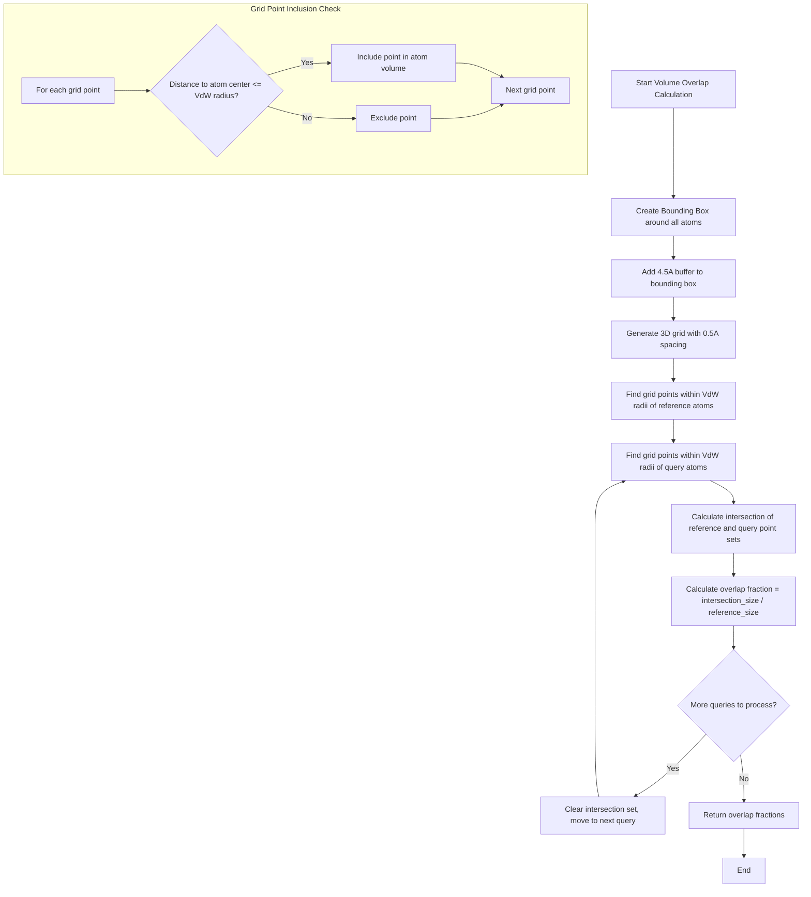

# `scream_VolumeOverlap.cpp` File Analysis

## File Purpose and Primary Role

This file implements volume overlap calculations between molecular structures in the SCREAM project. The primary purpose is to calculate the fractional volume overlap between a reference molecular structure and one or more query structures using a grid-based approach. This is likely used for evaluating steric clashes or conformational compatibility during side-chain placement or molecular docking operations.

## Key Classes, Structs, and Functions (if any)

### VolumeOverlap Class

- **`volumeOverlapCalc(ScreamAtomV& ref, ScreamAtomV& query)`**: Calculates volume overlap between two single molecular structures, returns a double representing the fraction of reference volume overlapped by query
- **`volumeOverlapCalc(ScreamAtomV& ref, vector<ScreamAtomV>& queryList)`**: Batch calculation of volume overlaps between one reference and multiple query structures, returns vector of overlap fractions
- **`getBoundingBox(ScreamAtomV& ref, vector<ScreamAtomV>& queryList, double buffer)`**: Creates an axis-aligned bounding box encompassing all atoms with a specified buffer distance

### Box Class

- **`Box(double x_min, y_min, z_min, x_max, y_max, z_max)`**: Constructor for creating a 3D bounding box
- **`generateGrid(double spacing)`**: Creates a uniform 3D grid of points within the box with specified spacing (0.5 Å typically)
- **`getEnclosedPoints(ScreamAtomV& l)`**: Returns all grid points within van der Waals radii of atoms in a molecular structure
- **`getEnclosedPoints(ScreamVector v, double r)`**: Returns grid points within radius r of a specific point
- **`_distanceSquared(ScreamVector& v1, ScreamVector& v2)`**: Utility function for efficient distance calculations

## Inputs

### Data Structures/Objects

- **`ScreamAtomV&`**: Vector/list of atoms representing molecular structures (reference and query)
- **`ScreamVector`**: 3D coordinate vectors for atomic positions
- **`SCREAM_ATOM*`**: Individual atom objects with coordinates (`x[0], x[1], x[2]`) and van der Waals radius (`vdw_r`)

### Parameters/Configuration

- **Grid spacing**: Fixed at 0.5 Å for volume discretization
- **Buffer distance**: 4.5 Å buffer around bounding box for grid generation
- **Van der Waals radii**: From individual atom objects for determining atomic volumes

### File-Based Inputs

- No direct file I/O in this file

### Environment Variables

- No environment variables used directly

## Outputs

### Data Structures/Objects

- **`double`**: Single volume overlap fraction (intersection volume / reference volume)
- **`vector<double>`**: Multiple volume overlap fractions for batch calculations
- **`std::set<ScreamVector>`**: Sets of grid points representing molecular volumes
- **`Box`**: Bounding box objects with generated 3D grids

### File-Based Outputs

- No direct file output

### Console Output

- No console output in this file

### Side Effects

- Dynamically allocates 3D grid arrays in Box objects
- Modifies internal state of Box objects when generating grids

## External Code Dependencies

### Standard C++ Library

- **`<cmath>`**: Mathematical functions (ceil, floor, sqrt)
- **`<set>`**: STL set containers for grid point storage
- **`<algorithm>`**: STL algorithms (set_intersection)
- **`<vector>`**: STL vector containers (via defs.hpp)

### Internal SCREAM Project Headers

- **`"defs.hpp"`**: Core definitions and typedefs for SCREAM project
- **`"scream_VolumeOverlap.hpp"`**: Header file declaring VolumeOverlap and Box classes

### External Compiled Libraries

- None identified

## Core Logic/Algorithm Flowchart

## Potential Areas for Modernization/Refactoring in SCREAM++

### 1. Memory Management and Smart Pointers

- **Issue**: Manual memory management with raw 3D arrays (`new`/`delete[]`) in Box class destructor is error-prone
- **Solution**: Replace with modern containers like `std::vector<std::vector<std::vector<ScreamVector>>>` or use smart pointers for automatic memory management

### 2. Algorithm Efficiency and Modern STL

- **Issue**: Grid-based approach with 0.5Å spacing may be inefficient for large molecules; set operations could be optimized
- **Solution**: Consider spatial data structures (octrees, k-d trees) for more efficient neighbor queries, or use unordered_set for better performance with custom hash functions

### 3. API Design and Const-Correctness

- **Issue**: Missing const qualifiers on many methods, inconsistent parameter passing (references vs copies), and incomplete copy assignment operator
- **Solution**: Add proper const-correctness, use const references for read-only parameters, implement rule-of-five properly, and consider making the API more functional with immutable objects
