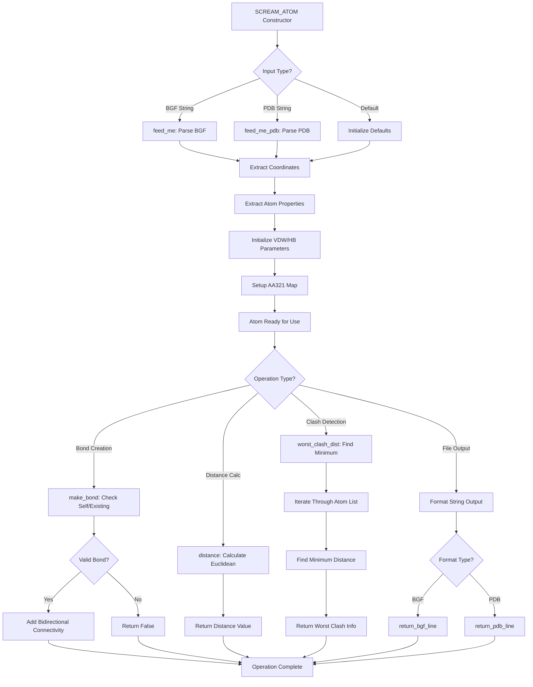

# `scream_atom.cpp` File Analysis

## File Purpose and Primary Role

This file implements the `SCREAM_ATOM` class, which represents individual atoms in the SCREAM molecular modeling system. It serves as the fundamental building block for molecular structures, handling atom properties, coordinates, connectivity, and file I/O operations. The class supports both BGF (Biograf) and PDB (Protein Data Bank) file formats and manages atomic properties essential for molecular simulations and side-chain placement algorithms.

## Key Classes, Structs, and Functions (if any)

### Primary Class: `SCREAM_ATOM`

- **Purpose**: Core atom representation with coordinates, properties, and connectivity
- **Key Constructors**:
  - Default constructor: Initializes atom with default values
  - BGF line constructor: Creates atom from BGF format string
  - Copy constructor: Creates atom from another SCREAM_ATOM (incomplete implementation)

### Key Member Functions:

- **`feed_me()`**: Parses BGF format line to populate atom data
- **`feed_me_pdb()`**: Parses PDB format line to populate atom data
- **`make_bond()`/`delete_bond()`**: Manages atomic connectivity
- **`distance()`/`distance_squared()`**: Calculates inter-atomic distances
- **`worst_clash_dist()`**: Finds closest atom from a list (clash detection)
- **`dump()`/`pdb_dump()`**: Console output in BGF/PDB formats
- **`return_bgf_line()`/`return_pdb_line()`**: String formatting for file output
- **`copy()`**: Deep copy implementation
- **`_init_AA321_map()`**: Initializes amino acid 3-to-1 letter conversion map

### Static Data:

- **`AA321_map`**: Static map for amino acid name conversion (3-letter to 1-letter codes)

## Inputs

### Data Structures/Objects:

- **BGF format strings**: Line-based molecular structure format for atom initialization
- **PDB format strings**: Standard protein structure format for atom initialization
- **SCREAM_ATOM pointers**: For connectivity operations and distance calculations
- **Vector of SCREAM_ATOM pointers**: For clash detection algorithms
- **Integer bond types**: For connectivity specification

### File-Based Inputs:

- **BGF files**: Indirectly through string parsing (format: ATOM/HETATM records with coordinates, types, charges)
- **PDB files**: Indirectly through string parsing (standard PDB ATOM/HETATM records)

### Environment Variables:

- None directly used in this file

### Parameters/Configuration:

- **Default VDW parameters**: Initialized to -600 (likely indicating unset values)
- **Default hydrogen bonding parameters**: Initialized to -600
- **Default delta values**: Initialized to -600 (related to flat-bottom energy strategy)

## Outputs

### Data Structures/Objects:

- **Populated SCREAM_ATOM objects**: With coordinates, atom types, residue information, and properties
- **Connectivity maps**: `std::map<SCREAM_ATOM*, int>` representing bonded atoms
- **Distance values**: Double precision inter-atomic distances
- **Formatted strings**: BGF and PDB format lines for file output

### File-Based Outputs:

- **BGF format output**: Through `append_to_filehandle()` and `return_bgf_line()`
- **PDB format output**: Through `pdb_append_to_filehandle()` and `return_pdb_line()`
- **Connectivity records**: CONECT lines for both BGF and PDB formats

### Console Output (stdout/stderr):

- **Atom dumps**: Formatted atom information via `dump()` and `pdb_dump()`
- **Error messages**: Bond creation/deletion warnings
- **Debug information**: Bond-making validation messages

### Side Effects:

- **Modifies connectivity maps**: Bidirectional bond creation/deletion
- **Updates static AA321_map**: First-time initialization of amino acid conversion table

## External Code Dependencies (Libraries/Headers)

### Standard C++ Library:

- `<stdio.h>`: C-style I/O operations (sprintf, sscanf)
- `<string.h>`: C-string manipulation (strcpy, strtok)
- `<math.h>`: Mathematical functions (sqrt, pow)
- `<iostream>`: C++ I/O streams
- `<sstream>`: String stream operations
- `<stdlib.h>`: Standard library functions (atoi)

### Internal SCREAM Project Headers:

- `"scream_atom.hpp"`: Header file containing SCREAM_ATOM class declaration

### External Compiled Libraries:

- None identified (uses only standard C/C++ libraries)

## Core Logic/Algorithm Flowchart (Mermaid JS Format)

## Potential Areas for Modernization/Refactoring in SCREAM++

### 1. **Replace Raw Pointers with Smart Pointers**

The current implementation uses raw pointers extensively in the connectivity map (`std::map<SCREAM_ATOM*, int>`). This creates potential memory management issues and unclear ownership semantics. Modern C++ should use `std::shared_ptr<SCREAM_ATOM>` or `std::weak_ptr<SCREAM_ATOM>` to handle the bidirectional connectivity graph safely and prevent memory leaks.

### 2. **Eliminate C-Style String Handling**

The code heavily relies on C-style string functions (`strcpy`, `strtok`, `sprintf`, `sscanf`) and fixed-size character arrays. This should be replaced with modern C++ string handling using `std::string`, `std::stringstream`, and standard library algorithms. The parsing logic could benefit from more robust string manipulation methods that are safer and more maintainable.

### 3. **Implement RAII and Exception Safety**

The current copy constructor is incomplete, and there's no clear error handling strategy. Modern C++ should implement proper RAII principles, use exceptions for error handling instead of returning boolean success/failure codes, and ensure all constructors properly initialize all member variables. The static `AA321_map` initialization could also be made thread-safe using `std::once_flag` or similar mechanisms.
