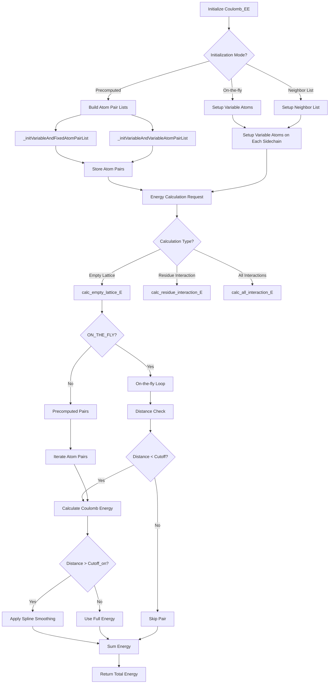

# `scream_coulomb_EE.cpp` File Analysis

## File Purpose and Primary Role

This file implements the `Coulomb_EE` class, which is responsible for calculating electrostatic (Coulomb) interaction energies between atoms in the SCREAM protein modeling framework. The "EE" likely stands for "Electrostatic Energy". This class serves as a core energy evaluation component that computes Coulomb forces between variable atoms (typically sidechain atoms being optimized) and fixed atoms (backbone and other non-variable atoms), as well as between variable atoms themselves. It supports both precomputed atom pair lists and on-the-fly energy calculations with distance-based cutoffs and spline smoothing.

## Key Classes, Structs, and Functions (if any)

### Primary Class:

- **`Coulomb_EE`**: Main class for electrostatic energy calculations
  - Manages atom pair lists for efficient energy computation
  - Supports multiple initialization modes (precomputed pairs vs. on-the-fly)
  - Implements distance cutoffs with spline smoothing for computational efficiency

### Key Member Functions:

- **`calc_empty_lattice_E(const MutInfo mutInfo)`**: Calculates interaction energy between a specific residue and all fixed atoms
- **`calc_residue_interaction_E()`**: Computes interaction energies between variable residues
- **`calc_all_interaction_E()`**: Calculates total interaction energy between all atom pairs
- **`calc_EL_rot_selfBB()`, `calc_EL_rot_otherBB()`, `calc_EL_rot_fixedSC()`, `calc_EL_rot_fixedHET()`**: Specialized functions for different types of electrostatic interactions
- **`_initVariableAndFixedAtomPairList()`**, **`_initVariableAndVariableAtomPairList()`**: Initialize precomputed atom pair lists
- **`_calc_empty_lattice_E_on_the_fly_loop()`**, **`_calc_all_interaction_E_on_the_fly_loop()`**: On-the-fly energy calculation methods

## Inputs

### Data Structures/Objects:

- **`Protein* ptn`**: Pointer to protein structure containing atomic coordinates and connectivity
- **`vector<MutInfo> mutInfoV`**: Vector of mutation information specifying variable residues
- **`SCREAM_Coulomb_OBJ* coulomb_obj`**: Coulomb calculation object for computing pairwise electrostatic energies
- **`map<MutInfo, RotConnInfo*> mutInfo_rotConnInfo_map`**: Maps residue mutation info to rotamer connectivity information
- **`RotamerNeighborList* rotamerNeighborList`**: Neighbor list for efficient distance-based calculations

### File-Based Inputs:

- No direct file I/O operations are performed in this file
- Relies on data structures populated from external parameter files (likely charge parameters and connectivity data)

### Environment Variables:

- No direct environment variable dependencies identified

### Parameters/Configuration:

- **Distance cutoffs**: Hard-coded values (8.5 Å on, 10.5 Å off) for electrostatic interactions
- **Exclusion rules**: 1-2 and 1-3 bonded atom exclusions for electrostatic calculations
- **Spline smoothing**: Linear interpolation between cutoff distances

## Outputs

### Data Structures/Objects:

- **`double`**: Energy values returned by various calculation functions
- **Internal atom pair lists**: `variable_and_fixed`, `variable_and_variable` maps storing precomputed atom pairs
- **Modified atom coordinates**: Indirectly through protein object modifications

### File-Based Outputs:

- No direct file output operations

### Console Output (stdout/stderr):

- Debug information about atom pair list sizes
- Energy values and atom information when energies exceed thresholds (> 100)
- Pair list statistics during initialization

### Side Effects:

- Modifies internal data structures (`variable_and_fixed`, `variable_and_variable` maps)
- Temporarily modifies atom properties (storing mutInfo_n assignments in atom->a field)

## External Code Dependencies (Libraries/Headers)

### Standard C++ Library:

- `<algorithm>`: For STL algorithms like `find()` and iterators
- `<time.h>`, `<stdio.h>`: For timing and C-style I/O
- `<cassert>`: For runtime assertions

### Internal SCREAM Project Headers:

- `"defs.hpp"`: Core definitions and type declarations
- `"MutInfo.hpp"`: Mutation information data structures
- `"scream_coulomb_EE.hpp"`: Header file for this class
- `"RotamerNeighborList.hpp"`: Neighbor list implementation

## Core Logic/Algorithm Flowchart (Mermaid JS Format)

## Potential Areas for Modernization/Refactoring in SCREAM++

1. **Smart Pointer Adoption**: Replace raw pointers (`Protein* ptn`, `SCREAM_Coulomb_OBJ* coulomb_obj`, `RotConnInfo*`) with smart pointers (`std::shared_ptr` or `std::unique_ptr`) to improve memory safety and eliminate potential memory leaks.

2. **Configuration Management**: Replace hard-coded parameters (cutoff distances 8.5/10.5 Å, atom label strings like "O", "HN", "OXT") with a configurable parameters system using a modern configuration library or at minimum, named constants with clear documentation.

3. **Algorithm Optimization and Modern STL**:
   - Replace custom atom pair storage with more efficient data structures
   - Use modern C++ algorithms (`std::ranges`, `std::algorithms`) instead of manual loops
   - Implement proper const-correctness throughout the class
   - Consider using `std::optional` for nullable RotConnInfo pointers instead of raw NULL pointers
