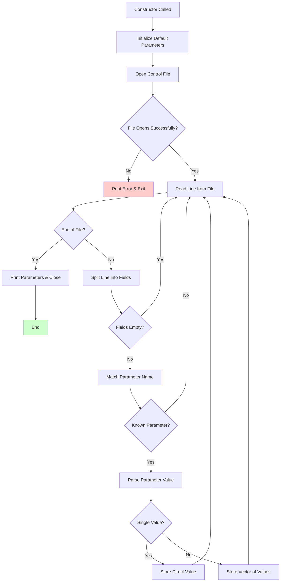

# `scream_ctl_reader.cpp` File Analysis

## File Purpose and Primary Role

This file implements the `ScreamParameters` class, which serves as the central configuration management system for the SCREAM molecular modeling software. Its primary responsibility is to read, parse, and store all runtime parameters from control files (`.ctl` files), providing a unified interface for accessing configuration settings throughout the SCREAM application. The class acts as a parameter repository that translates user-specified control file entries into usable C++ data structures and provides convenience methods for parameter interpretation and path resolution.

## Key Classes, Structs, and Functions (if any)

**`ScreamParameters` class:**

- **Constructor `ScreamParameters(string ctl_name)`**: Initializes default parameters and reads the specified control file
- **`read_scream_par_file(string par_file)`**: Core parsing function that reads and processes control file entries
- **`print_to_output(ostream* ostream_p)`**: Outputs all current parameter values for verification/debugging
- **Getter methods**: Various methods to access specific parameters (`getKeepOriginalRotamer()`, `getUseScreamEnergyFunction()`, etc.)
- **Design position methods**: `getDesignPositions()`, `getDesignClassFromPosition()`, `getDesignClassAAs()` for protein design configuration
- **Path resolution methods**: `determineLibDirPath()`, `determineCnnDirPath()`, `determineLibDirFileNameSuffix()` for library file location
- **Energy method utilities**: `minimizationMethod()`, `minimizationSteps()`, `oneEMethod()`, `returnEnergyMethod()` for energy calculation configuration
- **Residue parsing utilities**: `residueToScreamName()`, `residueToScreamPstn()`, `residueToScreamChn()` for residue information extraction
- **`_init_default_params()`**: Private method that sets all default parameter values

## Inputs

**Data Structures/Objects:**

- `string ctl_name`: Control file path passed to constructor
- `string par_file`: Parameter file path for reading
- `ostream* ostream_p`: Output stream pointer for parameter printing

**File-Based Inputs:**

- **Control files (`.ctl`)**: Main configuration files containing all SCREAM runtime parameters
- **Referenced parameter files**: Various `.par` files specified within control files (e.g., `OneEnergyFFParFile`, `DeltaParFile`, `EachAtomDeltaFile`)

**Environment Variables:**

- `SCREAM_NEW`: Base directory for SCREAM installation
- `SCREAM_NEW_LIB`: Directory for rotamer libraries
- `SCREAM_NEW_CNN`: Directory for connection files

**Parameters/Configuration:**
The class handles 40+ configuration parameters including:

- Input/output settings (`InputFileName`, `LibPath`, `Verbosity`)
- Energy calculation parameters (`UseDeltaMethod`, `FlatDeltaValue`, `Dielectric`)
- Rotamer library settings (`Library`, `PlacementMethod`, `KeepOriginalRotamer`)
- Design specification (`DesignPositionAndClass`, `DesignAAClassDefns`)
- Search parameters (`Selections`, `MaxSearchNumber`, `MaxFinalStepRunTime`)
- Clash detection (`StericClashCutoffEnergy`, `StericClashCutoffDist`)

## Outputs

**Data Structures/Objects:**

- Fully populated `ScreamParameters` object with all configuration values
- `vector<string>` collections for design positions, amino acid classes, and various parameter lists
- Processed parameter values (converted from strings to appropriate numeric types)

**File-Based Outputs:**

- No direct file output (only reads configuration files)

**Console Output (stdout/stderr):**

- Complete parameter dump via `print_to_output()` showing all loaded configuration values
- Error messages for file opening failures and parameter validation issues
- Exit calls with error codes on critical failures

**Side Effects:**

- Modifies all member variables of the `ScreamParameters` instance
- Calls `exit()` on critical errors (environment variables not set, file access failures)
- Prints configuration summary to console during initialization

## External Code Dependencies (Libraries/Headers)

**Standard C++ Library:**

- `<string>`: String manipulation and storage
- `<iostream>`: Console I/O operations
- `<fstream>`: File reading operations
- `<stdlib.h>`: Environment variable access (`getenv()`), string conversion (`atoi()`, `atof()`)
- `<stdio.h>`: C-style I/O functions (`printf()`)

**Internal SCREAM Project Headers:**

- `"defs.hpp"`: Core definitions and utility functions (`split()`, `from_string()`, `stringify()`)
- `"MutInfo.hpp"`: Mutation information class for residue specification
- `"scream_ctl_reader.hpp"`: Header declaring the `ScreamParameters` class
- `"scream_tools.hpp"`: Utility functions (`strip_whitespace()`, `split()`)

**External Compiled Libraries:**

- None identified (uses only standard C++ library)

## Core Logic/Algorithm Flowchart (Mermaid JS Format)

## Potential Areas for Modernization/Refactoring in SCREAM++

**1. Replace C-style Error Handling with Modern Exception Management**

- Current code uses `exit()` calls and `printf()` for error handling
- Modern approach: Use exceptions (`std::runtime_error`, `std::invalid_argument`) and RAII principles
- Implement proper error recovery and resource cleanup instead of abrupt program termination

**2. Adopt Modern C++ String and Container Practices**

- Replace extensive use of C-style string functions (`atoi()`, `atof()`) with `std::stoi()`, `std::stod()`
- Use `std::filesystem::path` for path manipulation instead of string concatenation
- Implement structured configuration with `std::variant` or JSON/YAML parsing libraries for more robust parameter handling

**3. Implement Configuration Validation and Type Safety**

- Current code performs minimal validation and relies on string-based parameter storage
- Modern approach: Use strong typing with enums/enum classes for categorical parameters, implement parameter validation with clear error messages
- Consider a configuration schema system with default values, ranges, and dependencies between parameters clearly defined
