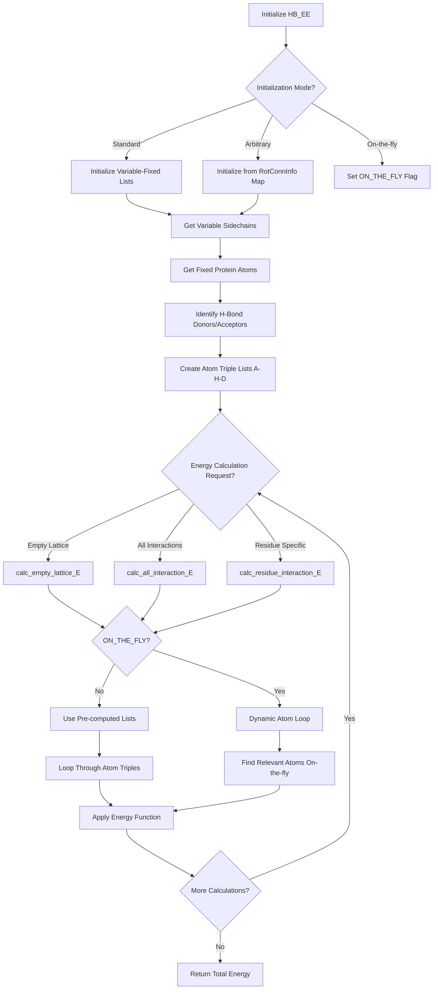

# `scream_hb_EE.cpp` File Analysis

## File Purpose and Primary Role

The `HB_EE` class is a specialized energy evaluation module within the SCREAM project that handles hydrogen bond energy calculations between protein atoms. Its primary responsibility is to compute hydrogen bonding energies in different scenarios:

1. **Empty Lattice Energy**: Calculates hydrogen bond energies between a variable sidechain and fixed protein atoms
2. **Variable-Variable Interactions**: Computes hydrogen bond energies between different variable sidechains
3. **Residue-Specific Interactions**: Evaluates hydrogen bonding for specific residue pairs
4. **On-the-fly Calculations**: Provides dynamic energy evaluation without pre-computed interaction lists

The module supports multiple energy calculation modes including flat-bottom, full delta, and scaled approaches, which align with the "Flat-Bottom Strategy" methodology described in the associated research paper.

## Key Classes, Structs, and Functions (if any)

### Primary Class

- **`HB_EE`**: Main class for hydrogen bond energy evaluation
  - Manages atom interaction lists for hydrogen bonding
  - Provides multiple energy calculation methods
  - Supports both pre-computed and on-the-fly evaluation modes

### Key Methods

- **`calc_empty_lattice_E()`**: Calculates hydrogen bond energy between a sidechain and fixed protein atoms
- **`calc_all_interaction_E()`**: Computes total hydrogen bond energy between all variable atom pairs
- **`calc_residue_interaction_E()`**: Evaluates hydrogen bonding for specific residue interactions
- **`_initVariableAndFixedAtomTripleList()`**: Initializes lists of atom triples (A-H-D) for hydrogen bonding
- **`_calc_empty_lattice_E_on_the_fly_loop()`**: Performs dynamic energy calculations without pre-computed lists
- **`potential_HB_acceptor()`**: Determines if an atom can act as a hydrogen bond acceptor

### Supporting Functions

- **`calc_EL_rot_selfBB()`**: Calculates sidechain-backbone hydrogen bonds within the same residue
- **`calc_EL_rot_otherBB()`**: Calculates sidechain interactions with other backbone atoms
- **`calc_EL_rot_fixedSC()`**: Calculates interactions with fixed sidechain atoms

## Inputs

### Data Structures/Objects

- **`Protein* ptn`**: Pointer to the protein structure containing all atomic information
- **`vector<MutInfo> mutInfo_V`**: Vector of mutation information specifying variable residues
- **`SCREAM_HB_OBJ* hb_obj`**: Hydrogen bond parameter object containing energy calculation functions
- **`map<MutInfo, RotConnInfo*> mutInfo_rotConnInfo_map`**: Maps mutation information to rotamer connectivity data
- **`RotamerNeighborList* rotamerNeighborList`**: Neighbor list for efficient distance calculations
- **`MutInfo`**: Structure containing chain, position, and amino acid information for variable residues

### File-Based Inputs

- This file does not directly read external files, but relies on hydrogen bond parameters loaded elsewhere into `SCREAM_HB_OBJ`
- Protein structure data is loaded externally into the `Protein` object

### Environment Variables

- No direct environment variable dependencies identified in this file

### Parameters/Configuration

- **Hydrogen Bond Parameters**: Distance cutoffs (`R_on`, `R_off`), angle cutoffs (`theta_on`, `theta_off`)
- **Energy Calculation Modes**: "FULL", "FLAT", "SCALED", "RESIDUE" with optional modifiers like "ASYM", "NOCB", "NONONPOLARH"
- **Delta Parameters**: Scaling factors for flat-bottom energy calculations
- **Exclusion Rules**: 1-2 and 1-3 bonded atom exclusions for energy calculations

## Outputs

### Data Structures/Objects

- **`map<MutInfo, vector<vector<SCREAM_ATOM*>>> variable_and_fixed`**: Pre-computed atom triple lists for variable-fixed interactions
- **`map<MutInfoPair, vector<ScreamAtomV>> variable_and_variable`**: Pre-computed atom triple lists for variable-variable interactions
- **`map<MutInfo, ScreamAtomV> each_sc_atom_list`**: Atom lists for each variable sidechain
- **Energy Values**: Double-precision floating-point energy values for various interaction types

### File-Based Outputs

- No direct file output from this module

### Console Output (stdout/stderr)

- **Debug Information**: Number of hydrogen bonds found for each residue
- **Progress Information**: Size of interaction lists and atom counts
- **Error Messages**: Warnings about uninitialized atom properties or missing functors
- **Debugging Output**: Atom information and energy calculation details

### Side Effects

- **Atom Property Modification**: Updates `hb_da` (hydrogen bond donor/acceptor) flags on atoms
- **Internal State Updates**: Modifies various internal maps and lists for energy calculations
- **Memory Allocation**: Creates and manages functional objects for energy calculations

## External Code Dependencies

### Standard C++ Library

- **`<cassert>`**: Assertion macros for debugging
- **`<algorithm>`**: STL algorithms (find, etc.)
- **`<vector>`**: Dynamic arrays
- **`<map>`**: Associative containers
- **`<string>`**: String manipulation
- **`<iostream>`**: Input/output operations

### Internal SCREAM Project Headers

- **`"defs.hpp"`**: Core definitions and type aliases
- **`"MutInfo.hpp"`**: Mutation information structures
- **`"scream_hb_EE.hpp"`**: Header file for this class
- **`"RotamerNeighborList.hpp"`**: Neighbor list functionality

### External Dependencies

- None identified - uses only standard C++ library and internal SCREAM components

## Core Logic/Algorithm Flowchart

## Potential Areas for Modernization/Refactoring in SCREAM++

### 1. Smart Pointer Usage and Memory Management

The current code uses raw pointers extensively (`SCREAM_ATOM*`, `RotConnInfo*`, `SCREAM_HB_OBJ*`) which can lead to memory management issues. Modern C++ should use:

- `std::unique_ptr` for owned resources
- `std::shared_ptr` for shared ownership
- `std::weak_ptr` to break circular dependencies
- RAII principles for automatic resource cleanup

### 2. Standard Container and Algorithm Modernization

The code could benefit from modern C++ features:

- Replace manual loops with STL algorithms (`std::for_each`, `std::transform`, `std::find_if`)
- Use range-based for loops instead of iterator-based loops
- Employ `std::optional` for nullable return values
- Utilize `std::variant` for polymorphic behavior instead of function pointers

### 3. Energy Calculation Strategy Pattern

The current approach of using string-based mode selection ("FULL", "FLAT", "SCALED") and manual functor creation could be replaced with:

- A proper Strategy pattern with polymorphic energy calculator classes
- Factory pattern for creating appropriate energy calculators
- Template-based compile-time strategy selection for better performance
- Type-safe enumeration instead of string-based mode selection

This would eliminate the repetitive conditional logic, improve type safety, and make the code more extensible for new energy calculation methods.
