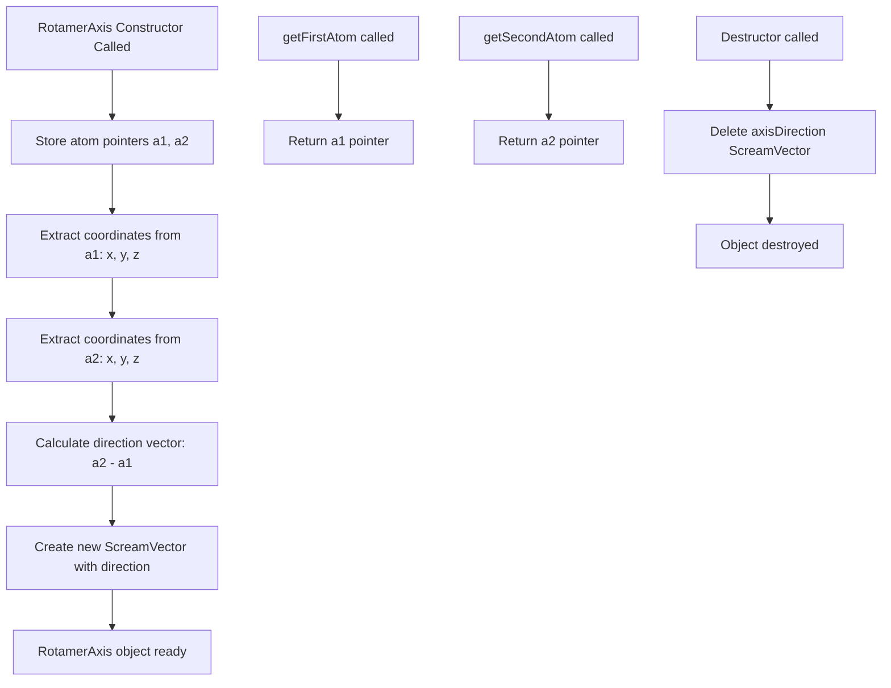

# `scream_helper_classes.cpp` File Analysis

## File Purpose and Primary Role

This file contains the implementation of the `RotamerAxis` class, which appears to be a helper class for representing and managing rotational axes in molecular modeling. The class encapsulates the concept of a rotation axis defined by two atoms, storing both the atoms themselves and the directional vector between them. This is likely used in the context of protein side-chain rotamer sampling and placement, where rotational axes around bonds are fundamental for conformational searching.

## Key Classes, Structs, and Functions (if any)

### RotamerAxis Class

- **Constructor `RotamerAxis(SCREAM_ATOM* a1, SCREAM_ATOM *a2)`**: Initializes a rotation axis using two atoms, calculating the directional vector between them
- **Destructor `~RotamerAxis()`**: Properly cleans up dynamically allocated memory for the axis direction vector
- **`getFirstAtom()`**: Returns a const pointer to the first atom defining the axis
- **`getSecondAtom()`**: Returns a const pointer to the second atom defining the axis

## Inputs

### Data Structures/Objects:

- **`SCREAM_ATOM*`**: Two pointers to SCREAM_ATOM structures that define the endpoints of the rotation axis
- Each SCREAM_ATOM contains coordinate information accessible via `x[0]`, `x[1]`, `x[2]` for x, y, z coordinates respectively

### File-Based Inputs:

- This file does not directly read from any external data files

### Environment Variables:

- No direct usage of environment variables detected in this file

### Parameters/Configuration:

- No configuration parameters are used directly in this file; behavior is determined solely by the input atoms

## Outputs

### Data Structures/Objects:

- **`RotamerAxis` object**: A complete rotation axis representation containing atom references and directional vector
- **`ScreamVector*`**: A dynamically allocated vector representing the axis direction (stored internally)
- **`SCREAM_ATOM* const`**: Const pointers to the atoms defining the axis (via getter methods)

### File-Based Outputs:

- This file does not write to any output files

### Console Output (stdout/stderr):

- No console output is generated by this file

### Side Effects:

- Dynamically allocates memory for a `ScreamVector` object (cleaned up in destructor)
- Stores references to external SCREAM_ATOM objects (does not modify them)

## External Code Dependencies (Libraries/Headers)

### Standard C++ Library:

- No explicit standard library headers are included in this implementation file

### Internal SCREAM Project Headers:

- **`scream_helper_classes.hpp`**: Contains the class declaration and likely defines `SCREAM_ATOM` and `ScreamVector`

### External Compiled Libraries:

- None detected

## Core Logic/Algorithm Flowchart (Mermaid JS Format)

## Potential Areas for Modernization/Refactoring in SCREAM++

1. **Smart Pointer Usage**: Replace raw pointer management with `std::unique_ptr<ScreamVector>` for `axisDirection` to eliminate manual memory management and potential memory leaks. This would make the destructor unnecessary.

2. **Modern Vector Mathematics**: Replace the custom `ScreamVector` class with standard library alternatives like `std::array<double, 3>` or a modern linear algebra library (e.g., Eigen::Vector3d) for better performance, standard algorithms, and reduced maintenance burden.

3. **Constructor Improvements**:
   - Add parameter validation to ensure non-null atom pointers
   - Consider using const references for atom parameters where appropriate
   - Implement move semantics and copy constructors for proper RAII compliance
   - Add noexcept specifications where appropriate for better exception safety
