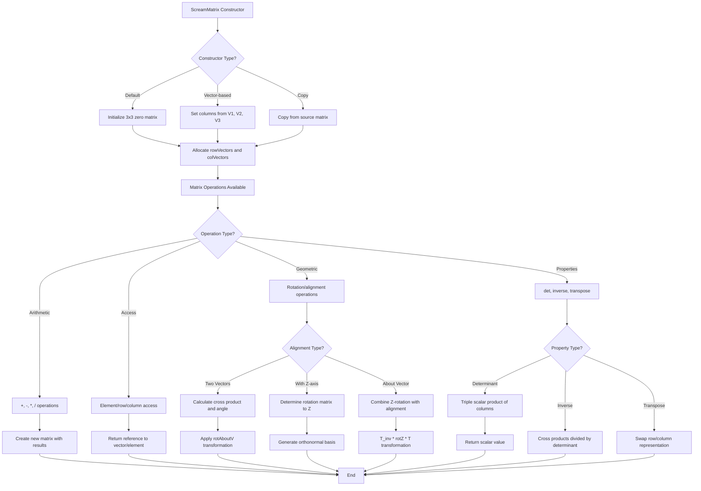

# `scream_matrix.cpp` File Analysis

## File Purpose and Primary Role

This file implements the `ScreamMatrix` class, which provides 3x3 matrix operations for the SCREAM molecular modeling software. The class serves as a fundamental mathematical utility for 3D geometric transformations, rotations, and linear algebra operations commonly needed in molecular simulations. It maintains both row and column vector representations internally for efficient access patterns and supports standard matrix operations like addition, multiplication, determinant calculation, and matrix inversion.

## Key Classes, Structs, and Functions (if any)

### Primary Class: `ScreamMatrix`

- **Purpose**: Represents a 3x3 matrix with comprehensive mathematical operations
- **Key Members**:
  - `ScreamVector* rowVectors`: Array of 3 row vectors
  - `ScreamVector* colVectors`: Array of 3 column vectors (for efficient column access)

### Key Methods:

- **Constructors**: Default, vector-based construction, copy constructor
- **Operators**: `[]`, `=`, `+`, `-`, `*`, `/` for matrix arithmetic
- **Geometric Operations**: `det()`, `inverse()`, `transpose()`
- **Specialized Functions**:
  - `alignTwoVectors()`: Creates transformation matrix to align two vectors
  - `alignWithZ()`: Aligns a vector with the Z-axis
  - `rotAboutZ()`: Rotation around Z-axis
  - `rotAboutV()`: Rotation around arbitrary vector
- **Utility**: `getCol()`, `printMe()`

## Inputs

### Data Structures/Objects:

- **`ScreamVector`**: Used extensively for construction and operations (V1, V2, V3 vectors)
- **`ScreamMatrix`**: For copy operations and matrix arithmetic
- **`double`**: Scalar values for scaling, rotation angles, and matrix elements
- **`int`**: Index values for element access

### File-Based Inputs:

- **None directly**: This file does not read from external data files

### Environment Variables:

- **None**: No direct reliance on environment variables

### Parameters/Configuration:

- **Rotation angles**: Expected in degrees (converted to radians internally)
- **Vector alignment tolerances**: Hardcoded threshold of 0.00002 for angle comparisons
- **Matrix dimensions**: Fixed 3x3 size for 3D operations

## Outputs

### Data Structures/Objects:

- **`ScreamMatrix`**: New matrix instances from arithmetic operations
- **`ScreamVector`**: Results from matrix-vector multiplication and column access
- **`double`**: Scalar results from determinant calculations
- **Modified matrix elements**: Through assignment operators and element access

### File-Based Outputs:

- **None**: No direct file writing operations

### Console Output (stdout/stderr):

- **Error messages**: Index out of bounds warnings via `cerr`
- **Division by zero warnings**: Error output for zero divisors
- **Debug output**: `printMe()` function outputs matrix contents to `cout`

### Side Effects:

- **Memory allocation**: Dynamic allocation of `ScreamVector` arrays
- **Element modification**: Non-const operators modify internal state
- **Dual representation updates**: Changes to row vectors update corresponding column vectors

## External Code Dependencies (Libraries/Headers)

### Standard C++ Library:

- **`<stdlib.h>`**: Standard library functions
- **`<stdio.h>`**: Standard I/O operations
- **`<stdarg.h>`**: Variable argument handling
- **`<math.h>`**: Mathematical functions (cos, sin, fabs)
- **`<iostream>`**: Stream I/O operations (cout, cerr)

### Internal SCREAM Project Headers:

- **`scream_vector.hpp`**: Provides the `ScreamVector` class for vector operations
- **`scream_matrix.hpp`**: Header file declaring the `ScreamMatrix` class interface

### External Compiled Libraries:

- **None**: Uses only standard C++ libraries and internal SCREAM components

## Core Logic/Algorithm Flowchart (Mermaid JS Format)

## Potential Areas for Modernization/Refactoring in SCREAM++

### 1. Memory Management and RAII

**Current Issue**: Manual memory management with `new[]`/`delete[]` for vector arrays creates potential for memory leaks and exception safety issues.
**Modernization**: Replace with `std::array<ScreamVector, 3>` or `std::vector<ScreamVector>` to leverage automatic memory management and RAII principles. This eliminates manual cleanup and provides exception safety.

### 2. Redundant Data Storage and Consistency

**Current Issue**: Storing both `rowVectors` and `colVectors` separately leads to data duplication and potential inconsistency, requiring careful synchronization in all operations.
**Modernization**: Use a single `std::array<std::array<double, 3>, 3>` or `Eigen::Matrix3d` for storage, with computed row/column access methods. This reduces memory overhead and eliminates synchronization bugs while potentially improving cache locality.

### 3. Error Handling and Type Safety

**Current Issue**: Index bounds checking uses `cerr` output but continues execution with potentially invalid indices, and angle/vector operations lack validation.
**Modernization**: Implement proper exception handling with custom exception types (e.g., `matrix_index_error`, `singular_matrix_error`), use `constexpr` for compile-time constants, and add comprehensive input validation. Consider using `std::optional` for operations that might fail (like matrix inversion of singular matrices).
