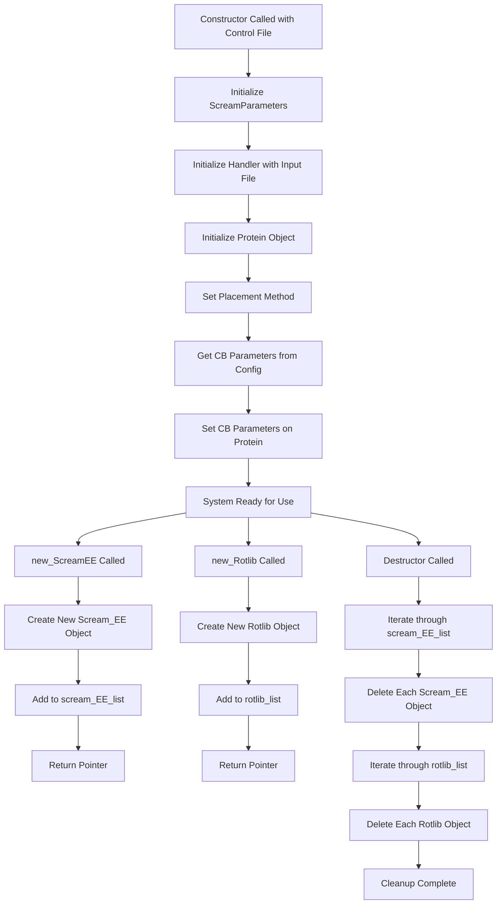

# `scream_model.cpp` File Analysis

## File Purpose and Primary Role

The `ScreamModel` class serves as the main orchestrator and high-level interface for the SCREAM protein modeling system. It acts as a central coordinator that:

- Initializes and manages the overall SCREAM system configuration from control files
- Manages memory for core computational objects (Scream_EE and Rotlib instances)
- Sets up protein structure handling and side-chain placement parameters
- Coordinates between different subsystems (energy evaluation, rotamer libraries, protein structure)
- Provides factory methods for creating and managing SCREAM computational objects

This appears to be the primary entry point class that a user or Python wrapper would interact with to perform protein modeling tasks.

## Key Classes, Structs, and Functions (if any)

### Primary Class

- **`ScreamModel`**: Main orchestrator class with the following key methods:
  - **Constructor**: `ScreamModel(string scream_ctl_file)` - Initializes the entire system from a control file
  - **Destructor**: Manages cleanup of dynamically allocated objects
  - **`new_ScreamEE()`**: Factory method for creating energy evaluation objects
  - **`new_Rotlib()`**: Factory method for creating rotamer library objects
  - **`_initScreamEE()`**: Private method for initializing energy evaluation subsystem (currently obsolete)
  - **`_convertDesignPositionToMutInfoName()`**: Utility method for converting design position notation

### Key Data Members

- **`scream_parameters`**: Configuration object loaded from control file
- **`HANDLER`**: Protein structure handler
- **`ptn`**: Protein object for structure manipulation
- **`scream_EE_list`**: Vector of energy evaluation objects
- **`rotlib_list`**: Vector of rotamer library objects

## Inputs

### Data Structures/Objects

- **`string scream_ctl_file`**: Path to the main SCREAM control file containing all configuration parameters
- **Internal objects**: The class creates and manages `ScreamParameters`, `Handler`, and `Protein` objects internally

### File-Based Inputs

- **Control File (`.ctl`)**: Main configuration file specified in constructor that contains:
  - Input protein structure filename
  - Placement method parameters
  - CB (carbon-beta) creation parameters
  - Mutation/design specifications
  - Energy calculation settings
  - Rotamer library configurations
- **Protein Structure Files**: Referenced through `InputFileName` parameter in control file
- **Rotamer Library Files**: Managed through the control file configuration

### Environment Variables

- No direct environment variable usage detected in this file

### Parameters/Configuration

Key parameters from control file that influence behavior:

- **Placement Method**: Algorithm for side-chain placement
- **CB Parameters**: [Off-bisector angle, off-plane angle, bond length, rotamer match vector lambda]
- **Mutation Info List**: Residues to mutate or design positions
- **Design Positions**: For protein design mode
- **Binding Site Parameters**: Distance and mode for binding site analysis
- **Rotamer Neighbor List**: Usage flag for optimization

## Outputs

### Data Structures/Objects

- **`Scream_EE*`**: Energy evaluation objects created by factory method
- **`Rotlib*`**: Rotamer library objects created by factory method
- **Configured `ptn` object**: Protein structure with placement parameters set

### File-Based Outputs

- No direct file output from this class (handled by other components)

### Console Output (stdout/stderr)

- **Identification Messages**: "THIS LINE INDICATES YOU USED THE GRIFFITH SCREAM VERSION"
- **Debug Information**: Converted design position names
- **Lifecycle Messages**: Construction and destruction notifications

### Side Effects

- **Memory Management**: Maintains lists of dynamically allocated objects
- **Global Configuration**: Sets up system-wide parameters for protein modeling
- **Object State Modification**: Configures protein object with placement parameters

## External Code Dependencies

### Standard C++ Library

- **`<string>`**: String manipulation and storage
- **`<vector>`**: Dynamic arrays for object management
- **`<iostream>`**: Console output operations

### Internal SCREAM Project Headers

- **`scream_model.hpp`**: Class declaration header
- **`defs.hpp`**: Project-wide definitions and utilities
- **`MutInfo.hpp`**: Mutation information handling
- Additional dependencies through included headers:
  - `ScreamParameters` class
  - `Handler` class
  - `Protein` class
  - `Scream_EE` class
  - `Rotlib` class

### External Compiled Libraries

- None detected (uses only standard C++ library)

## Core Logic/Algorithm Flowchart

## Potential Areas for Modernization/Refactoring in SCREAM++

### 1. **Smart Pointer Adoption**

Replace raw pointer management with modern C++ smart pointers:

- Use `std::unique_ptr<Scream_EE>` instead of raw `Scream_EE*` pointers
- Use `std::unique_ptr<Rotlib>` for rotamer library objects
- This would eliminate manual `delete` calls in destructor and prevent memory leaks
- Factory methods could return `std::unique_ptr` for automatic memory management

### 2. **Resource Management and RAII**

Implement proper RAII (Resource Acquisition Is Initialization) patterns:

- Move object initialization logic into member initializer lists where possible
- Consider using composition over dynamic allocation for core objects like `scream_EE`
- Replace vector-of-pointers with vector-of-objects or containers of smart pointers

### 3. **Modern C++ Container and Algorithm Usage**

- Replace manual iterator loops with range-based for loops (C++11) or STL algorithms
- Use `std::make_unique` for object creation (C++14)
- Consider using `std::array` for fixed-size CB parameter arrays
- Implement move semantics for expensive object operations
- Add `const`-correctness throughout the interface

### 4. **Error Handling and API Design**

- Replace string-based control file path with `std::filesystem::path` (C++17)
- Add proper exception handling for file operations and object creation
- Implement builder pattern or configuration object for complex initialization
- Add validation for configuration parameters and provide meaningful error messages
