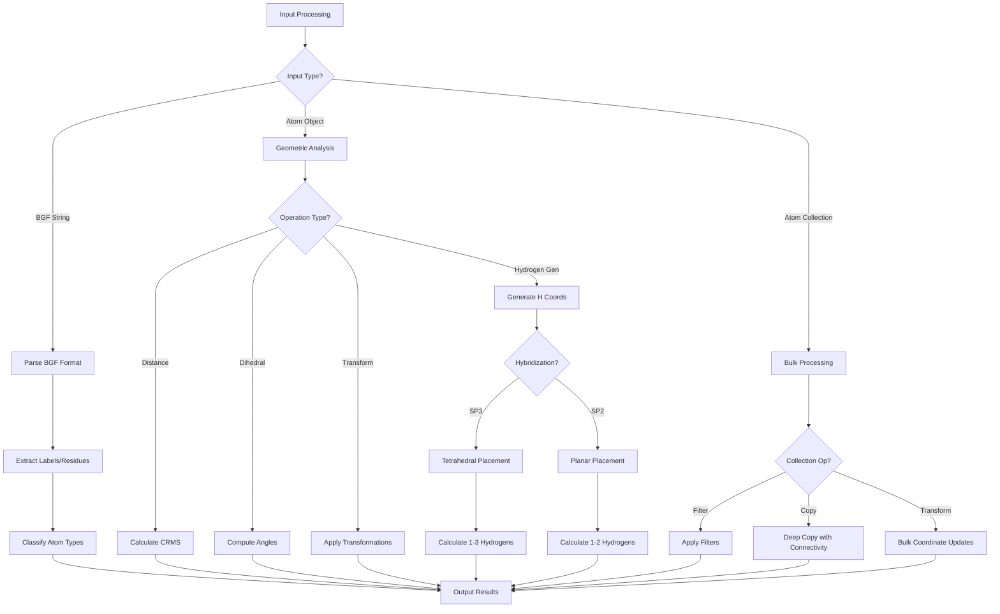

# `scream_tools.cpp` File Analysis

## File Purpose and Primary Role

This file implements the `scream_tools` namespace, which serves as a comprehensive utility library for the SCREAM molecular modeling software. It provides essential string processing, file parsing, geometric calculations, atom manipulation, and hydrogen generation functions. The file acts as a central toolkit that supports various molecular modeling operations including BGF file parsing, amino acid recognition, coordinate transformations, and automatic hydrogen placement.

## Key Classes, Structs, and Functions (if any)

### Primary Namespace Functions:

- **String/BGF Parsing Functions:**

  - `atom_label()` - Extracts atom labels from BGF format lines
  - `res_number()`, `res_type()`, `chain_desig()` - Parse residue information from BGF lines
  - `strip_whitespace()` - Removes leading/trailing whitespace
  - `split()` - Splits strings into tokens (uses C-style strtok)

- **File Format Recognition:**

  - `is_bgf_header_line()`, `is_bgf_atom_line()` - BGF format line identification
  - `is_format_connect_line()`, `is_connectivity_info()` - Connectivity parsing

- **Chemical Classification:**

  - `is_AA()` - Identifies amino acid residues
  - `is_metal_atom()`, `is_SC_atom()`, `is_BB_atom()` - Atom type classification
  - `is_heavy_atom()`, `is_N_term_hydrogen()`, `is_C_term_atom()` - Chemical categorization
  - `is_natural_AA()` - Natural amino acid recognition

- **Geometric Calculations:**

  - `calc_dihedral()` - Dihedral angle calculations (two overloads)
  - `distance()` - CRMS distance between atom lists
  - `distance_by_atom_label_map()` - Distance calculation using atom label mapping

- **Coordinate Transformations:**

  - `translation()` - Multiple overloads for translating atoms/atom groups
  - `getTransformationPairFromAtoms()` - Generates transformation matrices

- **Hydrogen Generation:**

  - `generateHydrogenCoords()` - Main hydrogen coordinate generation
  - `createHydrogens()` - Creates SCREAM_ATOM objects for hydrogens
  - `generate3SP3HydrogenCoords()`, `generate2SP3HydrogenCoords()`, `generate1SP3HydrogenCoords()` - SP3 hydrogen placement
  - `generate2SP2HydrogenCoords()`, `generate1SP2HydrogenCoords()` - SP2 hydrogen placement

- **Data Structure Management:**

  - `deep_copy_str_SCREAM_ATOM_mm()` - Deep copy of multimap structures
  - `deep_copy_ScreamAtomV()` - Deep copy of atom vectors with connectivity
  - `make_connectivity()` - Establishes atom connectivity from connection maps

- **Utility Functions:**
  - `AA_atom_order()` - Custom comparator for amino acid atom ordering
  - `return_heavy_atoms()` - Filters heavy atoms from atom lists
  - `three_letter_AA()`, `one_letter_AA()` - Amino acid code conversion

## Inputs

### Data Structures/Objects:

- **SCREAM_ATOM\*** - Primary atom objects with coordinates, labels, and connectivity
- **ScreamAtomV** (vector<SCREAM_ATOM\*>) - Collections of atom pointers
- **ScreamVector** - Custom 3D vector class for coordinates and calculations
- **ScreamMatrix** - Custom matrix class for transformations
- **multimap<string, SCREAM_ATOM\*>** - Atom collections organized by string keys
- **map<int, vector<int>>** - Connectivity information mapping atom numbers
- **map<string, SCREAM_ATOM\*>** - Atom mappings by label

### File-Based Inputs:

- **BGF format strings** - Biological structure format lines for parsing atom information
- **Mutation information strings** - Encoded mutation data (format: AA_position_chain)

### Parameters/Configuration:

- **Force field types** - DREIDING force field atom types for hydrogen generation
- **Bond lengths** - Hardcoded values (0.97Å for H-N, 1.00Å for other H-X bonds)
- **Tetrahedral angles** - SP3 geometry (109.47°) and SP2 geometry (120°)
- **Amino acid definitions** - Hardcoded sets of natural and recognized amino acids

## Outputs

### Data Structures/Objects:

- **ScreamAtomV** - Collections of newly created or filtered atoms
- **ScreamVector** - Calculated coordinates and geometric vectors
- **ScreamMatrix/ScreamVector pairs** - Transformation matrices and translation vectors
- **multimap<string, SCREAM_ATOM\*>** - Deep-copied atom collections
- **vector<ScreamVector>** - Generated hydrogen coordinates

### Console Output (stdout/stderr):

- **Debug information** - Atom connectivity details and vector processing status
- **Warning messages** - Size mismatches in distance calculations
- **Error messages** - Memory allocation issues and invalid atom references
- **Testing output** - Vector content verification during development

### Side Effects:

- **Memory allocation** - Creates new SCREAM_ATOM objects that require manual deletion
- **Connectivity modification** - Updates atom connectivity maps in-place
- **Coordinate modification** - Translates atom positions by reference

## External Code Dependencies (Libraries/Headers)

### Standard C++ Library:

- `<cstdlib>` - C standard library functions (atoi, etc.)
- `<math.h>` - Mathematical functions (sqrt, trigonometry)
- `<iostream>` - Input/output stream operations
- `<sstream>` - String stream processing
- `<vector>` - Dynamic arrays
- `<map>` - Associative containers
- `<string>` - String manipulation
- `<string.h>` - C-style string functions (strcpy, strtok)

### Internal SCREAM Project Headers:

- `"defs.hpp"` - Project-wide definitions and constants
- `"scream_atom.hpp"` - SCREAM_ATOM class definition
- `"scream_tools.hpp"` - Function declarations for this implementation
- `"scream_vector.hpp"` - Custom 3D vector mathematics class

## Core Logic/Algorithm Flowchart (Mermaid JS Format)

## Potential Areas for Modernization/Refactoring in SCREAM++

### 1. Memory Management and Smart Pointers

The code extensively uses raw pointers and manual memory management with `new`/`delete`. The `deep_copy_str_SCREAM_ATOM_mm()` and `createHydrogens()` functions create raw pointers that require manual cleanup. Modern C++ should use `std::unique_ptr` or `std::shared_ptr` to ensure automatic memory management and prevent leaks.

### 2. String Processing and Error Handling

The string parsing functions use unsafe C-style operations like `strcpy` and `strtok` with fixed-size buffers (40000 characters). The `split()` function should be replaced with modern C++ string algorithms using `std::string_view`, `std::ranges`, or regex. Additionally, error handling is minimal - functions like `atoi()` don't validate input, and many functions lack bounds checking.

### 3. Configuration and Data Hardcoding

Chemical data (amino acid mappings, bond lengths, atom types) are hardcoded throughout the file using static maps and magic numbers. This should be externalized to configuration files (JSON/YAML) or constexpr lookup tables. The force field parameters and geometric constants should be centralized in a configuration system to improve maintainability and allow for different force fields.
