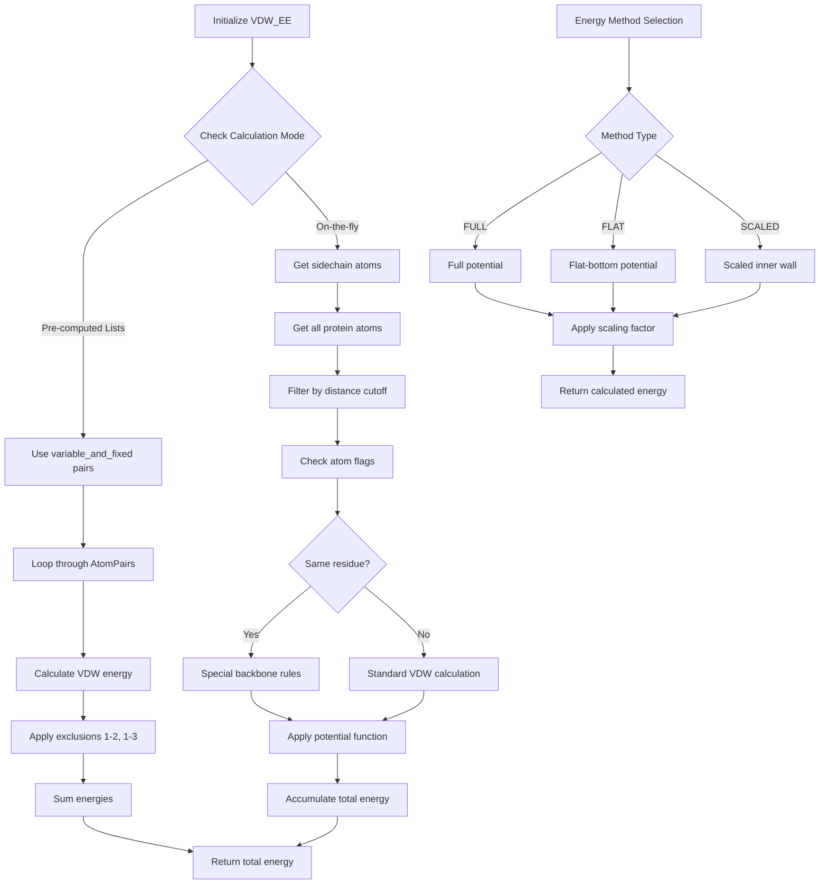

# `scream_vdw_EE.cpp` File Analysis

## File Purpose and Primary Role

This file implements the `VDW_EE` (Van der Waals Energy Evaluator) class, which is responsible for calculating van der Waals interaction energies between atoms in protein structures within the SCREAM molecular modeling software. The class handles energy calculations for both fixed atoms (backbone and non-moveable sidechains) and variable atoms (moveable sidechains) using various potential functions including the flat-bottom strategy described in the associated research paper. It supports both pre-computed atom pair lists and on-the-fly energy calculations.

## Key Classes, Structs, and Functions (if any)

- **`VDW_EE` class**: Main class for van der Waals energy calculations
  - Multiple constructors for different initialization modes
  - `calc_empty_lattice_E()`: Calculates energy for a single residue against fixed environment
  - `calc_empty_lattice_E_delta()`: Calculates energy using flat-bottom potential variants
  - `calc_residue_interaction_E()`: Calculates interaction energy between specific residues
  - `calc_all_interaction_E()`: Calculates total interaction energy between all variable atoms
  - `calc_EL_rot_selfBB()`: Calculates sidechain-backbone interactions within same residue
  - `calc_EL_rot_otherBB()`: Calculates sidechain interactions with other backbone atoms
  - `calc_EL_rot_fixedSC()`: Calculates interactions with fixed sidechains
  - `calc_EL_rot_fixedHET()`: Calculates interactions with fixed heteroatoms
  - Various private helper methods for initialization and setup

## Inputs

**Data Structures/Objects:**

- `Protein* ptn`: Protein structure containing atomic coordinates and connectivity
- `vector<MutInfo> mutInfo_V`: Information about residue positions to be optimized
- `SCREAM_VDW_OBJ* vdw_obj`: Van der Waals parameter object containing force field data
- `map<MutInfo, RotConnInfo*> mutInfo_rotConnInfo_map`: Mapping of residues to rotamer connectivity information
- `ClashCollection* clashCollection`: Object for storing clash information between residue pairs
- `RotamerNeighborList* rotamerNeighborList`: Neighbor list for optimized distance calculations

**File-Based Inputs:**

- This file does not directly read external files, but relies on data loaded by other modules (force field parameters, protein structures)

**Environment Variables:**

- No direct environment variable usage detected

**Parameters/Configuration:**

- Energy calculation methods: "FULL", "FLAT", "SCALED" for different potential forms
- Distance cutoffs (typically 8-10 Å for non-bonded interactions)
- Scaling factors for flat-bottom potentials
- Flags for including/excluding non-polar hydrogens ("NONONPOLARH")
- Asymmetric potential options ("ASYM")

## Outputs

**Data Structures/Objects:**

- `double`: Energy values (kcal/mol) from various calculation methods
- Modified `ClashCollection` objects with clash pair information
- Internal atom pair lists (`variable_and_fixed`, `variable_and_variable`)

**File-Based Outputs:**

- No direct file output

**Console Output (stdout/stderr):**

- Debug information about atom pair list sizes
- Clash warnings for high-energy interactions (E > 250 kcal/mol)
- Method selection information during energy calculations

**Side Effects:**

- Modifies atom flags to indicate fixed/moveable status
- Populates internal data structures for atom pair interactions
- Updates clash collection statistics

## External Code Dependencies (Libraries/Headers)

**Standard C++ Library:**

- `<algorithm>`: For STL algorithms like `find()`
- `<vector>`: For dynamic arrays
- `<map>`: For associative containers
- `<string>`: For string operations
- `<time.h>`: For timing measurements
- `<stdio.h>`: For C-style I/O
- `<cassert>`: For assertion macros

**Internal SCREAM Project Headers:**

- `"defs.hpp"`: Project-wide definitions and constants
- `"MutInfo.hpp"`: Mutation/residue information structures
- `"scream_vdw_EE.hpp"`: Header for this VDW energy evaluator class
- `"ClashCollection.hpp"`: Clash detection and storage
- `"RotamerNeighborList.hpp"`: Neighbor list optimization

**External Compiled Libraries:**

- None detected (uses only standard C++ library)

## Core Logic/Algorithm Flowchart (Mermaid JS Format)

## Potential Areas for Modernization/Refactoring in SCREAM++

1. **Smart Pointer Usage**: Replace raw pointers (`Protein* ptn`, `SCREAM_VDW_OBJ* vdw_obj`, etc.) with smart pointers (`std::shared_ptr` or `std::unique_ptr`) to improve memory safety and automatic resource management. The current code relies heavily on manual memory management which is error-prone.

2. **Modern STL Containers and Algorithms**: The code uses basic STL containers but could benefit from more modern approaches like `std::unordered_map` for better performance, range-based for loops instead of iterator-based loops, and standard algorithms to replace manual loops. The extensive use of custom vector types (`ScreamAtomV`) could be standardized.

3. **Function Object and Lambda Modernization**: The current functor system using inheritance (`SCREAM_VDW_BASE_FUNCTIONAL_OBJ`) could be replaced with modern C++ lambdas or `std::function` objects, making the code more concise and eliminating the need for manual `new`/`delete` operations on functors. This would also improve type safety and reduce boilerplate code.
