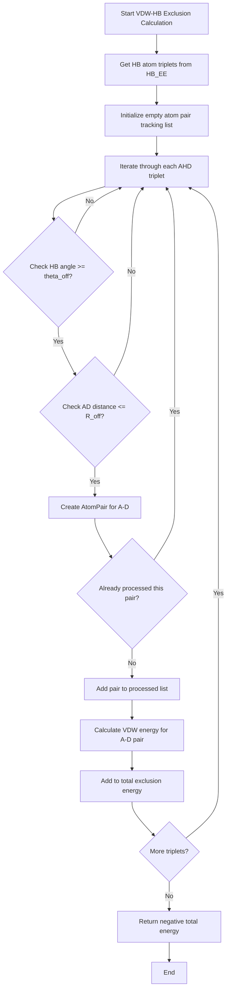

# `scream_vdw_hb_exclusion_EE.cpp` File Analysis

## File Purpose and Primary Role

This file implements the `VDW_HB_Exclusion_EE` class, which handles the exclusion of van der Waals (VDW) interactions that occur between atoms participating in hydrogen bonds. This is a critical component in molecular modeling where VDW forces need to be subtracted/excluded when atoms are involved in hydrogen bonding to avoid double-counting energetic contributions. The class acts as a bridge between VDW energy evaluation (`VDW_EE`) and hydrogen bond energy evaluation (`HB_EE`) modules, ensuring proper energy accounting in protein side-chain placement calculations.

## Key Classes, Structs, and Functions (if any)

### Classes

- **`VDW_HB_Exclusion_EE`**: Main class responsible for calculating VDW exclusion energies
  - Manages the exclusion of VDW interactions for atom pairs involved in hydrogen bonds
  - Provides both regular and delta (perturbation) energy calculations
  - Tracks already-processed atom pairs to avoid double counting

### Key Functions

- **`calc_empty_lattice_E(const MutInfo& mI)`**: Calculates VDW exclusion energy for a specific mutation against fixed background
- **`calc_empty_lattice_E_delta(const MutInfo& mI, string mode, double r)`**: Calculates delta VDW exclusion energy with different modes (FULL, FLAT, SCALED)
- **`calc_all_interaction_E()`**: Calculates total VDW exclusion energy for all variable-variable interactions
- **`calc_all_interaction_E_delta(string mode, double r)`**: Delta version of all interaction energy calculation
- **`find_atompair_in_list(AtomPair& aP, vector<AtomPair>& aP_v)`**: Utility function to check if an atom pair has already been processed

## Inputs

### Data Structures/Objects

- **`VDW_EE*`**: Pointer to VDW energy evaluator object
- **`HB_EE*`**: Pointer to hydrogen bond energy evaluator object
- **`MutInfo`**: Mutation information objects containing residue and rotamer details
- **`SCREAM_ATOM*`**: Pointers to atom objects (Acceptor, Hydrogen, Donor atoms in HB triplets)
- **`AtomPair`**: Custom structure representing pairs of atoms for tracking processed interactions

### Parameters/Configuration

- **`theta_off`**: Angle cutoff threshold for hydrogen bond geometry (from HB_EE object)
- **`R_off`**: Distance cutoff for hydrogen bond interactions (from HB_EE object)
- **`mode`**: String parameter for delta calculations ("FULL", "FLAT", "SCALED")
- **`r`**: Scaling factor for delta energy calculations

### File-Based Inputs

- No direct file I/O in this module; relies on data structures populated by other modules

### Environment Variables

- No direct environment variable usage detected

## Outputs

### Data Structures/Objects

- **`double`**: Energy values (total VDW exclusion energies)
- **`vector<AtomPair>`**: List of processed atom pairs (to prevent double counting)

### Console Output (stdout/stderr)

- Debug output: Size of already subtracted atom pairs list

### Side Effects

- Modifies internal `already_subtracted_atomPairs` vectors during calculations
- No modification of external objects passed by reference

## External Code Dependencies

### Standard C++ Library

- **`<vector>`**: For storing lists of atom triplets and atom pairs
- **`<string>`**: For mode parameter handling
- **`<iostream>`**: For console output (cout)
- **`<map>`**: Used indirectly through HB_EE data structures

### Internal SCREAM Project Headers

- **`"scream_vdw_hb_exclusion_EE.hpp"`**: Class declaration header
- **`"scream_vdw_EE.hpp"`**: VDW energy evaluator interface
- **`"scream_hb_EE.hpp"`**: Hydrogen bond energy evaluator interface
- **`"defs.hpp"`**: Project-wide definitions and types
- **`"MutInfo.hpp"`**: Mutation information structures

## Core Logic/Algorithm Flowchart

## Potential Areas for Modernization/Refactoring in SCREAM++

1. **Smart Pointer Usage**: Replace raw pointers (`VDW_EE*`, `HB_EE*`, `SCREAM_ATOM*`) with smart pointers (`std::shared_ptr` or `std::unique_ptr`) to improve memory safety and automatic resource management.

2. **STL Algorithm Modernization**: Replace manual vector iteration with STL algorithms and range-based for loops. The `find_atompair_in_list` function could be replaced with `std::find_if` or `std::any_of` for better readability and potentially better performance.

3. **Type Safety and Enum Classes**: Replace string-based mode parameters ("FULL", "FLAT", "SCALED") with strongly-typed enum classes to eliminate runtime string comparison overhead and improve compile-time error detection.
