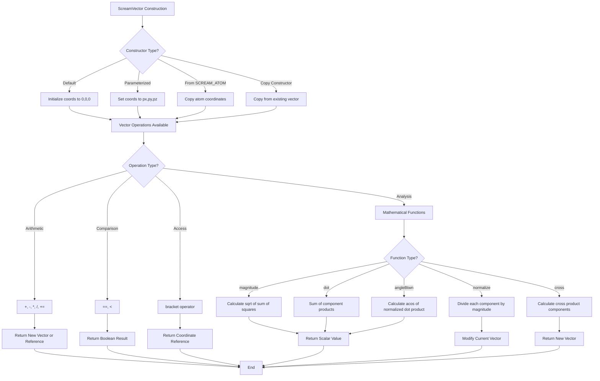

# `scream_vector.cpp` File Analysis

## File Purpose and Primary Role

The `scream_vector.cpp` file implements the `ScreamVector` class, which provides a custom 3D vector implementation for the SCREAM molecular modeling software. This class serves as a fundamental mathematical building block for representing and manipulating 3D coordinates, positions, and directional vectors in molecular space. It handles basic vector operations essential for protein side-chain placement calculations, including vector arithmetic, normalization, cross products, dot products, and angle calculations.

## Key Classes, Structs, and Functions (if any)

### Primary Class: `ScreamVector`

- **Purpose**: Represents a 3D vector with double precision coordinates
- **Core Functionality**:
  - Vector construction from coordinates, atoms, or other vectors
  - Mathematical operations (addition, subtraction, scalar multiplication/division)
  - Vector analysis (magnitude, normalization, cross product, dot product)
  - Geometric calculations (angle between vectors)
  - Element access via indexing operators

### Key Member Functions:

- **Constructors**: Default, parameterized (x,y,z), from `SCREAM_ATOM*`, copy constructor
- **Operators**: `[]`, `=`, `==`, `<`, `+`, `-`, `*`, `/`, `+=`
- **Vector Operations**: `magnitude()`, `normalize()`, `normalizedVector()`, `cross()`, `dot()`, `angleBtwn()`
- **Utility**: `printMe()`

## Inputs

### Data Structures/Objects:

- **`SCREAM_ATOM*`**: Pointer to atom structure containing 3D coordinates (`x[0]`, `x[1]`, `x[2]`)
- **`ScreamVector`**: Other vector instances for copy construction and mathematical operations
- **`double`**: Individual coordinate values (px, py, pz) and scalar factors
- **`int`**: Array indices for element access

### File-Based Inputs:

- None directly. This class does not read from external files.

### Environment Variables:

- None identified in this file.

### Parameters/Configuration:

- No external configuration parameters. Behavior is determined by the mathematical operations requested.

## Outputs

### Data Structures/Objects:

- **`ScreamVector`**: New vector instances returned by mathematical operations
- **`double&`**: References to coordinate elements via indexing operators
- **`double`**: Scalar results from magnitude, dot product, and angle calculations
- **`bool`**: Comparison results from equality and less-than operators

### File-Based Outputs:

- None directly. This class does not write to files.

### Console Output (stdout/stderr):

- **Error messages**: Index bounds checking errors via `cerr`
- **Debug output**: Coordinate values via `printMe()` method using `cout`

### Side Effects:

- **Memory management**: Allocates/deallocates coordinate array in constructor/destructor
- **In-place modification**: `normalize()` and `operator+=()` modify the current vector instance

## External Code Dependencies (Libraries/Headers)

### Standard C++ Library:

- **`<math.h>`**: For `sqrt()` and `acos()` functions
- **`<iostream>`**: For `cout`, `cerr`, and stream operations

### Internal SCREAM Project Headers:

- **`"scream_atom.hpp"`**: Defines the `SCREAM_ATOM` structure
- **`"scream_vector.hpp"`**: Header file for the `ScreamVector` class declaration

### External Compiled Libraries:

- None identified. Uses only standard C++ libraries.

## Core Logic/Algorithm Flowchart (Mermaid JS Format)

## Potential Areas for Modernization/Refactoring in SCREAM++

### 1. **Replace Raw Pointers with Smart Pointers or STL Containers**

The current implementation uses `new double[3]` for coordinate storage, requiring manual memory management. Modern C++ would benefit from using `std::array<double, 3>` or `std::vector<double>` to eliminate memory leaks and simplify resource management. This would also remove the need for explicit destructor implementation.

### 2. **Improve Error Handling and Bounds Checking**

The current bounds checking in `operator[]` only prints an error message but continues execution with potentially invalid memory access. Modern C++ should use exceptions (e.g., `std::out_of_range`) or assertions to handle bounds violations more robustly. Consider using `at()` methods or compile-time bounds checking where possible.

### 3. **Replace C-style Headers and Improve Const-Correctness**

Replace `<math.h>` with `<cmath>` for better C++ compliance. Add more const-correctness throughout the interface, and consider using `constexpr` for operations that can be evaluated at compile time. The `printMe()` method should be const, and consider adding `noexcept` specifications where appropriate for better optimization and exception safety guarantees.
